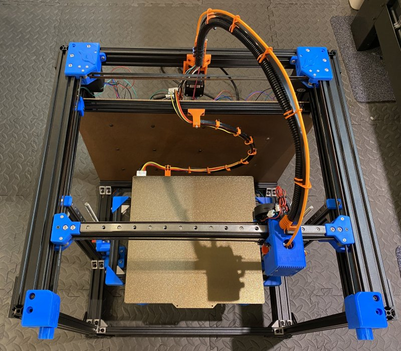

# MY BLV MGN Cube

## Table of contents
  1. [Introduction](#introduction)
  2. [Bill of materials](manual/bom.md)
  3. [Printed parts](parts/README.md)
  4. [Print settings](manual/partsSettings.md)
  5. [Assembly Guide](manual/guide/README.md)
  1. [License](#license)
  1. [Credits and inspiration](#credits-and-inspiration)

## Disclaimer
**WORK IN PROGRESS**

I'm in the process of building my first Cube so directions will probably change as I figure things out. Definitely consult other sources and double check what I'm saying at every step.

## Introduction
This documents my journey building the MGN BLV 3D Printer designed and graciously contributed to the world by Ben Levi. My goal is to provide a guide that others can follow to build their own cubes. This guide, at least initally, will provide instructions for my specific build as detailed below. If your configuration is different keep that in mind when following the directions.

### Current Build Picture

### My Build Specifications
* Standard 365mm build height frame (The one listed on BLV's site)
* E3D V6 Cloned Hotend
* BLTouch ABL probe
* SKR v1.4 controller
* TMC2208 stepper drivers
* TFT35 LCD touch screen

## Bill of Materials
[Read the BoM here](manual/bom.md)

## Printed Parts
[Printed parts](parts/README.md)

## Print Settings
[Print Settings](manual/partsSettings.md)

## Assembly Guide
[Assembly Guide](manual/guide/README.md)

## License

Licensed under [CC BY-NC-SA 3.0](https://creativecommons.org/licenses/by-nc-sa/3.0/)

## Credits and inspiration
This work is based on the [BLV mgn Cube - 3d printer](https://www.blvprojects.com/blv-mgn-cube-3d-printer) graciously donated the the community by [Ben Levi](https://www.facebook.com/blevi?fref=gs&dti=371460246914851&hc_location=group_dialog) and is licensed under [CC BY-NC-SA 3.0](https://creativecommons.org/licenses/by-nc-sa/3.0/).  Any modified files will be clearly labelled.

Lots of tips and pointers from watching [Fugatech3D's live stream on his build](https://www.youtube.com/user/fuganater987)

Also the documentation and style modifications were greatly inspired by [Greg Saun's Work](https://github.com/gregsaun/bear_extruder_and_x_axis/blob/master/README.md) 
