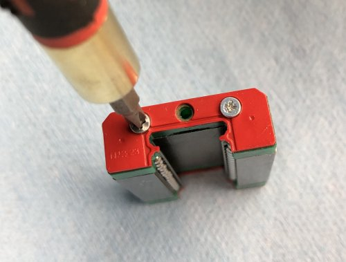
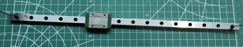

# My BLV MGN Cube - Assembly Instructions

##**_WORK IN PROGRESS_**

## Step 1 Lubricate MGN Rails

### Checkout my Comparison of Several Reasonably Priced Linear Rail Brands

[Linear Rail Bake-off](../../notes/linear-rail-bakeoff.md)

### Step 1 BoM

[Step 1 BoM Link](https://docs.google.com/spreadsheets/d/e/2PACX-1vTVx7BvB3V7CozF2l4eWkNntWrHSjOawmrsi_bRSVxQLIGVlfZTYEGp8a6fHpENV6hV2cn9PrDLHHl0/pubhtml?gid=2107061638&single=true)

## Prep

1. Tape some magnets to the bottom of a mason jar.

    \
    *fig 1.1*

1. Tape some magnets to the bottom of the large container.

    \
    *fig 1.2*

3. Put a shop towel in the bottom of the large container.

    \
    *fig 1.3*

4. Put the alcohol in a mason jar.

    \
    *fig 1.4*

## Procedure

**DO ONE RAIL AT A TIME AND DON'T INTERMIX PARTS**

1. Remove the plug from one end of rail. I used a small allen key on the other side of the rail. Save the plug for later.

    \
    *fig 1.5*

2. Carefully slide carriage off of rail, over large container. The bearings can pop out of the carriage when removing it from the rail.

    \
    *fig 1.6*

3. Dab a shop towel in the alcohol and wipe down the rail removing any anti rust gunk the factory put on.

    \
    *fig 1.7*

4. Repeat by using a alcohol soaked pipe cleaner to thoroughly clean the races.

    \
    *fig 1.8*

5. Use the spray air to quickly dry the alcohol off the rail and remove any lint.

    \
    *fig 1.9*

6. Spray the rail with silicone lubricant and wipe off excess. Do this outside or over a utility sink cause it's messy. Also wear some disposable gloves.

    \
    *fig 1.10*

7. Set the rail aside to dry. Oh and put on a fresh set of gloves.

8. Disassemble the carriage over a mason jar and in the large container.

    1. Unscrew the dust cap. Yeah I should have done this in the mason jar as well.

        \
        *fig 1.11*

    2. Carefully remove the bearing retainer wires using an X-Acto knife or something sharp. Be careful not to bend the wires. They're delicate.
       **Bearings WILL fall out here so do this and the rest of the dissembly steps in a jar inside the container**

        \
        *fig 1.12*

    3. Pry off the end caps and separate into 2 halves. Also empty the remaining ball bearings into the jar.

        \
        *fig 1.13*

    4. Here is what the Carriage should look like fully disassembled.

        \
        *fig 1.14*

9. Degrease all the carriage parts.
    1. Degrease the main carriage body in the mason jar filled with alcohol. Use a pipe cleaner soaked in alcohol to clean the ball return holes.

        \
        *fig 1.15*

    2. Degrease the rest of the parts in the alcohol jar and using the pipe cleaners soaked in alcohol. Retaining Wires/Dust Covers/Plastic End Caps. Don't do the ball bearings just yet.

        \
        *fig 1.16*

        \
        *fig 1.17*

        \
        *fig 1.18*

    3. Carefully put the ball bearings in a shallow dish/plastic cap etc... and pour alcohol over them. **Don't use the 2 part mason jar lid**

        \
        *fig 1.19*

10. Dry all the carriage parts.
    1. Using the spray air dry the carriage. Especially the ball return and screw holes.

        \
        *fig 1.20*

    2. Using the spray air dry the Plastic End Caps.

        \
        *fig 1.21*

    3. Slowly pour off the alcohol from the cap containing the bearings into the mason jar. And on a paper towel, in the large container dump the bearings. Roll them in the paper towel to dry them.

        \
        *fig 1.22*

    4. Dry off the wires and Dust covers.

11. Reassemble the Carriage without the bearings.

    \
    *fig 1.23*

12. Add the bearings into the carriage races using tweezers. Use your fingers to pop them into the races. Insert bearings (33) into each side until it looks like there is only one space left.

    \
    *fig 1.24*

    \
    *fig 1.25*

    \
    *fig 1.26*

13. Put oil on the bearings. I normally do 5 drops per side.

    \
    *fig 1.27*

14. Put the carriage back on the rail. Be careful as bearings tend to pop out.

    \
    *fig 1.28*

15. Put some oil in the hole in the center of both end caps. This will crate a little reserve of oil for the bearings.

    \
    *fig 1.29*

16. Use zip ties to secure the ends of the rails so the carriage doesn't accidentally slip off.

    \
    *fig 1.30*

17. Now run the carriage back and fourth to work the oil into the bearings. To test slowly move the carriage and check for binding. It probably wont be perfect. Perfect = $200. I've also noticed they get smoother after the oil has had a day or 2 to penetrate.

## References

https://clevercreations.eu/clean-repair-linear-guide-rails/
