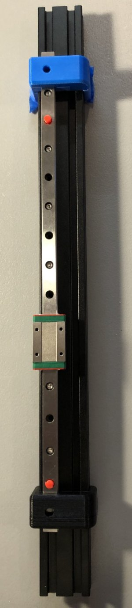
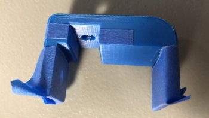
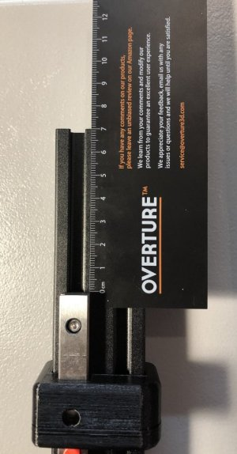
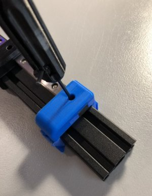
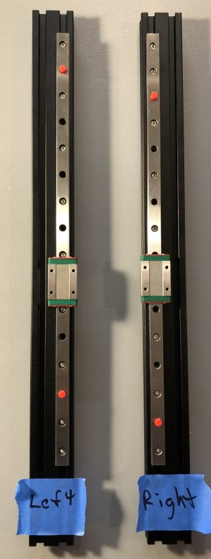

# My BLV MGN Cube

## Assembly Instructions

### Step 1 Build Y Rails

#### Parts

* 18x M3 T-Nuts (Hammer Head/Drop In Style/)
* 18x M3 8mm socket head cap screws (DIN912)
* 2x 496mm (~19.5in) 2040 extrusions (Standard 365mm Z frame)
* 2x 400mm linear rails
* 2x 2040 Jigs (2040_Jig.stl)
* 1x Left bottom X mount (X_mount_-_Bottom_left.stl)
* 1x Right bottom X mount (X_mount_-_Bottom_right.stl)

#### Assembly

1. Attach T-Nuts into every other hole of linear rail using M3 8mm socket head cap screws (See Fig 1.1). If there is an extra hole just double up at the end. Be careful not to let the carriages fall off the linear rails.
    
    \
    *fig 1.1*

2. Mount a rail on one of the 2040 extrusions and center over the left channel using the two 2040 jigs to properly center it (See Fig 1.2).

    \
    *fig 1.2*

1. If your jigs are a little loose you can use some tape placed equally on both sides to tighten them up (See Fig 1.2b). (See Fig 1.2b).

    \
    *fig 1.2b*

1. Offset the top of the rail by 70mm (See Fig 1.3). This is because the pulleys at the back of the printer take up more space than the tensioner at the front.

    \
    *fig 1.3*

1. Tighten the T-Nuts using the guides to make sure the linear rail remains centered over the channel (See Fig 1.4)

    \
    *fig 1.4*

1. Repeat the above steps to complete the right rail.

2. Here is what it should look like when you are done (See Fig 1.6)

    \
    *fig 1.6*
