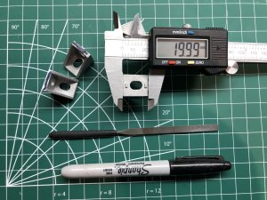
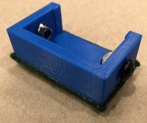
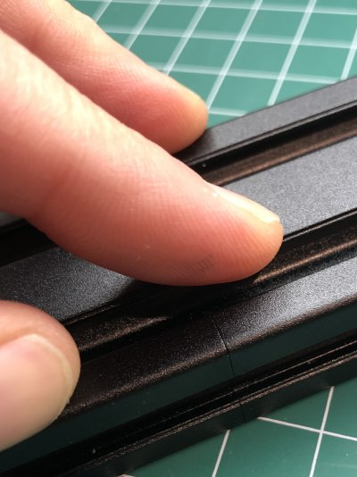
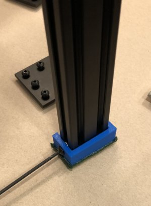
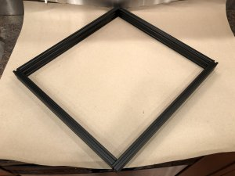
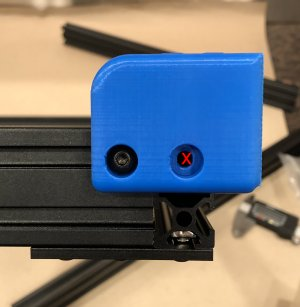
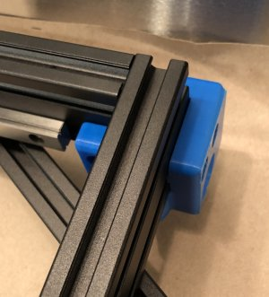
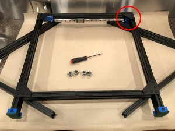
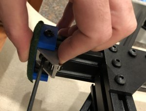
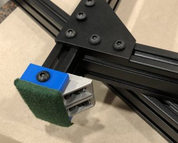

# My BLV MGN Cube

## Assembly Instructions

### Step 2 Left Side of Frame

#### Parts

* 47x M5 T-Nuts (Hammer Head/Drop In Style)
* 47x M5 8mm (or 10mm with washers) socket button head bolts
* 4x M3 8mm socket head cap bolts (DIN912)
* 11x 2020 M5 Angle Brackets (Brackets) See Fig 2.1
* 4x 90 Degree Joining Plates (Plates) See Fig 1.1
* 1x Left Y Rail (From last step)
* 1x 496mm (~19.5in) 2040 extrusions (Standard 365mm Z frame) 
* 2x 560mm (~22in) 2040 extrusions (Standard 365mm Z frame) 
* 2x Frame Feet (blv-mgn-cube-foot.stl)
* 1x Left bottom X mount (X_mount_-_Bottom_left.stl)
* 1x Left tensioner mount (Left_Tensioner_-_mount.stl

#### Tools
* [Framing Square](https://www.amazon.com/dp/B086R74VLK/ref=cm_sw_em_r_mt_dp_X7GcGbRTDNAJY)
* [M5 ball end tip screwdriver](https://www.amazon.com/dp/B0073T91II/ref=cm_sw_em_r_mt_dp_x9GcGbF16JR0Y) *Especially helpfull working with the brackets*
* M3 allen key
* 2x 440mm (~17.5in) 2040 Extrusion *used to support frame*
* 2x 496mm (~19.5in) 2040 Extrusion *used to support frame*
* 2x Plates
* 4x M5 T-Nuts
* 4x M5 8mm or 10mm socket button head screws
* [24" Bar Clamp](https://www.amazon.com/dp/B000FA0BMC/ref=cm_sw_em_r_mt_dp_KXHcGbPA7MM33?_encoding=UTF8&psc=1) *Either this or a helper to help compress everything*

#### Prep
1. Measure brackets and find 4 that are close to 20mm on one side. Might have to file them down or add a little tape. You'll use these to correctly position your first joint so the closer to 20mm the better. Mark these 4 brackets with a Sharpie.

    \
    *fig 2.1*

2. Install 2x M5 10mm bolts and T-nuts on each frame foot and attach some felt to prevent scratches.

    \
    *fig 2.2*

3. Find a the flattest surfance in your house. Hint, If you have a granite counter top that's probably the best. Make sure it's clean and then use one of your pieces of extrusion as a straight edge and a piece of paper as a thickness guage. Try and slip a piece of paper under the extrusion in a couple of places to test for flatness. Test multiple directions. Probably won't be perfect but pick the best counter you have. This will be the surface you use to build the frame.

    \
    *fig 2.3*

4. Check extrusion ends for squareness. We'll be relying on the extrusion ends being square to produce a square frame. The kits should all have pretty good cuts. To check for squareness, but two ends against each other (you should only see a hairline crack where they meet. Flip one around and check it the other way. If you have the same result you're good! If they aren't cut perfectly square or aren't to exact length it's going to be a challenge to get a square frame.

    \
    *fig 2.4*

5. Cover the surface in a large piece of craft paper to protect it. *Can't build a 3d printer if your significant other murders you for scratching their counter top with sharp edged extrusions*

#### Assembly

1. Attach the frame feet to the 560mm (~22in) 2040 extrusions.

    \
    *fig 2.5*

1. Arrange the spare extrusions, mentioned in the tools section, in a diamond. These will support the frame and keep it level even with the rails and the printed parts mounted on them.

    \
    *fig 2.6*

1. Attach M5 bolts and T-nuts to the 4 plates and lay out the extrusions with the plates installed but not tightened. Also now is the time to position the tensoner mount (Circiled in fig 2.10). Don't forget the M5 bolts/T-nuts for the tensoner mount (fig 2.8). Note one hole on the tensioner mount should remain empty (fig 2.7). Insert the top and right extrusions through the tensioner but keep the tensioners bolts loose (fig 2.9). 

    \
    *fig 2.7*

    \
    *fig 2.8*

    \
    *fig 2.9*

    \
    *fig 2.10*

2. Mount 2 of the 20mm lower brackets, that you prepared earlier, flush against feet in the cutout section of the feet. This will be used to make sure the 496mm extrusion is exactly 20mm inset, when attached to the 560mm extrusions. Tighten to the 560mm extrusion while keeping them snug with the bottom ledge in the foot cutout. Repeat for the other lower corner.

    \
    *fig 2.11*

    \
    *fig 2.12*

6. using pipe clamp ... or 3rd and 4th arms compress uprights slightly
7. now tighten down other side of lower angle brackets make sure that top is roughly aligned and compressed
8. check with a square (note it'll never be perfect. There will be a 0.5 mm of rock probably. Trust in your extrusions cuts. We'll be pushing everything tight together so that should make sure the error doesn't get out of control
9. Now position plates over bottom corners and tighten in the recommended pattern
10. On the top attach spare plates to the top extrusion (You'll use these to make sure you're flush on top)
11. use pipe clamp or 3rd and 4th arms to apply slight pressure to sides.
12. Now tighten plates while making sure the top plates are flush with the uprights.
13. Now install the remaining brackets in all the corners. Note only one bracket in the corner with the tensioner.
14. Remove the plates from the top rail. Check all joints. There should be no gaps anywhere
15. Tighten down the tensioner bolts
16. Install the Left bottom x mount