# My BLV MGN Cube - Assembly Instructions

## Step 3 Build Frame Sides

### Step 3 BoM

#### Left Side Parts
| Parts     | Quantity | Details | Example Links |
|-----------|:--------:|---------|---------------|
| M5 T-Nuts | 46 | Hammer Head/Drop In Style | |
| M5 8mm Socket Button Head Screws | 42 | DIN912 (Can substitue 10mm with 1mm washers for brackets)  | |
| M5 10mm Socket Button Head Screws | 4 | DIN912 (For tensioner) | |
| M3 8mm Socket Head Cap Screws | 4 | DIN912 | |
| [2020 M5 Angle Brackets](img/all-PlateVsBracket.jpeg) (Brackets) | 11 | | [Amazon](https://www.amazon.com/dp/B07GGLYX9V/ref=cm_sw_em_r_mt_dp_YZedGbMJETNH6?_encoding=UTF8&psc=1) |
| [90 Degree Joining Plates](img/all-PlateVsBracket.jpeg) (Plates) | 4 | | [Amazon](https://www.amazon.com/dp/B07RW2Z941/ref=cm_sw_em_r_mt_dp_U1edGbVK1DXZ4) |
| Left Y Rail | 1 | From step 2 | [Build Y Rails](guide/02-build-y-rails.md) |
| 496mm (~19.5in) 2040 extrusion | 1 | From standard 365mm Z frame | 
| 560mm (~22in) 2040 extrusions | 2 | From standard 365mm Z frame |

#### Right Side Parts
| Parts     | Quantity | Details | Example Links |
|-----------|:--------:|---------|---------------|
| M5 T-Nuts | 48 | Hammer Head/Drop In Style | |
| M5 8mm Socket Button Head Screws | 44 | DIN912 (Can substitue 10mm with 1mm washers for brackets)  | |
| M5 10mm Socket Button Head Screws | 4 | DIN912 (For tensioner) | |
| M3 8mm Socket Head Cap Screws | 4 | DIN912 | |
| [2020 M5 Angle Brackets](img/all-PlateVsBracket.jpeg) (Brackets) | 12 | | [Amazon](https://www.amazon.com/dp/B07GGLYX9V/ref=cm_sw_em_r_mt_dp_YZedGbMJETNH6?_encoding=UTF8&psc=1) |
| [90 Degree Joining Plates](img/all-PlateVsBracket.jpeg) (Plates) | 4 | | [Amazon](https://www.amazon.com/dp/B07RW2Z941/ref=cm_sw_em_r_mt_dp_U1edGbVK1DXZ4) |
| Right Y Rail | 1 | From step 2 | [Build Y Rails](guide/02-build-y-rails.md) |
| 496mm (~19.5in) 2040 extrusion | 1 | From standard 365mm Z frame |
| 560mm (~22in) 2040 extrusions | 2 | From standard 365mm Z frame |

#### Printed Parts Left Side
| Parts     | Quantity | Details |
|-----------|:--------:|---------|
| X_mount_-_Bottom_left.stl | 1 | [Printed Parts Spreadsheet](../notes/Printed Parts Spreadsheet.xlsx) |
| Left_Tensioner_-_mount.stl| 1 | [Printed Parts Spreadsheet](../notes/Printed Parts Spreadsheet.xlsx) |

#### Printed Parts Right Side
| Parts     | Quantity | Details |
|-----------|:--------:|---------|
| X_mount_-_Bottom_right.stl | 1 | [Printed Parts Spreadsheet](../notes/Printed Parts Spreadsheet.xlsx) |
| Right_Tensioner_-_mount.stl| 1 | [Printed Parts Spreadsheet](../notes/Printed Parts Spreadsheet.xlsx) |

#### Tools
| Parts     | Quantity | Details | Example Links |
|-----------|:--------:|---------|---------------|
| Framing Square | 1 | | [Amazon](https://www.amazon.com/dp/B086R74VLK/ref=cm_sw_em_r_mt_dp_X7GcGbRTDNAJY) |
| M5 ball end tip screwdriver | 1 | Especially helpfull working with the brackets | [Amazon](https://www.amazon.com/dp/B0073T91II/ref=cm_sw_em_r_mt_dp_x9GcGbF16JR0Y) |
| M3 Allen Key | 1 | | |
| 440mm (~17.5in) 2040 extrusions | 2 | From kit. Used to provide clearance while building frame | |
| 496mm (~19.5in) 2040 extrusions | 2 | From kit. Used to provide clearance while building frame | |
| [90 Degree Joining Plates](img/all-PlateVsBracket.jpeg) (Plates) | 2 | | [Amazon](https://www.amazon.com/dp/B07RW2Z941/ref=cm_sw_em_r_mt_dp_U1edGbVK1DXZ4) |
| M5 T-Nuts | 4 | Hammer Head/Drop In Style | |
| M5 8mm Socket Button Head Screws | 4 | DIN912 (Can substitue 10mm with 1mm washers for brackets)  | |
| 30" Bar Clamp | 1 | Or substitute a helper with steady hands | [Amazon](https://www.amazon.com/Yost-Tools-F124-24-F-Clamp/dp/B078V3NB7N/ref=sr_1_9?dchild=1&keywords=bar%2Bclamp&qid=1611447936&sr=8-9&th=1) |

### Prep

1. Measure brackets and find 4 that are close to 20mm on one side. Might have to file them down or add a little tape. You'll use these to correctly position your first joint so the closer to 20mm the better. Mark these 4 brackets with a Sharpie.

    \
    *fig 2.1*

3. Find a the flattest surfance in your house. Hint, If you have a granite counter top that's probably the best. Make sure it's clean and then use one of your pieces of extrusion as a straight edge and a piece of paper as a thickness guage. Try and slip a piece of paper under the extrusion in a couple of places to test for flatness. Test multiple directions. Probably won't be perfect but pick the best counter you have. This will be the surface you use to build the frame.

    \
    *fig 2.3*

4. Check extrusion ends for squareness. We'll be relying on the extrusion ends being square to produce a square frame. The kits should all have pretty good cuts. To check for squareness, but two ends against each other (you should only see a hairline crack where they meet. Flip one around and check it the other way. If you have the same result you're good! If they aren't cut perfectly square or aren't to exact length it's going to be a challenge to get a square frame.

    \
    *fig 2.4*

5. Cover the surface in a large piece of craft paper to protect it. *Can't build a 3d printer if your significant other murders you for scratching their counter top with sharp edged extrusions*

### Assembly - Left Side

1. Arrange the spare extrusions, mentioned in the tools section, in a diamond. These will support the frame and keep it level even with the rails and the printed parts mounted on them.

    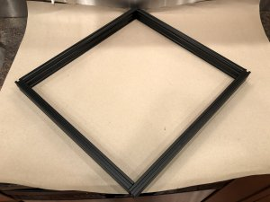\
    *fig 2.6*

2. Attach M5 bolts and T-nuts to the 4 plates and lay out the extrusions with the plates installed but not tightened. Also now is the time to position the tensoner mount (Circiled in fig 2.10). Don't forget the M5 bolts/T-nuts for the tensoner mount (fig 2.8). Note one hole on the tensioner mount should remain empty (fig 2.7). Insert the top and right extrusions through the tensioner but keep the tensioners bolts loose (fig 2.9). 

    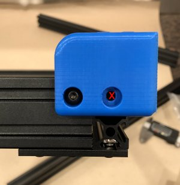\
    *fig 2.7*

    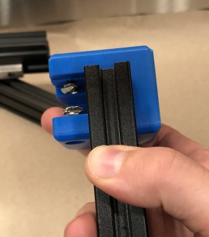\
    *fig 2.8*

    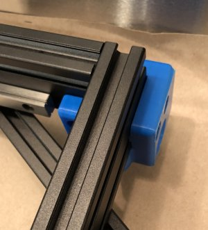\
    *fig 2.9*

    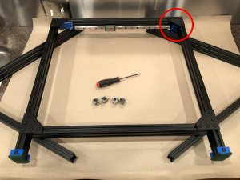\
    *fig 2.10*

3. Mount 2 of the 20mm lower brackets, that you prepared earlier, flush with the bottom of the extrusion. You can use one of the other pieces of extrusion to help with this, see fig 2.11. This will be used to make sure the 496mm extrusion is inset exactly 20mm when attached to the 560mm extrusions. Tighten to the 560mm extrusion while keeping them snug with the bottom ledge in the foot cutout. Repeat for the other lower corner. **_Ignore the blue feet in these pictures, I've moved that to a later step_**

    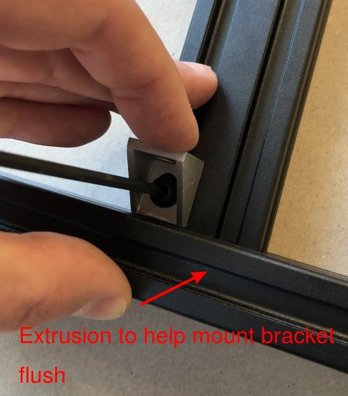\
    *fig 2.11*

    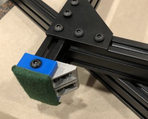\
    *fig 2.12*

5. Compress the bottom of the frame *gently* using bar clamp or your helper. Make sure the top of the frame extrusions don't have gaps. This will ensure things are pretty square. **DONT OVER TIGHTEN THE CLAMPS!! YOU CAN BEND THE EXTRUSION**

    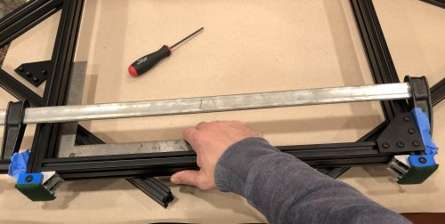\
    *fig 2.13*

6. Now check that things are fairly square, finish attaching the 4 lower brackets to the horizontal 496mm extrusion. All extrusions should butt up to one another and be flush. *We're trusting the extrusion ends to be square so don't worry if there is a little wiggle when checking the angle. We're just making sure things aren't grossly out of alignment*

    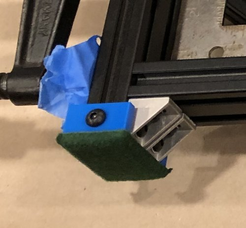\
    *fig 2.14*

7. Attach the 2 bottom plates. First finger tight and then use the tightening sequence in the figure.

    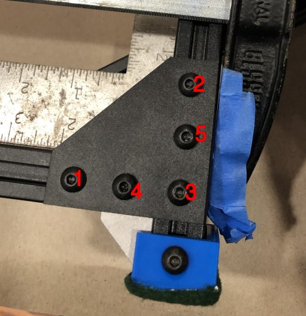\
    *fig 2.15*

8. This is what you should have when you are done. *Make sure all both bottom joints are flush*

    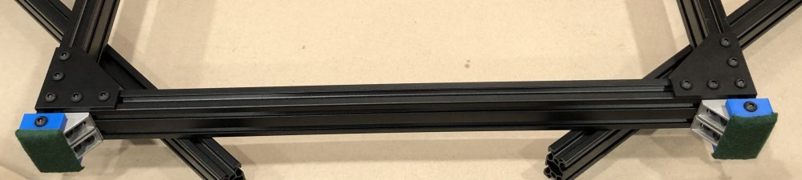\
    *fig 2.16*

10. On the top attach the 2 extra plates, mentioned in the tools list, to the top extrusion. These will help make sure you attach the extrusions flush with the top. *Also see fig 2.18*

    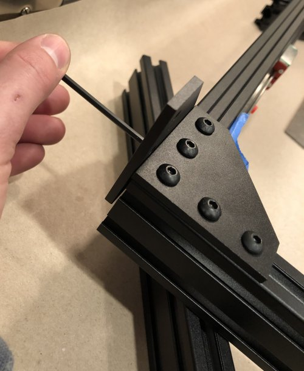\
    *fig 2.17*

11. Compress the top of the frame *gently* using bar clamp or your helper. This will ensure things are pretty square/tight/flush. **DONT OVER TIGHTEN THE CLAMPS!! YOU CAN BEND THE EXTRUSION**

    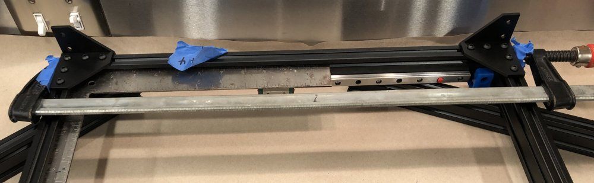\
    *fig 2.18*

12. Now tighten plates while making sure the 2x 496mm extrusions are flush with the top extrusion with the linear rail. *This is why we have those extra plates attached to the top*

    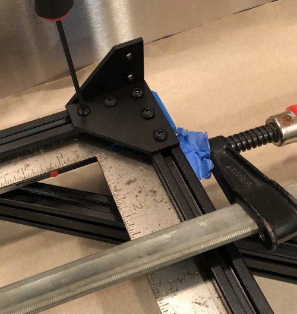\
    *fig 2.19*

    \
    *fig 2.19*

13. Remove the plates from the top rail, that you used for alignment. Check all joints. There should be no gaps anywhere

    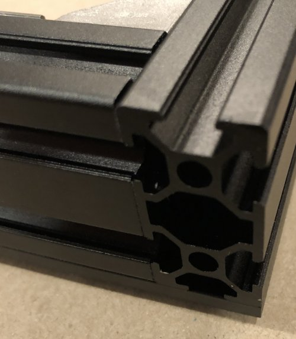\
    *fig 2.20*

14. Now install the remaining brackets in all the corners. *There is only one bracket in the corner with the tensioner*

    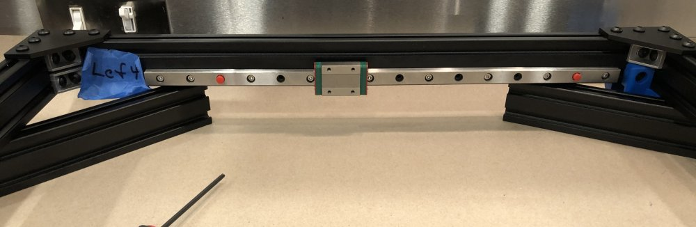\
    *fig 2.20*

    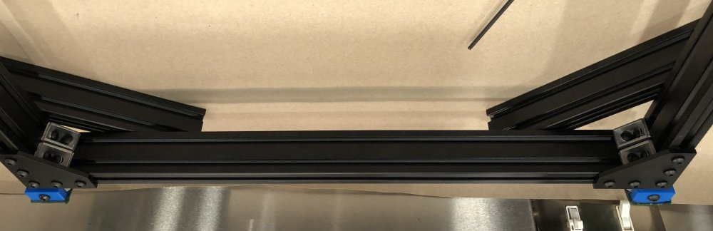\
    *fig 2.21*

15. Tighten down the tensioner bolts.

    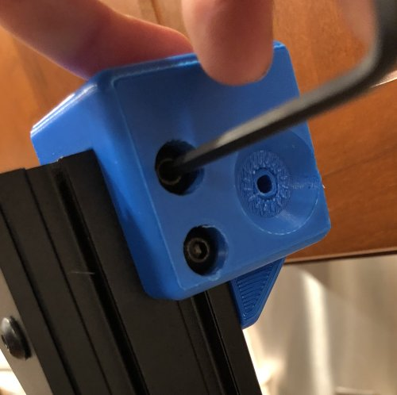\
    *fig 2.22*

16. Install the Left bottom x mount.

    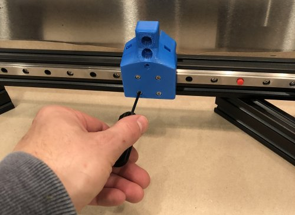\
    *fig 2.23*

17. Here is the final product.

    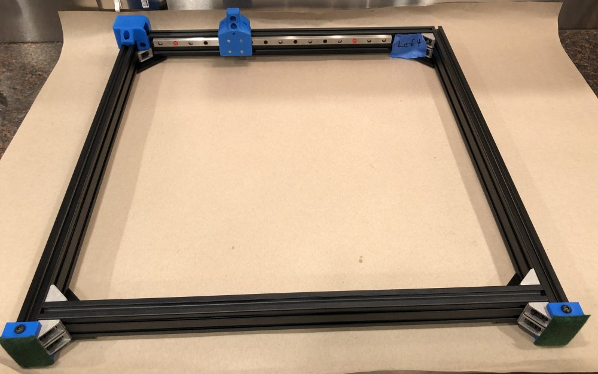\
    *fig 2.23*

### Assembly - Right Side
1. Use the [Right Side BoM](#right-side) and repeat the [Assembly - Left Side](#assembly---left-side) instructions.
2. One difference is that 12 brackets are used instead of 11. The corner with the tensioner takes 2 brackets for the right side.

