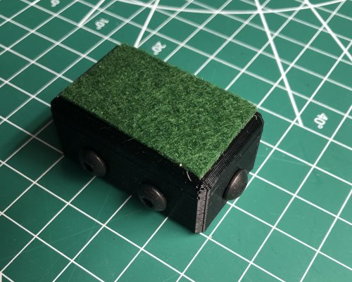
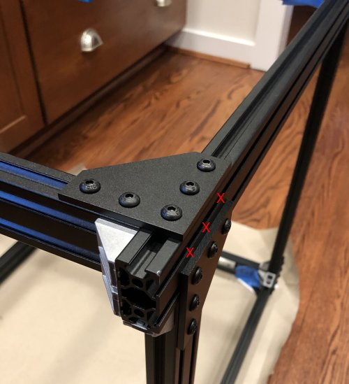

# My BLV MGN Cube - Assembly Instructions

## Step 4 Attach Frame Sides

### Step 4 BoM

#### Parts
| Parts     | Quantity | Details | Example Links |
|-----------|:--------:|---------|---------------|
| M5 T-Nuts | 74 | Hammer Head/Drop In Style | |
| M5 8mm Socket Button Head Screws | 62 | DIN912 (Can substitue 10mm with 1mm washers for brackets)  | |
| M5 10mm Socket Button Head Screws | 12 | DIN912 (For tensioner) | |
| [2020 M5 Angle Brackets](img/all-PlateVsBracket.jpeg) (Brackets) | 16 | | [Amazon](https://www.amazon.com/dp/B07GGLYX9V/ref=cm_sw_em_r_mt_dp_YZedGbMJETNH6?_encoding=UTF8&psc=1) |
| [90 Degree Joining Plates](img/all-PlateVsBracket.jpeg) (Plates) | 6 | | [Amazon](https://www.amazon.com/dp/B07RW2Z941/ref=cm_sw_em_r_mt_dp_U1edGbVK1DXZ4) |
| 496mm (~19.5in) 2040 extrusion | 3 | From standard 365mm Z frame | 

#### Printed Parts
| Parts     | Quantity | Details |
|-----------|:--------:|---------|
| FootLv2.stl | 2 | [Printed Parts Spreadsheet](../notes/Printed Parts Spreadsheet.xlsx) |
| FootRv2.stl | 2 | [Printed Parts Spreadsheet](../notes/Printed Parts Spreadsheet.xlsx) |

#### Tools
| Parts     | Quantity | Details | Example Links |
|-----------|:--------:|---------|---------------|
| Framing Square | 1 | | [Amazon](https://amzn.to/39Z2RTU) |
| M5 ball end tip screwdriver | 1 | Especially helpfull working with the brackets | [Amazon](https://amzn.to/2M6R1PJ) |
| Digital Calipers | 1 | | [Amazon](https://amzn.to/36cs0cx) |
| 30" Bar Clamp | 1 | Or substitute a helper with steady hands | [Amazon](https://amzn.to/3iT4TsL) |

### Prep
1. Install 3x M5 10mm bolts and T-nuts on each frame foot and attach some felt to prevent scratches.

    \
    *fig 4.1*

2. Measure brackets and find 4 that are close to 20mm on one side. Might have to file them down or add a little tape. You'll use these to correctly position your first joint so the closer to 20mm the better. Mark these 4 brackets with a Sharpie.

    \
    *fig 4.2*

3. Find a the flattest surfance in your house. Hint, If you have a granite counter top that's probably the best. Make sure it's clean and then use one of your pieces of extrusion as a straight edge and a piece of paper as a thickness guage. Try and slip a piece of paper under the extrusion in a couple of places to test for flatness. Test multiple directions. Probably won't be perfect but pick the best counter you have. This will be the surface you use to build the frame.

    \
    *fig 4.3*

4. Check extrusion ends for squareness. We'll be relying on the extrusion ends being square to produce a square frame. The kits should all have pretty good cuts. To check for squareness, but two ends against each other (you should only see a hairline crack where they meet. Flip one around and check it the other way. If you have the same result you're good! If they aren't cut perfectly square or aren't to exact length it's going to be a challenge to get a square frame.

    \
    *fig 4.4*

5. Cover the surface in a large piece of craft paper to protect it. *Can't build a 3d printer if your significant other murders you for scratching their counter top with sharp edged extrusions*

### Assembly

1. Flush mount 1 bracket on each leg of the left frame side. *Will be used to attach the cross members*

    \
    *fig 4.5*

    \
    *fig 4.6*

2. Attach 1st cross member using the bar clap to keep it flush against frame side. Attach one of the plates and finger tighten the plates and brackets.

    \
    *fig 4.7*

3. Check to make sure the cross member is square. Check multiple angles. It's fairly important to make sure its square as well as flush because you don't want to build tension in and possibly rack the cube at this point.

    \
    *fig 4.8*

4. Now that the cross member is square tighten down the plate and bracket in the following sequence

    \
    *fig 4.9*

5. Now that the 1st cross member is done, repeat for the steps above for other lower cross member.

    \
    *fig 4.10*

6. Now lets move to the upper back crossmember. This is the corner without the tensioner. Temporarily attach one plate to the top rail to help with aligning the crossmember and attach another plate to the left side back extrusion.

    \
    *fig 4.11*

7. Now attach the last cross member and make sure it is square before tightening down only the back plate.

    \
    *fig 4.12*

8. Add 2 brackets to reinforce the cross member and then put the left side and crossmembers on the floor. Shim up a corner to keep it from rocking.

    \
    *fig 4.13*

9. Remove the helper plate.

    \
    *fig 4.14*

10. Here's what it should look like at this point.

    \
    *fig 4.15*

11. Flush mount 1 bracket on each leg of the right frame side. You shoud tighten these down. *Will be used to attach the cross members*

    \
    *fig 4.16*

    \
    *fig 4.17*

12. Carefully place the right side on top of the cross members and finger tighten the leg brackets to the cross members. * You'll be using the brackets and legs together to make everything flush*

    \
    *fig 4.18*

13. Attach the plates that connect Right side to cross members. Try and keep things flush). *Note the pate attaches the the 2040 channel closest to the cross member and not the one closest to the other plate*

    \
    *fig 4.19*

14. Now tighten everything down making sure to keep everything as flush and square as possible. *I had to slightly adjust one cross member that didn't line up. I loosened as few bolts as possible and moved it closer. Still wasn't perfect but good enough.*

15. Now go around and add any missing brackets. This is what it should look like when it's done. Now would be a good time to measure and verify angles as well. **One more step after the pictures**

    \
    *fig 4.20*

    \
    *fig 4.21*

    \
    *fig 4.22*

    \
    *fig 4.23*

    \
    *fig 4.24*

16. Last add the feet.

    \
    *fig 4.25*

