# My BLV MGN Cube - Assembly Instructions

## Step 5 Build X Rail

### Step 5 BoM

#### Hardware
| Parts     | Quantity | Details | Example Links |
|-----------|:--------:|---------|---------------|
| M5 16mm Socket Button Head Screws | 2 | DIN9427 (Or M5 15mm) | |
| M5 10mm Socket Button Head Screws | 6 | DIN9427 | |
| M5 T-Nuts | 8 | Hammer Head/Drop In Style | |
| M3 T-Nuts | 9 | Hammer Head/Drop In Style | |
| M3 8mm Socket Head Cap Screws | 9 | DIN912 | |
| M3 Washers | 12 | DIN125 double up if they are 0.5mm | |
| M3 35mm Socket Head Cap Screws | 4 | DIN912 | |
| M3 50mm Socket Head Cap Screws | 4 | DIN912 | |
| 623zz Flanged Bearing | 8 | | [Aliexpress](https://s.click.aliexpress.com/e/_AdhoaW) |
| M3 Thin Square Nut | 4 | DIN562 | [Amazon](https://amzn.to/2MPCNTI) |
| M3 Lock Nut | 2 | DIN934 | |
| MGN12H 400mm Linear Rail | 1 | Quality ... Meh... | [Aliexpress](https://www.aliexpress.com/item/32829826159.html?spm=a2g0s.9042311.0.0.27424c4dwPelhS) |
| 460mm (~18in) 2020 extrusion | 1 | From standard 365mm Z frame |
| 3mm x 10.16cm zip ties (4in)  | 4-8 | ~2.5mm x ~120mm | [Amazon](https://amzn.to/3p2nDaE) |

#### Printed Parts
| Parts     | Quantity | Details |
|-----------|:--------:|---------|
| X_mount_-_Top_left.stl | 1 | [Printed Parts Settings](../partsSettings) |
| X_mount_-_Top_right.stl | 1 | [Printed Parts Settings](../partsSettings) |
| 2020_Jig.stl | 2 | [Printed Parts Settings](../partsSettings) |

#### Tools
| Parts     | Quantity | Details | Example Links |
|-----------|:--------:|---------|---------------|
| Needle Files | 1 set | | [Amazon](https://amzn.to/3cTLQgR) |
| M5 Ball End Tip Screwdriver | 1 | Especially helpfull working with the brackets | [Amazon](https://amzn.to/36TSnEy) |
| M3 Screwdriver | 1 | | [Amazon](https://amzn.to/3qNmEgs) |
| Build plate | 1 | Used to square the X beam | |

### Prep
1. Install M5 8mm screws and T-nuts in the top blocks.

    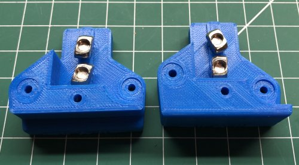\
    *fig 5.1*

2. Clean the nut traps and holes on the lower blocks using the needle files.

    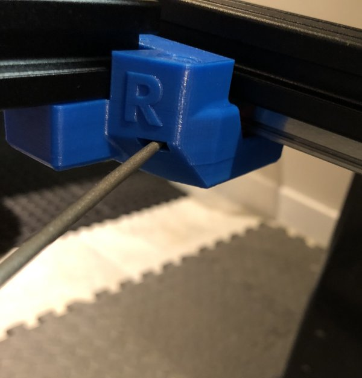\
    *fig 5.2*

    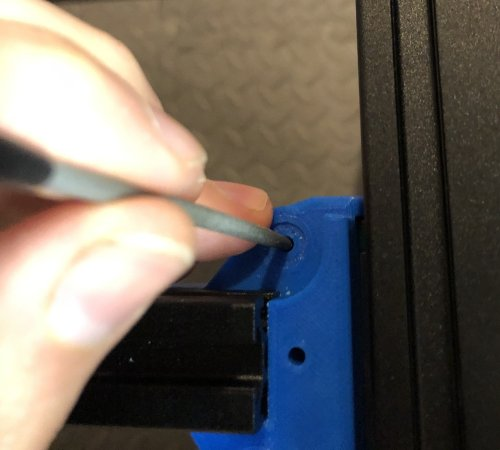\
    *fig 5.3*

### Assembly

1. Attach M5 16mm screws and M5 8mm screws with T-Nuts to both left and right lower blocks

    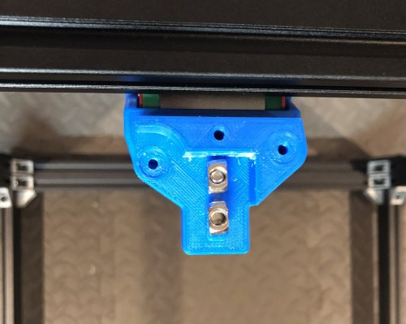\
    *fig 5.4*

2. Place the 460mm 2020 extrusion on top of the lower blocks. *should be a tight fit but still allow the rails to slide freely*

    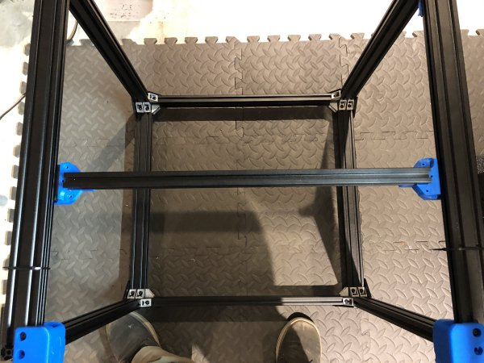\
    *fig 5.5*

3. Use Zip Ties to attach the build plate into the channel of the 2020 extrusion and channel of the back 2040 extrusion. *This is used to keep the 2020 extrusion perfectly parallel to the back 2040 extrusion*

    \
    *fig 5.5*

4. Tighten the lower block M5 10mm Screws and T-Nuts to firmly attach them to the 2020 extrusion. *Do this on both sides*

    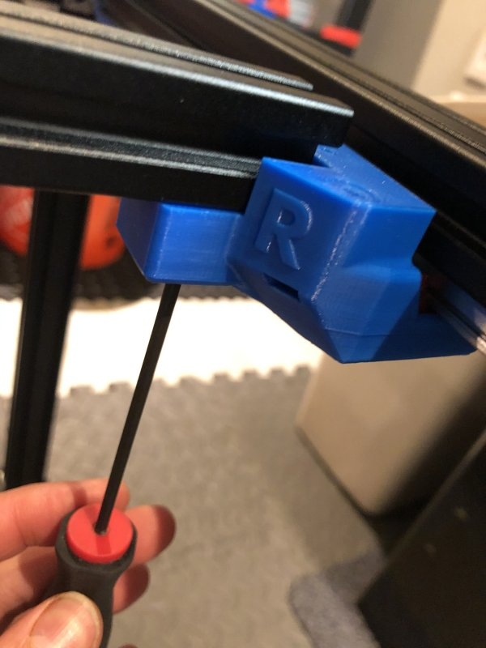\
    *fig 5.6*

5. Prepare the 2 bearing stacks for assembly. You'll be making a sandwich of washers and bearings. (washer->bottom flanged bearing->washer->top flanged bearing->washer)

    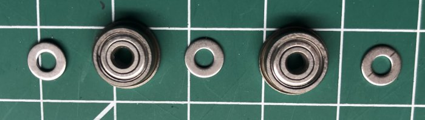\
    *fig 5.7*

6. Insert the 2x M3 35mm screws into the left upper block and assemble the bearing stacks on them. *If you have particularly skinny washers (0.5mm) you should double them to make 1mm*

    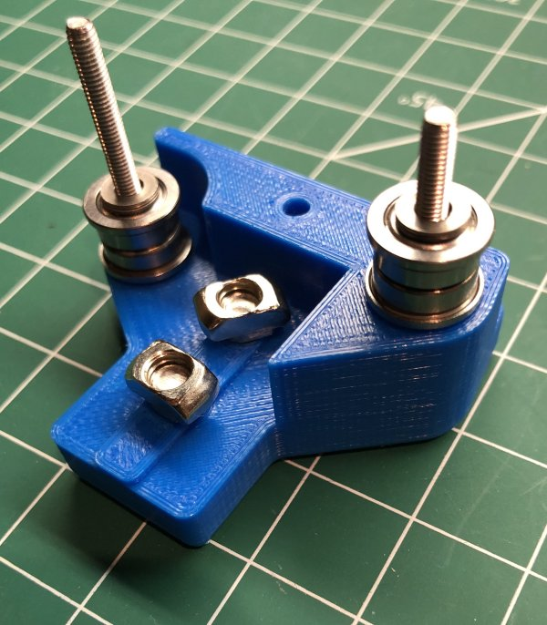\
    *fig 5.8*

7. While holding the bearing stack, flip the left upper block and slide the attached M3 35mm screws into the corresponding holes in the left lower block. **Don't insert M3's all the way as you still need to put nuts in the bottom block nut traps**

    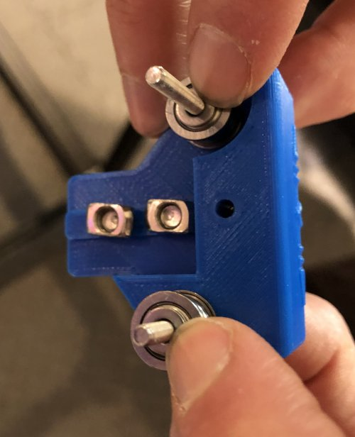\
    *fig 5.9*

    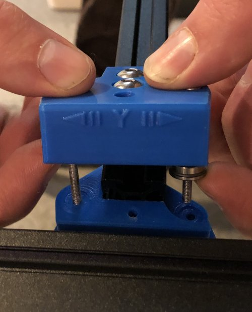\
    *fig 5.10*

8. Slide the M3 thin square nuts into the nut traps for the M3 35mm screws and then tighten them until they catch the nuts. Also insert the M3 50mm screw in the center hole. *Don't tighten any of the screws all the way down yet.

    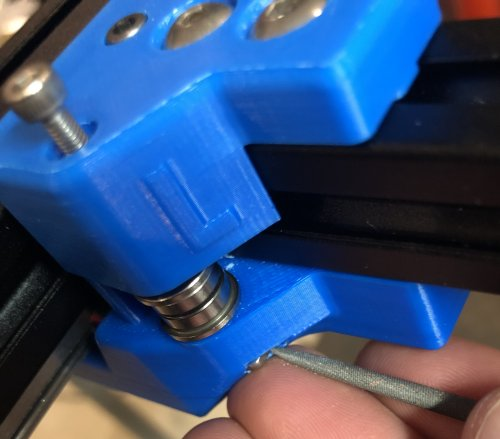\
    *fig 5.11*

9. Tighten M5 10mm and M5 16mm screws and T-Nuts in the left upper block into the 2020 extrusion.

    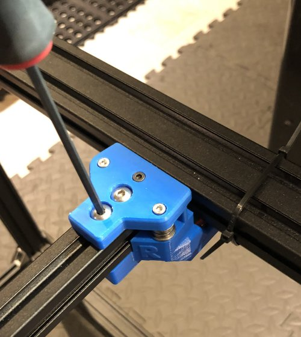\
    *fig 5.12*

10. Attach the M3 lock nut to the bottom of the M3 50mm screw and tighten it along with the 2x M3 35mm screws.

    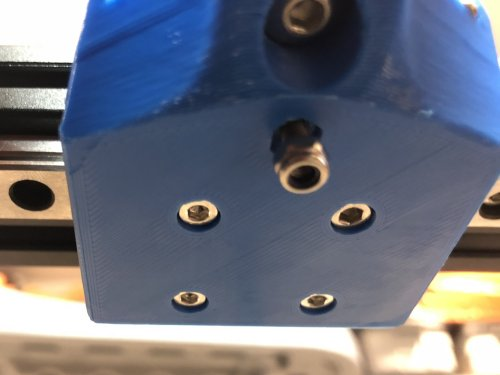\
    *fig 5.13*

13. Repeat the instruction above to complete the right side. *See below for completed view*

    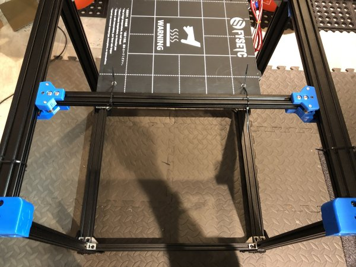\
    *fig 5.14*

14. Remove build plate you used to keep things square.

    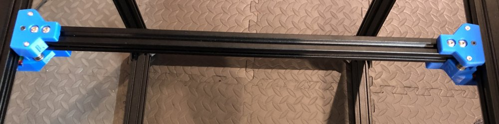\
    *fig 5.14*

15. Check bearings for free movement. Also check to make sure 2020 extrusion can slide forward and back smoothly on the linear rails. *careful not to slide carriages off of rails*

16. Attach 9x M3 8mm screws and M3 T-Nuts onto the 400mm linear rail.

    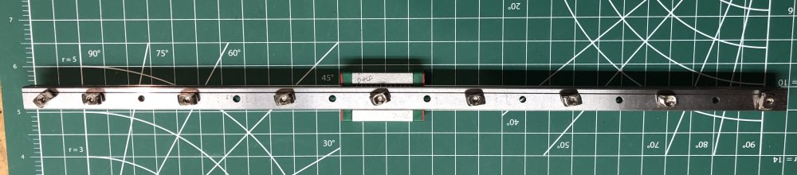\
    *fig 5.15*

17. Install the linear rail onto the top of the 2020 extrusion and attach the 2x 2020 jigs. *make sure the rail is centered between the left and right pulley blocks*

    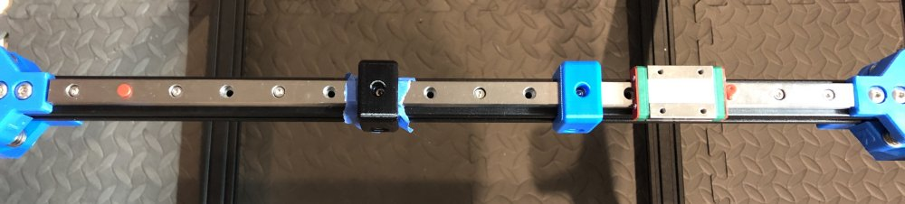\
    *fig 5.16*

18. If the 2020 jigs are loose on the 2020 extrusion or allow any play on the linear rail, apply tape to **both** sides of the jig to improve the fit while still keeping it centered. Also make sure to poke a hole so you can tighten the M3 screws with the jig in place.

    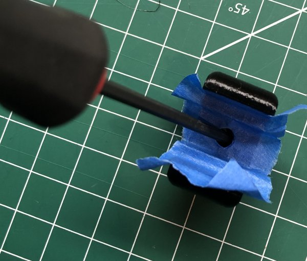\
    *fig 5.17*

19. Starting in the middle of the rail alternate tightening the M3 screws. Work your way to the ends on either side, moving the guides outward and tightening as you go.

    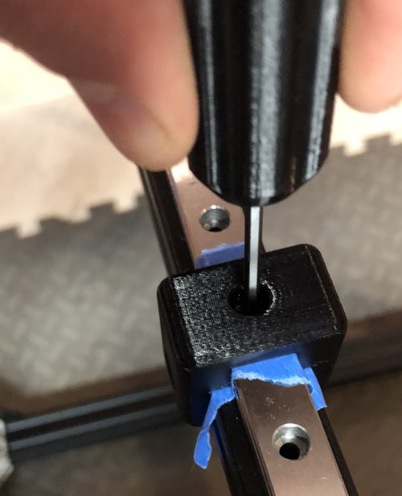\
    *fig 5.18*

    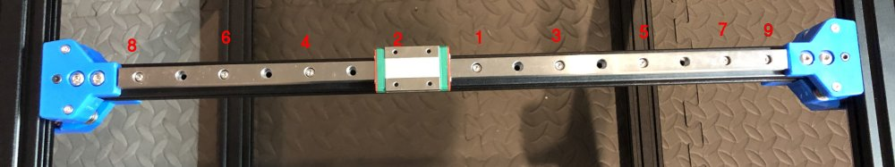\
    *fig 5.19*

20. You should now have a perfectly aligned X rail on smoothly sliding y rails.

    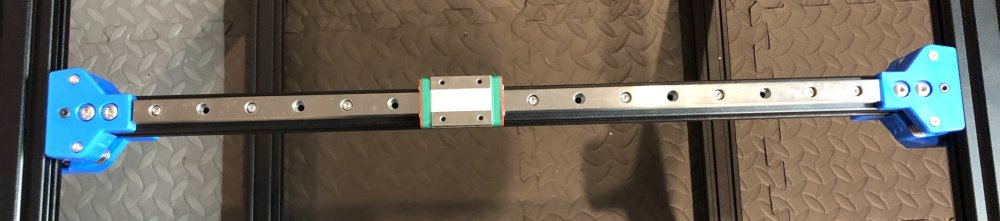\
    *fig 5.20*

