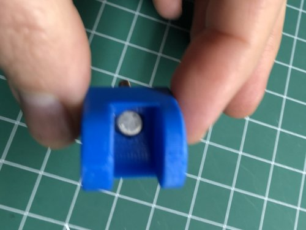
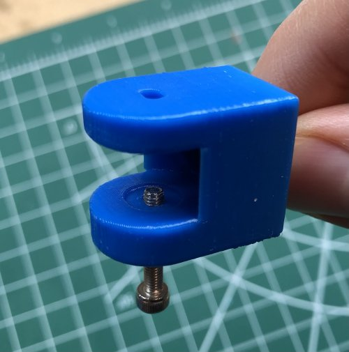
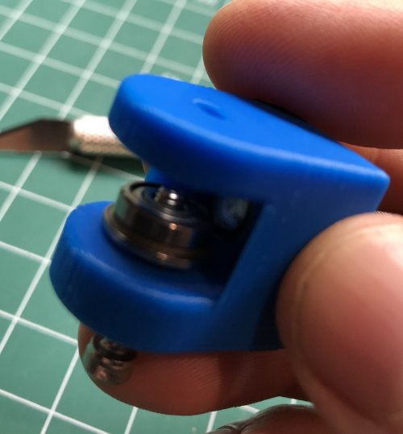
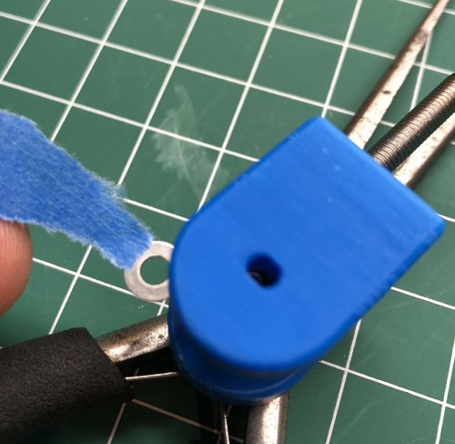
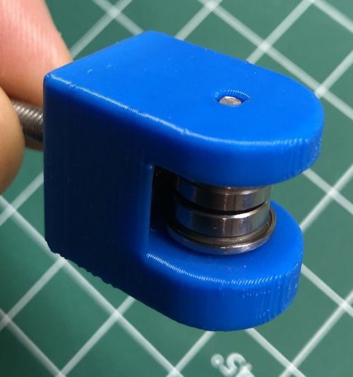
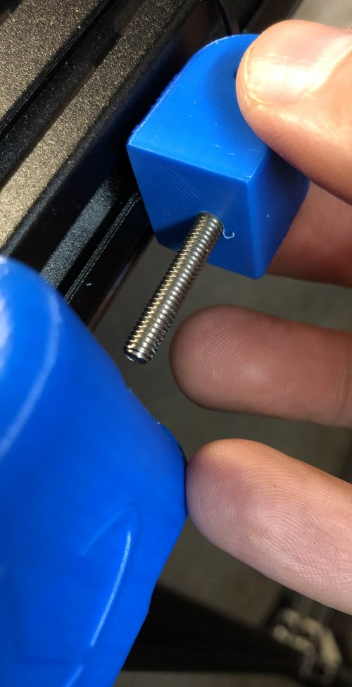
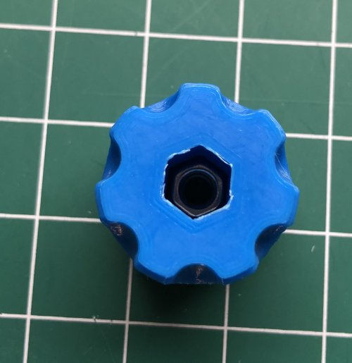
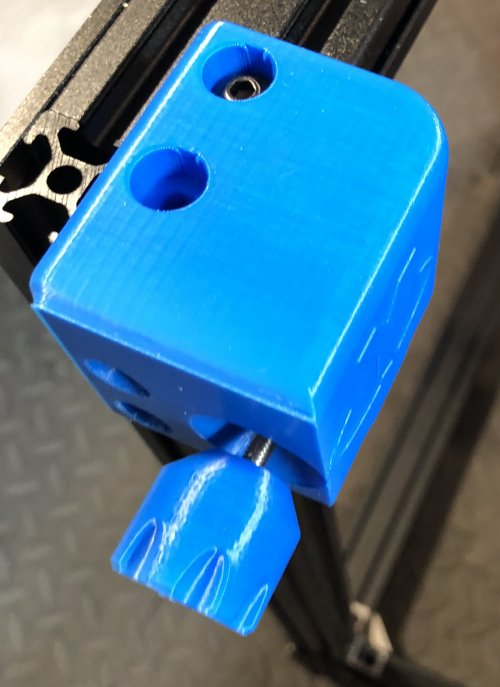

# My BLV MGN Cube - Step 6 Build Tensioners

## [Step 6 BoM Spreadsheet Link](https://docs.google.com/spreadsheets/d/e/2PACX-1vTVx7BvB3V7CozF2l4eWkNntWrHSjOawmrsi_bRSVxQLIGVlfZTYEGp8a6fHpENV6hV2cn9PrDLHHl0/pubhtml?gid=953419511&single=true)

### Assembly

1. Insert M4 into pulley holder.

    \
    *fig 6.1*

2. Partially insert the M3 18mm into the pulley holder.

    \
    *fig 6.2*

3. Slowly add the washer->bearing->washer->bearing->washer into the pulley holder advancing the M3 18mm as you go. You can use some blue tape as a helper. It's a pain. take your time and go slowly.

    \
    *fig 6.3*

    \
    *fig 6.4*

    \
    *fig 6.5*

4. Finish screwing in the M3 18mm until it's flush on both sides of the pulley. Don't worry if it starts splipping because the tensioner body will keep it in place. *This is really just acting as a dowel pin*

    \
    *fig 6.6*

5. Insert the pulley holder into the tensioner body.

    \
    *fig 6.7*

6. Now insert the M4 nut into the adjustment knob and screw onto the end of the m4 bolt. once it bites give it 5 turns.

    \
    *fig 6.8*

    \
    *fig 6.9*

7. Repeat for the right tensioner.