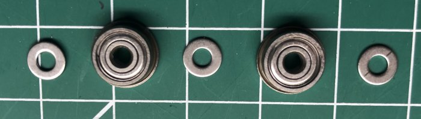

# My BLV MGN Cube - Assembly Instructions

## Step 6 Build Tensioners

### Step 6 BoM

#### Hardware
| Parts     | Quantity | Details | Example Links |
|-----------|:--------:|---------|---------------|
| M4 30mm Hex Head Screws | 2 | DIN???? | |
| M4 Nuts | 2 | DIN??? | |
| 623zz Flanged Bearing | 4 | |
| M3 washers | 6 | double up if they are 0.5mm | |
| M3 18mm Socket Head Cap Screws | 2 | DIN912 | |
| Blue Tape | 1 roll | | |

#### Printed Parts
| Parts     | Quantity | Details |
|-----------|:--------:|---------|
| Right_Tensioner_-_mount.stl | 1 | [Printed Parts Settings](../partsSettings) |
| Left_Tensioner_-_mount.stl | 1 | [Printed Parts Settings](../partsSettings) |
| Right_Tensioner_-_idler_holder.stl | 1 | [Printed Parts Settings](../partsSettings) |
| Left_Tensioner_-_idler_holder.stl | 1 | [Printed Parts Settings](../partsSettings) |

Right_Tensioner_-_idler_holder.stl

#### Tools
| Parts     | Quantity | Details | Example Links |
|-----------|:--------:|---------|---------------|
| M3 screwdriver | 1 | | |
| Blue Tape | 1 roll | | |

### Assembly

1. Insert M4 into pulley holder.

    \
    *fig 6.1*

2. Partially insert the M3 18mm into the pulley holder.

    \
    *fig 6.2*

3. Slowly add the washer->bearing->washer->bearing->washer into the pulley holder advancing the M3 18mm as you go. You can use some blue tape as a helper. It's a pain. take your time and go slowly.

    \
    *fig 6.3*

    \
    *fig 6.4*

    \
    *fig 6.5*

4. Finish screwing in the M3 18mm until it's flush on both sides of the pulley. Don't worry if it starts splipping because the tensioner body will keep it in place. *This is really just acting as a dowel pin*

    \
    *fig 6.6*

5. Insert the pulley holder into the tensioner body.

    \
    *fig 6.7*

6. Now insert the M4 nut into the adjustment knob and screw onto the end of the m4 bolt. once it bites give it 5 turns.

    \
    *fig 6.8*

    \
    *fig 6.9*

7. Repeat for the right tensioner.