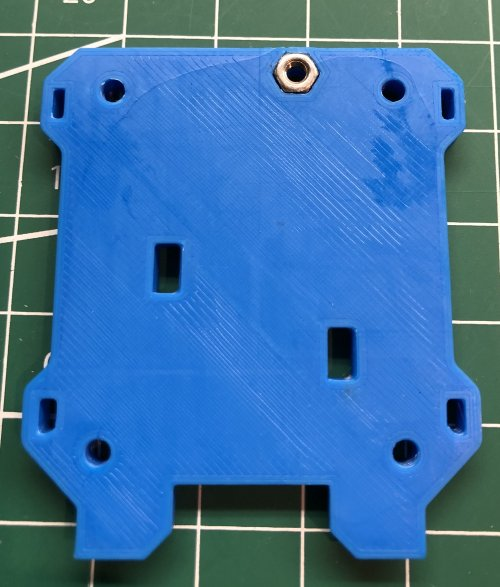

# My BLV MGN Cube - Assembly Instructions

## Step 7 Partially Build Hotend Carriage

### Step 7 BoM

#### Hardware
| Parts     | Quantity | Details | Example Links |
|-----------|:--------:|---------|---------------|
| M3 10mm Socket Head Cap Screws | 4 | DIN912 | |
| M3 40mm Socket Head Cap Screws | 4 | DIN912 | |
| M3 Nuts | 10 | DIN934 | |

#### Printed Parts
| Parts     | Quantity | Details |
|-----------|:--------:|---------|
| X_carriage_-_Bottom.stl | 1 | [Printed Parts Settings](../partsSettings) |
| X_carriage_-_Top.stl | 1 | [Printed Parts Settings](../partsSettings) |
| X_carriage_-_Front_plate.stl | 1 | [Printed Parts Settings](../partsSettings) |
| X_carriage_-_Rear_plate.stl | 1 | [Printed Parts Settings](../partsSettings) |

#### Tools
| Parts     | Quantity | Details | Example Links |
|-----------|:--------:|---------|---------------|
| M3 Screwdriver | 1 | | [Amazon](https://amzn.to/3qNmEgs) |
| 5.5 Hex wrench | 1 | Or Pliers | [Amazon](https://amzn.to/3bqH73V) |
| Blue Tape | 1 roll | | [Amazon](https://amzn.to/3ujyctH) |

### Prep
1. Clean support material out of any nut traps and holes.

    \
    *fig 7.1*

### Assembly
1. Prepare the x carrage top by inserting an M3 nut in the nut trap on the underside.

    \
    *fig 7.2*

1. Attach the X carriage top to the X linear rail with the 4 M3 x 10mm screws. *The top carriage isn't perfectly symmetrical so make sure that it is flush or overhangs the sides of the linear rail carriage*

    \
    *fig 7.3*

2. Prepare the front plate by inserting 2 of the M3 40mm screws and 4 of the M3 nuts into the nut traps. If the nuts are loose, use blue tape temporarily secure them.

    \
    *fig 7.4*

    \
    *fig 7.5*

3. Now carefully attach the front plate to the top plate by inserting the M3 40mm screws through the top plate thru holes.

    \
    *fig 7.6*

4. Prepare the back plate by inserting an M3 nut into the nut trap. *If it's loose secure it with blue tape*

    \
    *fig 7.7*

    \
    *fig 7.8*

5. Attach the back plate to the top plate.

    \
    *fig 7.9*

6. Hand tighten 2 M3 nuts onto the ends of the M3 40mm screws. Then carefully remove the blue tape you used to hold the nuts in place. They should now be held captive by the linear carriage and top carriage.

    \
    *fig 7.10*

    \
    *fig 7.11*

7. Finish tightening the nuts using the hex wrech and M3 screw driver.

    \
    *fig 7.12*

8. Using the remaining 2 M3 x 40mm screws secure the bottom plate by sandwitching it between the front and back plates. *You'll be removing the bottom plate in a later step do don't worry about attaching switches or the correct orientation.*

    \
    *fig 7.13*

    \
    *fig 7.14*

9. Here is what you should have when you are done. We just need enough to secure the belts. We'll do the rest later

    \
    *fig 7.15*

    \
    *fig 7.16*

