# My BLV MGN Cube - Assembly Instructions

## Step 8 Partially Build Back Corners

### Step 8 BoM

#### Hardware Left Block
| Parts     | Quantity | Details | Example Links |
|-----------|:--------:|---------|---------------|
| M5 10mm Socket Button Head Screws | 7 | DIN9427 | |
| M5 T-Nuts | 7 | Hammer Head/Drop In Style | |
| M3 Washers | 9 | DIN125 double up if they are 0.5mm | |
| M3 35mm Socket Head Cap Screws | 5 | DIN912 | |
| 623zz Flanged Bearing | 6 | | [Aliexpress](https://s.click.aliexpress.com/e/_AdhoaW) |
| XY Stepper Motor | 1 | STEPPERONLINE 17HM19-2004S1 | [STEPPERONLINE](https://www.omc-stepperonline.com/nema-17-bipolar-0-9deg-46ncm-65-1oz-in-2a-2-8v-42x42x48mm-4-wires-full-d-cut-shaft.html?search=17HM19-2004S) |
| GT2 Pulley | 1 | 16 Tooth W/5mm bore | [Aliexpres](https://s.click.aliexpress.com/e/_9y5zje) |

#### Hardware Right Block
| Parts     | Quantity | Details | Example Links |
|-----------|:--------:|---------|---------------|
| M5 10mm Socket Button Head Screws | 6 | DIN9427 | |
| M5 T-Nuts | 6 | Hammer Head/Drop In Style | |
| M3 Washers | 9 | DIN125 double up if they are 0.5mm | |
| M3 35mm Socket Head Cap Screws | 3 | DIN912 | |
| M3 25mm Socket Head Cap Screws | 2 | DIN912 | |
| 623zz Flanged Bearing | 6 | | [Aliexpress](https://s.click.aliexpress.com/e/_AdhoaW) |
| XY Stepper Motor | 1 | STEPPERONLINE 17HM19-2004S | |
| GT2 Pulley | 1 | 16 Tooth W/5mm bore | [Aliexpres](https://s.click.aliexpress.com/e/_9y5zje) |

#### Printed Parts Left Block
| Parts     | Quantity | Details |
|-----------|:--------:|---------|
| Left_corner_-_block.stl | 1 | [Printed Parts Settings](../partsSettings) |

#### Printed Parts Right Block
| Parts     | Quantity | Details |
|-----------|:--------:|---------|
| Right_corner_-_Block.stl | 1 | [Printed Parts Settings](../partsSettings) |
| Right_corner_-_bottom_aux.stl | 1 | [Printed Parts Settings](../partsSettings) |

#### Tools
| Parts     | Quantity | Details | Example Links |
|-----------|:--------:|---------|---------------|
| M5 Ball End Tip Screwdriver | 1 | Especially helpfull working with the brackets | [Amazon](https://amzn.to/36TSnEy) |
| M3 Screwdriver | 1 | | [Amazon](https://amzn.to/3qNmEgs) |
| 2mm Allen Wrench | 1 | For pulley | [Amazon](https://amzn.to/3qNmEgs) |
| M3 Nuts | 11 | DIN934 6 to temporarily secure the idlers, 5 to temporarily attach motors | |

### Prep
1. Install 4x M5 10mm screws and T-nuts in the left corner block.

    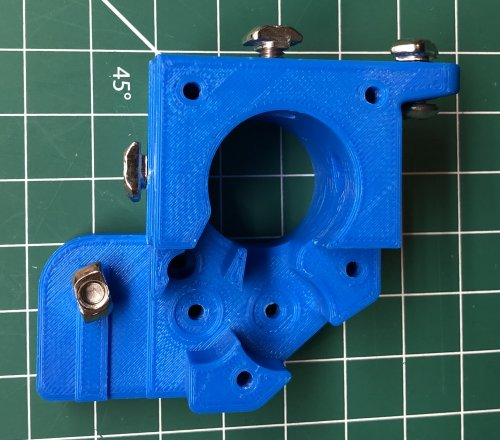\
    *fig 8.1*

2. Install 3x M5 10mm screws and T-nuts in the right corner block and 1x M5 10mm screw and T-nut in the right aux block.

    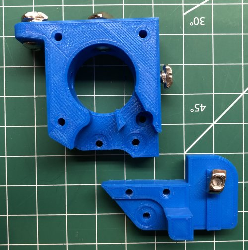\
    *fig 8.2*

### Assembly
1. Attach left block to the upper left inside corner of the frame.

    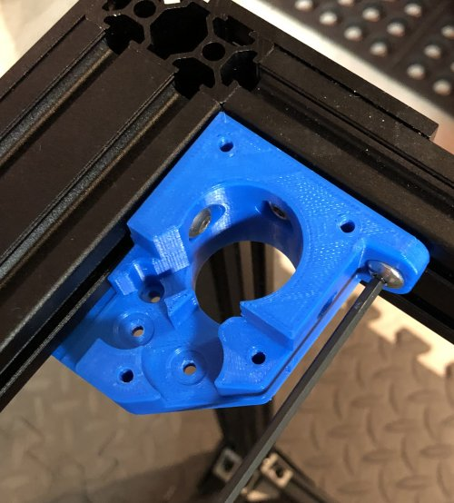\
    *fig 8.3*

2. Insert 3x M3 35mm screws in to the lower left block. Use some blue tape to keep them from falling out.

    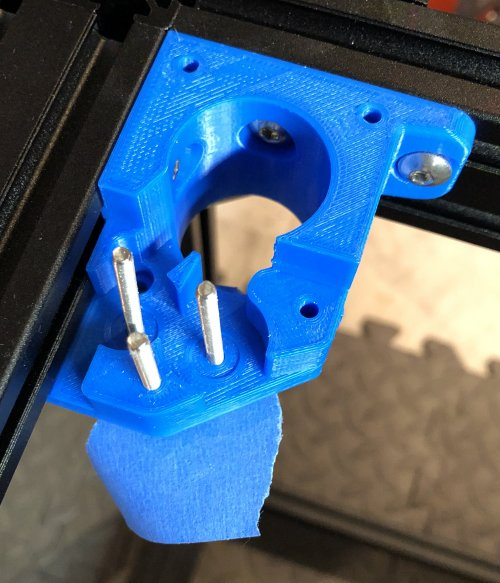\
    *fig 8.4*

3. Attach right block to the upper right inside corner of the frame.

    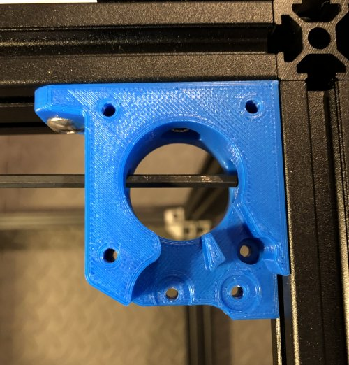\
    *fig 8.5*

4. Position the Right aux block so it lines up with the 2 holes on the front edge of the right block.

    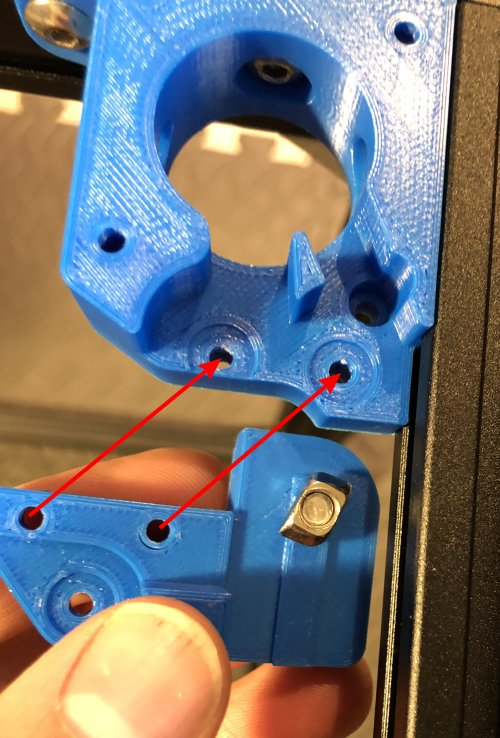\
    *fig 8.6*

5. Insert 3x M3 35mm screws through the right aux block. 2 will also go through the right block. Use blue tape to keep them from falling out.

    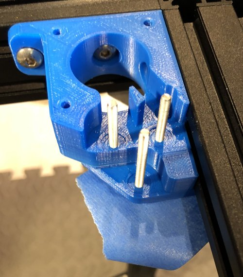\
    *fig 8.7*

6. Tighten the M5 10mm and T-nut on the bottom of the right aux block.

    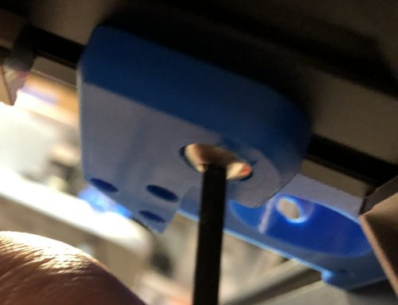\
    *fig 8.8*

7. Assemble a idler stack on each M3 35mm screw. As before you'll be making a sandwich of washers and bearings. *(washer->bottom flanged bearing->washer->top flanged bearing->washer)*

    \
    *fig 8.7*

    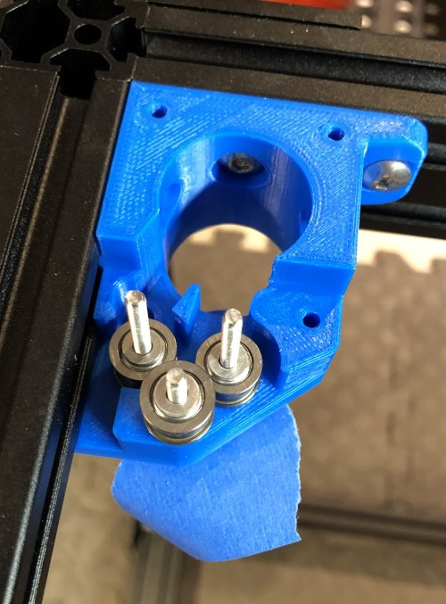\
    *fig 8.8*

    \
    *fig 8.9*

8. Temporarily use M3 nuts to hold the idlers on the M3 25mm screws and remove the blue tape. *We're doing this so we can run the belts before things get covered up*

    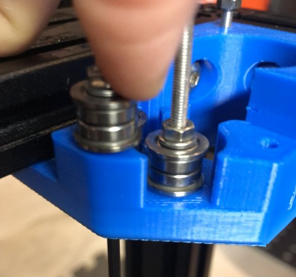\
    *fig 8.10*

    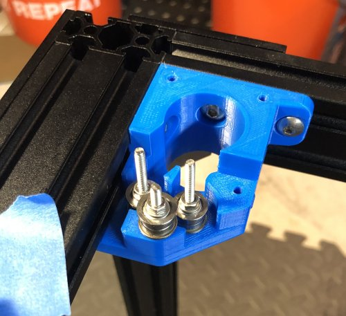\
    *fig 8.11*

    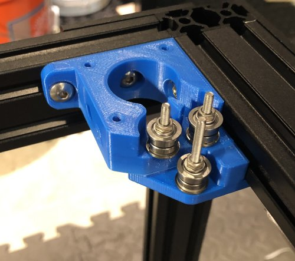\
    *fig 8.12*

9. Calculate the position of the Left pulley on the stepper. I wound up at 6.95mm from the stepper to the bottom of the pulley.

    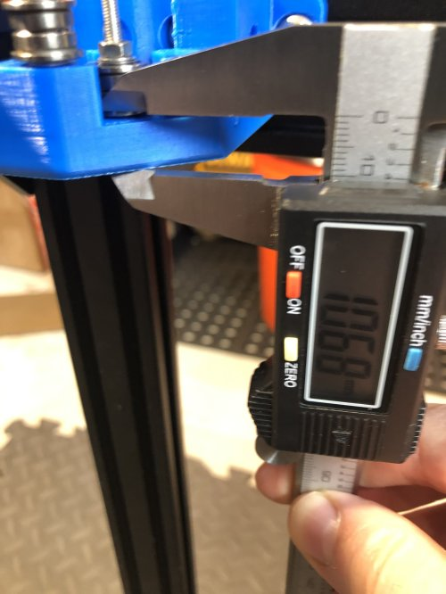\
    *fig 8.13*

    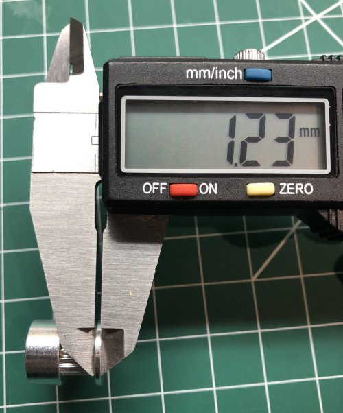\
    *fig 8.14*

    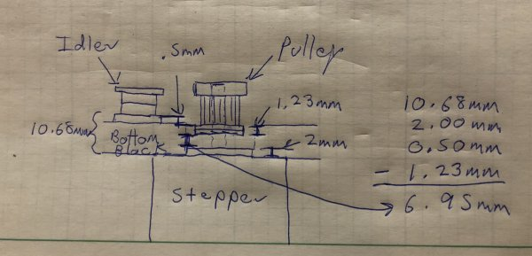\
    *fig 8.15*

10. Set the Left pulley on the Stepper according to the measurement and carefully tighten. Don't overtighten!! Stripping set screws is no fun.

    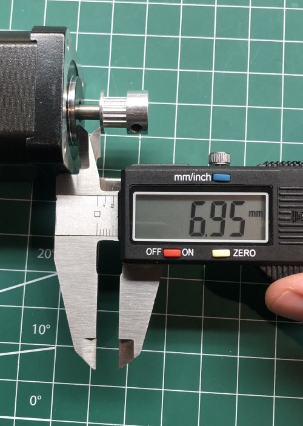\
    *fig 8.16*

11. Temporarily attach the left stepper to the bottom block using 2x M3 35mm with M3 nuts as spacers.

    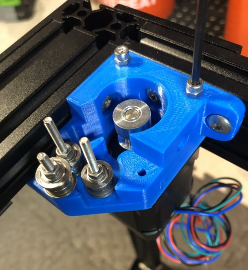\
    *fig 8.17*

12. Calculate the position of the Right pulley on the stepper. I wound up at 7.27mm from the stepper to the bottom of the pulley.

    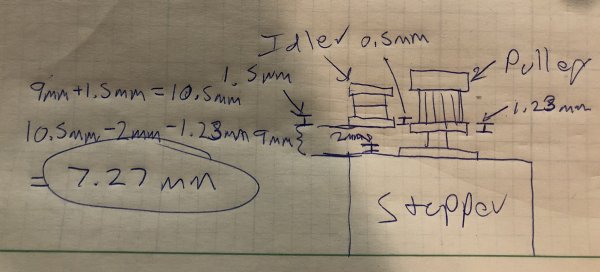\
    *fig 8.18*

13. Set the Right pulley on the Stepper according to the measurement and carefully tighten. Don't overtighten!! Stripping set screws is no fun.

    \
    *fig 8.19*

    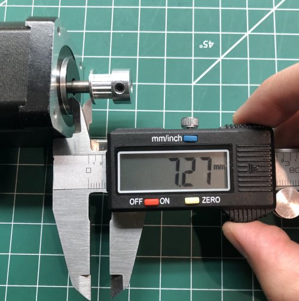\
    *fig 8.20*

14. Temporarily attach the right stepper to the bottom block using 3x M3 25mm with M3 nuts as spacers.

    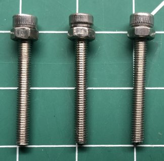\
    *fig 8.21*

    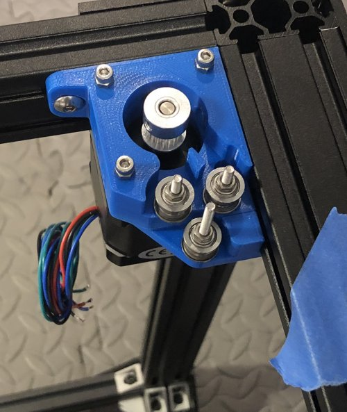\
    *fig 8.22*

15. Here's what it should look like when this step is done.

    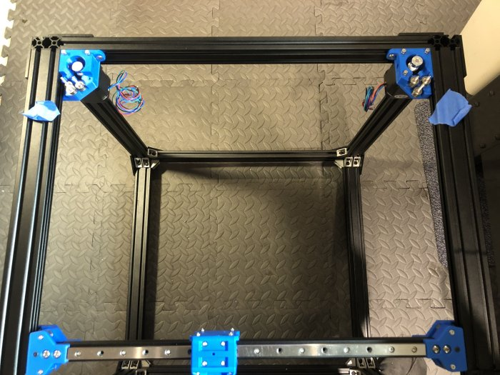\
    *fig 8.23*

