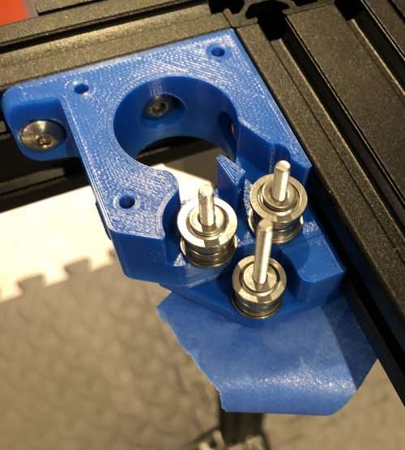
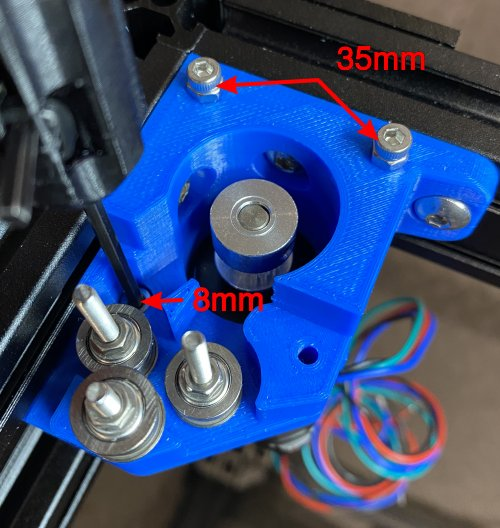
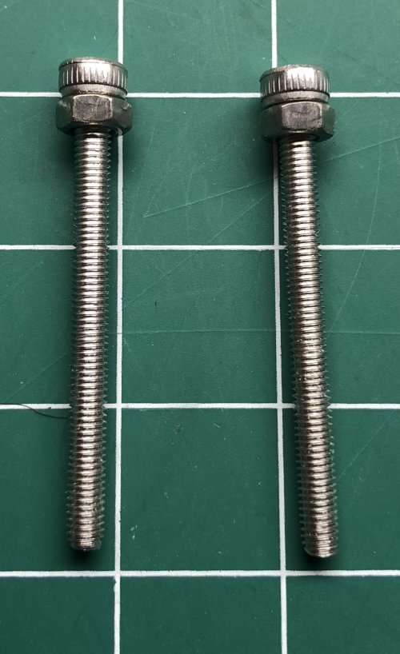
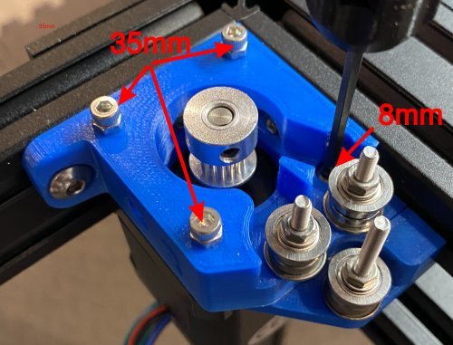

# My BLV MGN Cube - Step 8 Partially Build Back Corners

## [Step 8 BoM Spreadsheet Link](https://docs.google.com/spreadsheets/d/e/2PACX-1vTVx7BvB3V7CozF2l4eWkNntWrHSjOawmrsi_bRSVxQLIGVlfZTYEGp8a6fHpENV6hV2cn9PrDLHHl0/pubhtml?gid=1894903960&single=true)

### Prep
1. Install 4x M5 10mm screws and T-nuts in the left corner block.

    \
    *fig 8.1*

2. Install 3x M5 10mm screws and T-nuts in the right corner block and 1x M5 10mm screw and T-nut in the right aux block.

    \
    *fig 8.2*

### Assembly
1. Attach left block to the upper left inside corner of the frame.

    \
    *fig 8.3*

2. Insert 3x M3 35mm screws in to the lower left block. Use some blue tape to keep them from falling out.

    \
    *fig 8.4*

3. Attach right block to the upper right inside corner of the frame.

    \
    *fig 8.5*

4. Position the Right aux block so it lines up with the 2 holes on the front edge of the right block.

    \
    *fig 8.6*

5. Insert 3x M3 35mm screws through the right aux block. 2 will also go through the right block. Use blue tape to keep them from falling out.

    \
    *fig 8.7*

6. Tighten the M5 10mm and T-nut on the bottom of the right aux block.

    \
    *fig 8.8*

7. Assemble a idler stack on each M3 35mm screw. As before you'll be making a sandwich of washers and bearings. *(washer->bottom flanged bearing->washer->top flanged bearing->washer)*

    \
    *fig 8.7*

    \
    *fig 8.8*

    \
    *fig 8.9*

8. Temporarily use M3 nuts to hold the idlers on the M3 25mm screws and remove the blue tape. *We're doing this so we can run the belts before things get covered up*

    \
    *fig 8.10*

    \
    *fig 8.11*

    \
    *fig 8.12*

9. Calculate the position of the Left pulley on the stepper. I wound up at 6.95mm from the stepper to the bottom of the pulley.

    \
    *fig 8.13*

    \
    *fig 8.14*

    \
    *fig 8.15*

10. Set the Left pulley on the Stepper according to the measurement and carefully tighten. Don't overtighten!! Stripping set screws is no fun.

    \
    *fig 8.16*

11. Attach the left stepper to the bottom block using 1x M3 8mm (permanent) and 2x M3 35mm with M3 nuts as spacers (temporary).

    \
    *fig 8.17*

12. Calculate the position of the Right pulley on the stepper. I wound up at 7.27mm from the stepper to the bottom of the pulley.

    \
    *fig 8.18*

13. Set the Right pulley on the Stepper according to the measurement and carefully tighten. Don't overtighten!! Stripping set screws is no fun.

    \
    *fig 8.19*

    \
    *fig 8.20*

14. Attach the right stepper to the bottom block using 1x M3 8mm (permanent) and 3x M3 35mm with M3 nuts as spacers (temporary).

    \
    *fig 8.21*

    \
    *fig 8.22*

15. Here's what it should look like when this step is done.

    \
    *fig 8.23*

