# My BLV MGN Cube - Step 9 Install Belts

## [Step 9 BoM Spreadsheet Link](https://docs.google.com/spreadsheets/d/e/2PACX-1vTVx7BvB3V7CozF2l4eWkNntWrHSjOawmrsi_bRSVxQLIGVlfZTYEGp8a6fHpENV6hV2cn9PrDLHHl0/pubhtml?gid=1143742039&single=true)

### Assembly
1. Thread the end of the belt through the front left opening on the X-carriage. A zip tie can be handy to guide the belt through the hole. Stick the zip tie into the hole far enough that it bends and goes parallel to the extrusion. Then thread the belt along the zip tie and out the hole.

    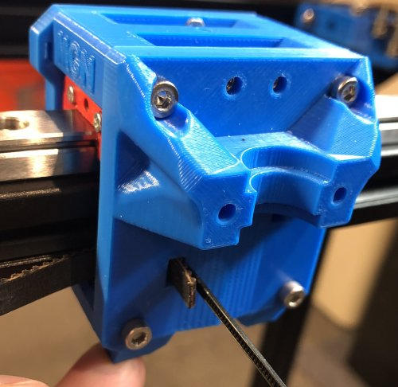\
    *fig 9.1*

2. Secure the end of the belt with 2 zip ties. Ideally the teeth of the belt would be folded together but I did the reverse to keep the belt as close to the extrusion as possible. Pay attention to the zip tie orientation to prevent the end of the zip tie from rubbing.

    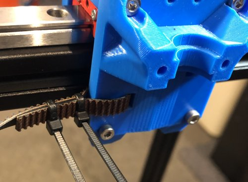\
    *fig 9.2*

3. Thread the belt through the front idler on the Left X mount.

    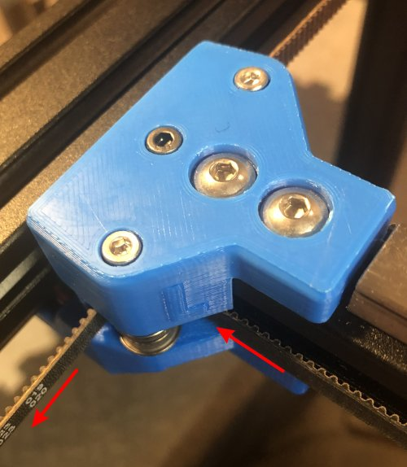\
    *fig 9.3*

4. Remove the idler holder from the Left tensioner block and thread the belt through the idler holder.

    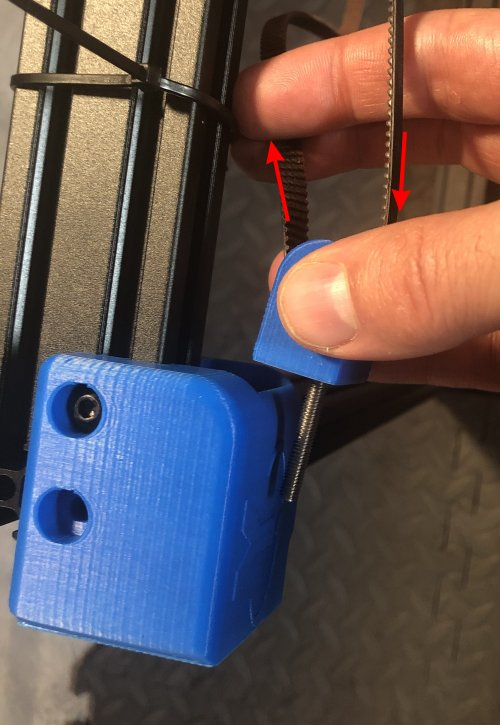\
    *fig 9.4*

5. Reattach the idler holder to the tensioner block using the tensioner knob. Once the nut grabs M4 bolt give it 6-7 full turns to provide the tensioner some headroom if you need to loosen it after attaching the belts. *If the nut is loose you can use the big end of a zip tie to hold it in place*

    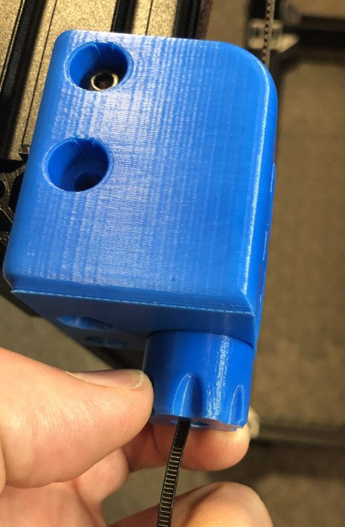\
    *fig 9.5*

6. Now run the belt past the Left X mount in the gap between the extrusion.

    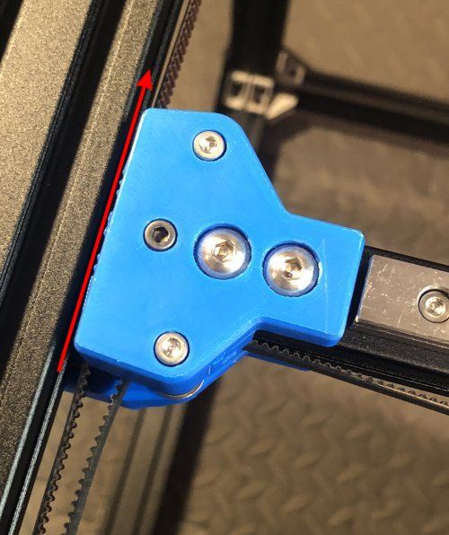\
    *fig 9.6*

7. Thread the belt through the Left corner block and over the stepper pulley.

    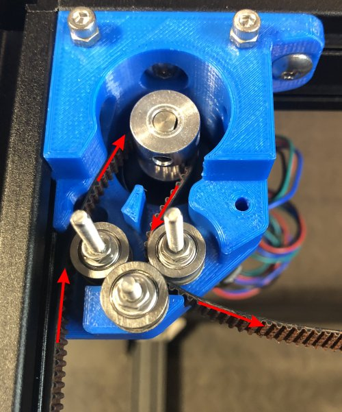\
    *fig 9.7*

8. Now flip the belt and run through the lower idler on the Right block. *the flat part of the belt should be against the right idler*

    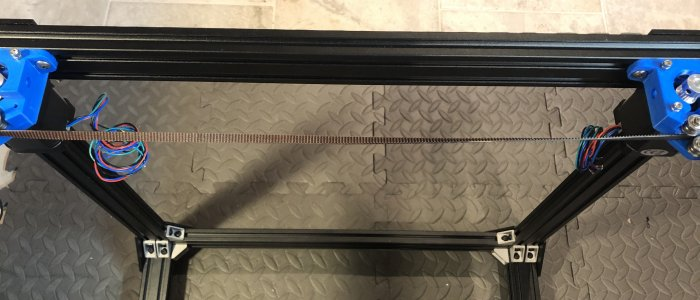\
    *fig 9.8*

    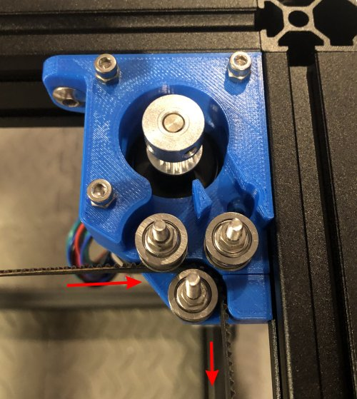\
    *fig 9.9*

9. Thread the belt through the back idler on the Right X mount. *you can use a zip tie as a guide*

    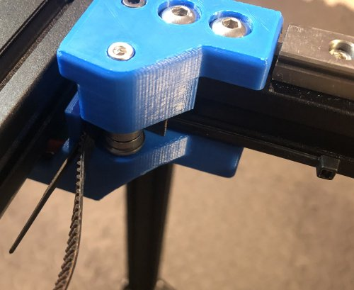\
    *fig 9.10*

10. Thread the end of the belt through the back right opening on the X-carriage. A zip tie can be handy to guide the belt through the hole. Stick the zip tie into the hole far enough that it bends and goes parallel to the extrusion. Then thread the belt along the zip tie and out the hole.

    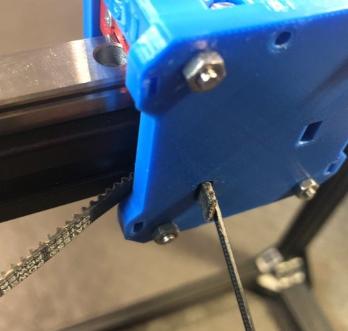\
    *fig 9.11*

11. Using a pen wedged between the X carriage and the front Left X mount idler pull on the belt end to take up the slack. **Don't pull hard/tighten the belt.** You need both belts in place otherwise you'll rack the X rail and in any case the back corner pulleys are only partially secured. We'll use the tensioners later in the build to properly tension the belts.

    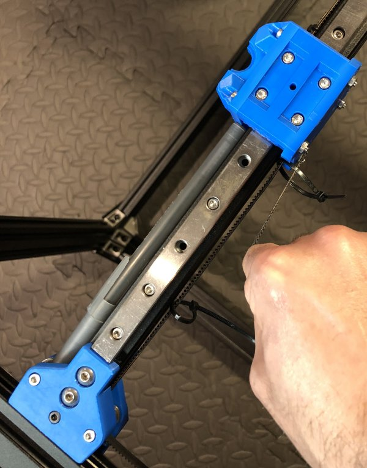\
    *fig 9.12*

12. Secure the belt end, teeth facing out, with 2 zip ties. Teeth facing out isn't ideal but it's better to have the belt more in line than have a tooth to tooth connection. Also pay attention the the zip tie orientation/spacing so they won't get in the way during operation. Also now is the time to trim the belt. You'll use the remainder for the next run. I personally left 50mm, from the edge of the x carrage and had plenty for the 2nd belt run.

    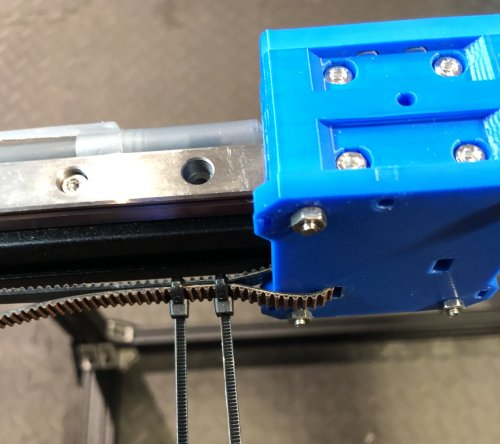\
    *fig 9.13*

13. Here is what it should look like at this point with the lower belt attached.

    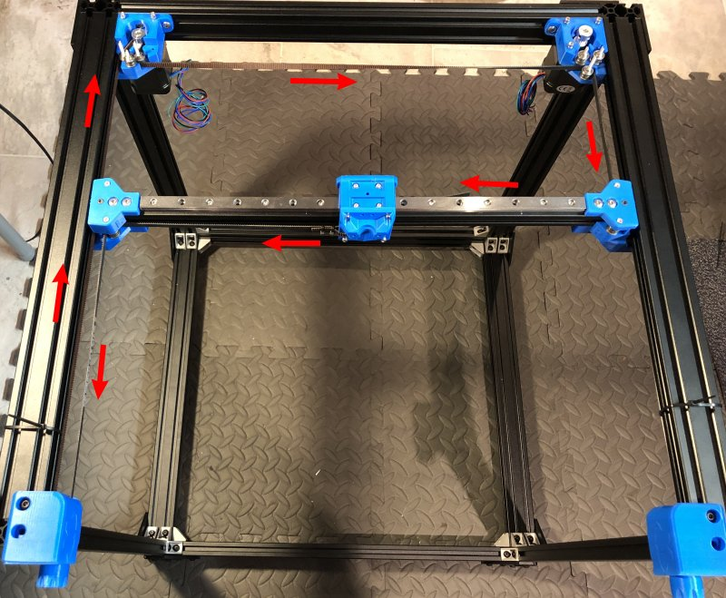\
    *fig 9.14*

14. Thread the end of the belt through the front right opening on the X-carriage. A zip tie can be handy to guide the belt through the hole. Stick the zip tie into the hole far enough that it bends and goes parallel to the extrusion. Then thread the belt along the zip tie and out the hole.

    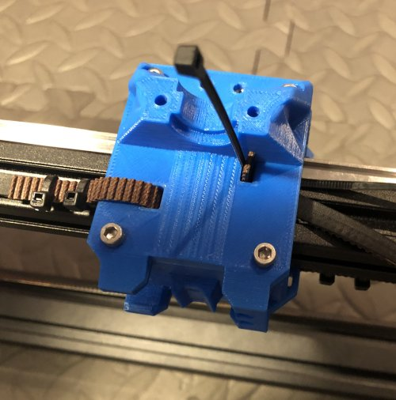\
    *fig 9.15*

15. Secure the end of the belt with 2 zip ties. Ideally the teeth of the belt would be folded together but I did the reverse to keep the belt as close to the extrusion as possible. Pay attention to the zip tie orientation to prevent the end of the zip tie from rubbing.

    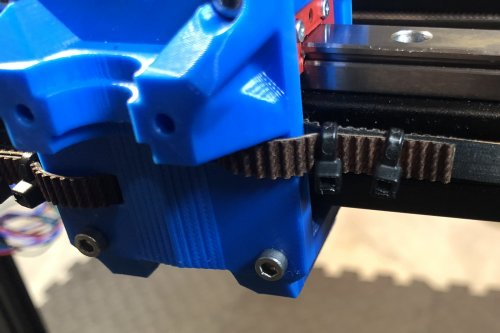\
    *fig 9.16*

16. Thread the belt through the front idler on the Right X mount.

    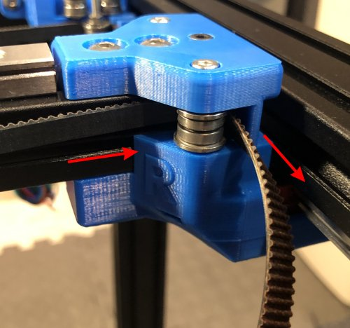\
    *fig 9.17*

17. Remove the idler holder from the Reft tensioner block and thread the belt through the idler holder.

    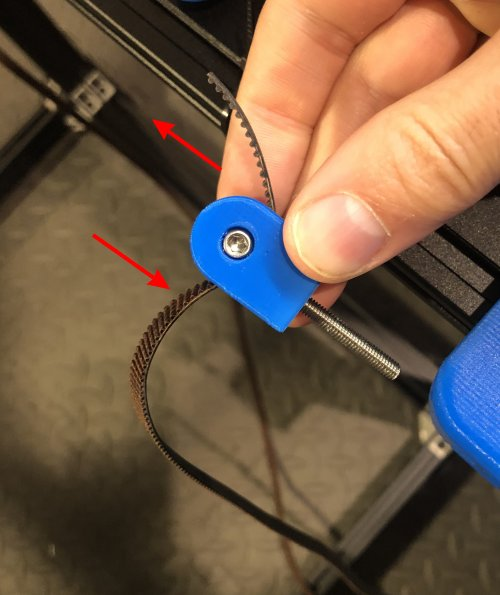\
    *fig 9.18*

18. Reattach the idler holder to the tensioner block using the tensioner knob. Once the nut grabs M4 bolt give it 6-7 full turns to provide the tensioner some headroom if you need to loosen it after attaching the belts. *If the nut is loose you can use the big end of a zip tie to hold it in place*

    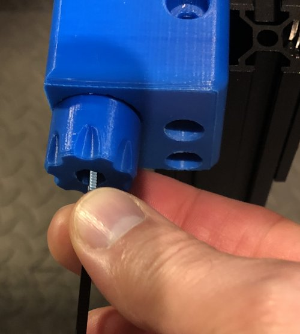\
    *fig 9.19*

19. Now run the belt past the Right X mount in the gap between the extrusion.

    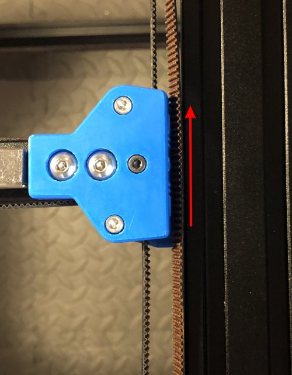\
    *fig 9.20*

20. Thread the belt through the Right corner block and over the stepper pulley.

    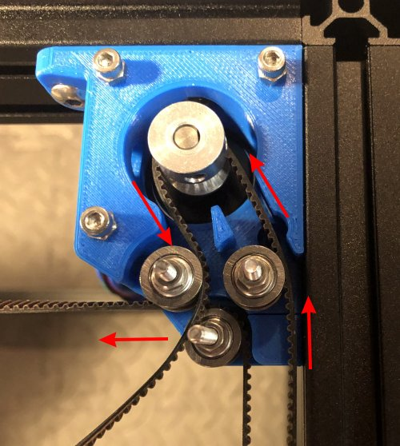\
    *fig 9.21*

21. Now flip the belt and run through the upper idler on the Left block. *the flat part of the belt should be against the right idler*

    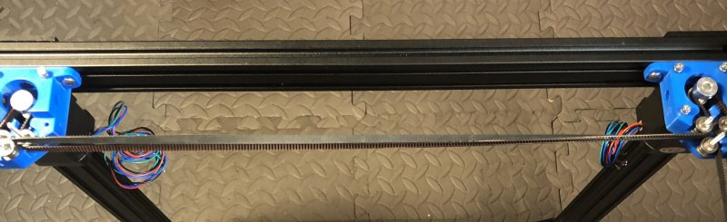\
    *fig 9.22*

    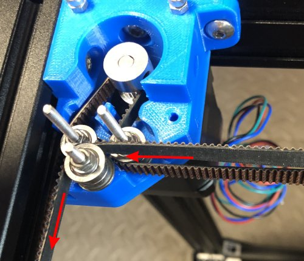\
    *fig 9.23*

22. Thread the belt through the back idler on the Left Mount. *you can use a zip tie as a guide*

    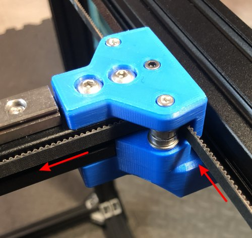\
    *fig 9.24*

23. Thread the end of the belt through the back left opening on the X-carriage. A zip tie can be handy to guide the belt through the hole. Stick the zip tie into the hole far enough that it bends and goes parallel to the extrusion. Then thread the belt along the zip tie and out the hole.

    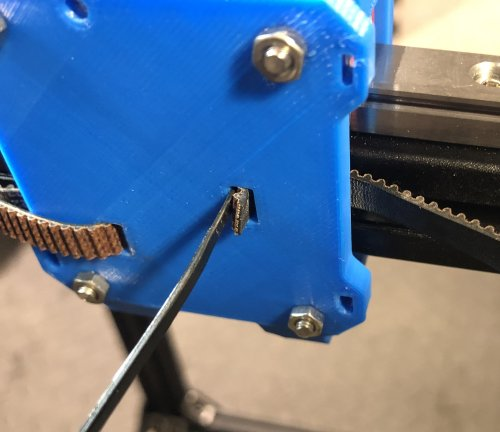\
    *fig 9.25*

24. Pull on the belt end to take up the slack and secure with 2 zip ties. **Don't pull hard/tighten the belt.** You need both belts in place otherwise you'll rack the X rail and in any case the back corner pulleys are only partially secured. We'll use the tensioners later in the build to properly tension the belts.

    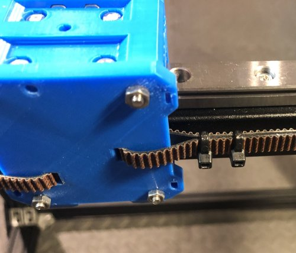\
    *fig 9.26*

25. Here is what it should look like with all the belts attached.

    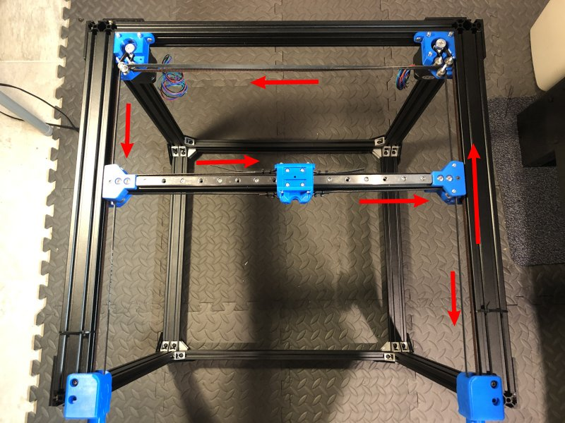\
    *fig 9.27*

