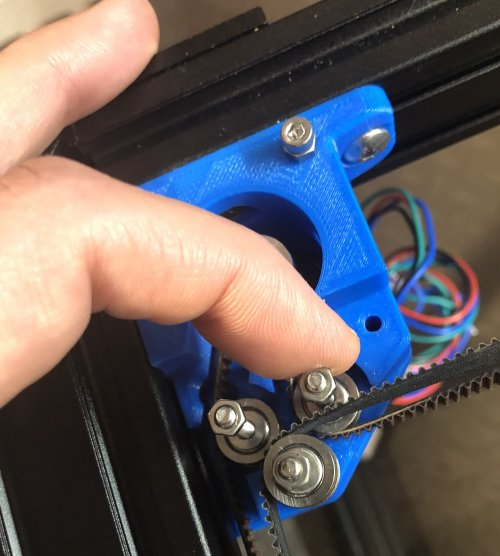

# My BLV MGN Cube - Assembly Instructions

## Step 10 Finish Building Back Corners

### Step 10 BoM

#### Hardware
| Parts     | Quantity | Details | Example Links |
|-----------|:--------:|---------|---------------|
| M5 10mm Socket Button Head Screws | 6 | DIN9427 | |
| M5 T-Nuts | 6 | Hammer Head/Drop In Style | |
| M3 35mm Socket Head Cap Screws | 1 | DIN912 | |
| M3 locking nut | 6 | |

#### Printed Parts
| Parts     | Quantity | Details |
|-----------|:--------:|---------|
| Left_corner_-_cap.stl | 1 | [Printed Parts Settings](../partsSettings) |
| Left_corner_-_top.stl | 1 | [Printed Parts Settings](../partsSettings) |
| Right_corner_-_cap.stl | 1 | [Printed Parts Settings](../partsSettings) |
| Right_corner_-_top.stl | 1 | [Printed Parts Settings](../partsSettings) |

#### Tools
| Parts     | Quantity | Details | Example Links |
|-----------|:--------:|---------|---------------|
| M5 ball end tip screwdriver | 1 | Especially helpfull working with the brackets | [Amazon](https://amzn.to/36TSnEy) |
| M3 screwdriver | 1 | | |

### Prep
1. Install 3x M5 10mm screws and T-nuts on the left and right corner tops.

    \
    *fig 10.1*

### Assembly
1. On the Left block, remove the 2x M3 35mm Socket Head Cap Screws and idler nuts temorarily installed in step 8. Make sure to use tape to keep the M3 bolts holding the idlers from falling out the bottom of the block.

    \
    *fig 10.2*

    \
    *fig 10.3*

    \
    *fig 10.4*

2. Place the Left corner top and reattach the stepper motor using 3x M3 35mm Socket Head Cap Screws. Don't tighten the M5 Bolts yet.

    \
    *fig 10.5*

3. Secure the idler M3 bolts using 3x M3 locknuts.

    \
    *fig 10.6*

4. Now tighten down the M5 bolts to finish securing the left corner top.

    \
    *fig 10.7*

5. Install the left corner cap.

    \
    *fig 10.8*

5. Repeat for the right side but use the M3 25mm Socket Head Cap Screws, temporarily installed in Step 8, to secure the stepper. Here's what it should look like when you're done.

    \
    *fig 10.9*

