# My BLV MGN Cube - Assembly Instructions

## Step 11 Finish Building Extruder Carriage

### Step 11 BoM

#### Hardware
| Parts     | Quantity | Details | Example Links |
|-----------|:--------:|---------|---------------|
| M2 15mm Philips Pan Head Screws | 2 | DIN7985 | |
| M2 Nuts | 3 | DIN934 | |
| M3 10mm Socket Head Cap Screws | 2 | DIN912 | |
| M3 14mm Socket Head Cap Screws | 2 | DIN912 | |
| M3 18mm Socket Head Cap Screws | 4 | DIN912 | |
| M3 25mm Socket Head Cap Screws | 2 | DIN912 | |
| M3 30mm Socket Head Cap Screws | 2 | DIN912 | |
| M3 Lock Nut | 1 | DIN934 | |
| M3 Washers | 4 | DIN125 | |
| Black Wire | ~15cm | 22 AWG Stranded Silicone | [Amazon](https://amzn.to/3ruTli7) |
| Green Wire | ~15cm | 22 AWG Stranded Silicone | [Amazon](https://amzn.to/3ruTli7) |
| Limit Switch | 1 | 3P with handle | [Aliexpress](https://s.click.aliexpress.com/e/_A4VObA) |
| Heat Shrink Tubing | 10mm | Enough to cover 3 Pins  of a JST-XH Male Connector | |
| Male 3 Pin JST-XH Connector | 1 | Your controller uses these and you should too | [Aliexpress](https://s.click.aliexpress.com/e/_AWPLkY) [Amazon](https://amzn.to/3u0TiMD) |
| 3mm x 10.16cm zip ties (4in)  | 1-9 | ~2.5mm x ~120mm | [Amazon](https://amzn.to/3p2nDaE) |
| 5015 Blower Fan | 1 | 24V Ball Bearings | [Aliexpress](https://s.click.aliexpress.com/e/_A9XEXg) |
| V6 Hotend | 1 | Trianglelab V6 All-metal Hotend (1.75 24V All-metal) | [Aliexpress](https://s.click.aliexpress.com/e/_A7ETNG) |
| E3D Thermistor | 1 | Optional: I choose to give a little back to E3D. Also it's super reliable/accurate | [Amazon](https://amzn.to/2QR6fdy) |
| 4010 Fan | 1 | 24V 2Pin Dual Ball Bearing | [Aliexpress](https://s.click.aliexpress.com/e/_A3DGg2) |
| BLTouch Probe | 1 | V3.1 is what I used | [Amazon](https://amzn.to/3rKZEhH) |
| PTFE Tubing | 1m |  1.9mm ID 4mm OD Capricorn Clone W/Cutter | [Aliexpress](https://s.click.aliexpress.com/e/_Anh45s) |
| 3mm x 10.16cm zip ties (4in)  | 2 | ~2.5mm x ~120mm | [Amazon](https://amzn.to/3p2nDaE) |

#### Printed Parts
| Parts     | Quantity | Details |
|-----------|:--------:|---------|
| [X_carriage_-_modified_MK3_fan_blower.stl](../../parts/source/stl/X_carriage_-_modified_MK3_fan_blower.stl) | 1 | [Printed Parts Settings](../partsSettings.md) |
| [X_carriage_-_Fan_mount.stl](../../parts/source/stl/X_carriage_-_Fan_mount.stl) | 1 | [Printed Parts Settings](../partsSettings.md) |
| [X_carriage_-_V6_Locker_BL-touch.stl](../../parts/source/stl/X_carriage_-_V6_Locker_BL-touch.stl) | 1 | [Printed Parts Settings](../partsSettings.md) |
| [X_carriage_-_Cable_locker_JSR.stl](../../parts/remixed/X_carriage_-_Cable_locker_JSR.stl) | 1 | [Printed Parts Settings](../partsSettings.md) |
| [X_carriage_-_Block_shield_for_Bltouch-8mm-12mm_sensors.stl](../../parts/source/stl/X_carriage_-_Block_shield_for_Bltouch-8mm-12mm_sensors.stl) | 1 | [Printed Parts Settings](../partsSettings.md) |

#### Tools
| Parts     | Quantity | Details | Example Links |
|-----------|:--------:|---------|---------------|
| Soldering Iron and Solder | 1 | For small electronics | [Amazon](https://amzn.to/3rvsgLI) |
| Multimeter W/Continuity Tester | 1 | This multimeter has a temp probe too! | [Amazon](https://amzn.to/3sxUjeT) |
| Threadlocker | 0.2 Fl. Oz | Blue (removable) formula | [Amazon](https://amzn.to/3w539Tr) |
| M3 Screwdriver | 1 | | [Amazon](https://amzn.to/3qNmEgs) |
| Small Philips Screwdriver |1 | | [Amazon](https://amzn.to/3fDZgyZ) |
| 5.5 Hex wrench | 1 | Or Pliers | [Amazon](https://amzn.to/3bqH73V) |
| Butane Mini Torch | 1 | You might need to purchase ligher fluid separately (Can't remember) | [Amazon](https://amzn.to/2R3ymGG) |

### Prep

1. Solder 15cm lengths of black and green wires onto the limit switch. The black wire should attach to the Common (COM) terminal and the green wire should attach to the Normally Closed (NC) terminal. *It's important to use NC instead of NO. If a wire breaks it will automatically trigger the endstop*

    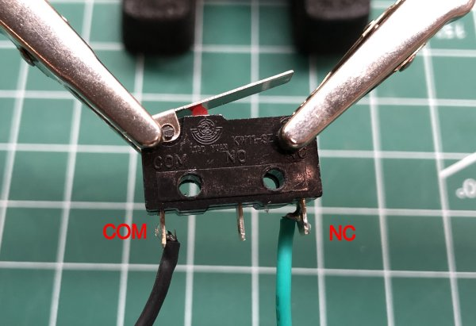\
    *fig 11.1*

2. Test the limit switch and wiring using the continuity tester on your Multimeter. It should be a closed circuit until you press the switch. *Throughout the wiring of the switch you should check this*

    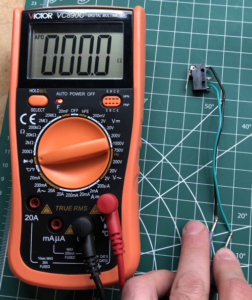\
    *fig 11.2*

3. Make sure the heater cartridge and thermistor wires come out this side of the heater block.

    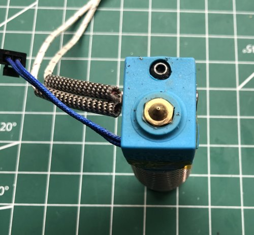\
    *fig 11.3*

4. Route the 4010 Fan and BLTouch Probe wires through the bottom of the X Carriage Cable Locker and temporarly secure with a zip tie. Make sure to stay to the right of the bottom cross bar.

    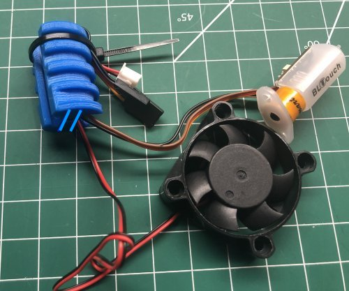\
    *fig 11.4*

### Assembly
1. Remove the 2 lower M3 40mm Socket Head Cap Screws/Nuts from the X carrage and remove the bottom of the carriage. *Belts should be a little loose so it doesn't stress the rest of the carriage*

    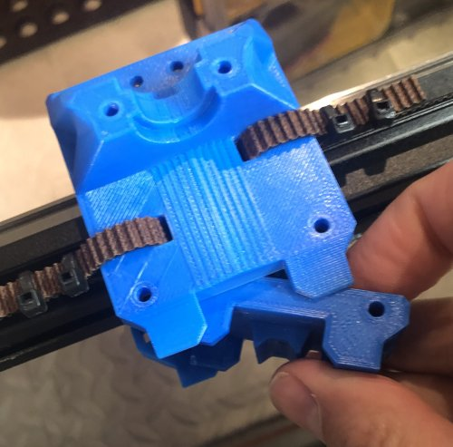\
    *fig 11.5*

2. Dip the ends of the 2 M2 15mm Philips Pan Head Screws in threadlocker.

    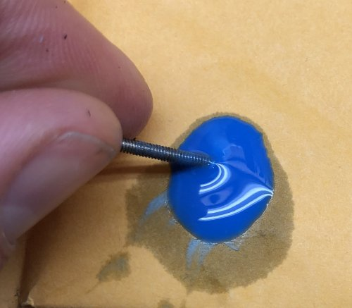\
    *fig 11.6*

3. Insert the 2 M2 15mm screws in to the lower X carrage as shown. You'll notice that I snapped off the bridge on this piece and I'm using M2's instead of M2.5s. This works much better, in reality, than what's described in BLV's extruder assembly video.

    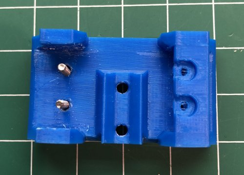\
    *fig 11.7*

4. Attach the limit switch to the lower X carrage using the M2 screws and nuts. You may need to file down the sides of the carraige to get the switch to fit. Don't overtighted the screws as the switch is delicate and you can crush the hollow casing. Note how I routed the wires.

    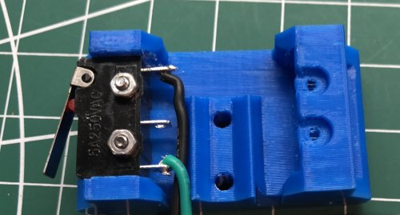\
    *fig 11.8*

5.  Insert an M3 nuts into the fan blower as shown. *Don't worry about the other hole*

    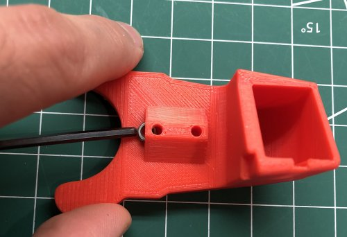\
    *fig 11.9*

6. Using the M3 14mm Socket Head Cap Screw, attach the fan blower to the lower X carriage.

    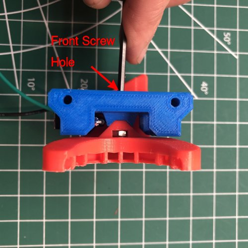\
    *fig 11.10*

7. Put 10mm of heat shrink tubing over both wires and then solder the wires as shown. Then slide the tubing over the exposed terminals of the male JST connector and apply heat to the shrink the tubing with the Mini Butane Torch.

    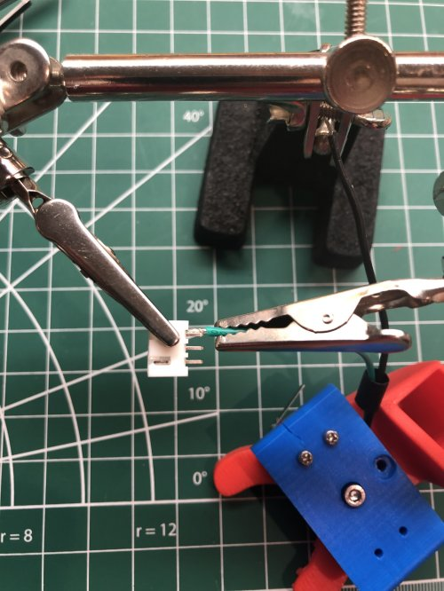\
    *fig 11.11*

    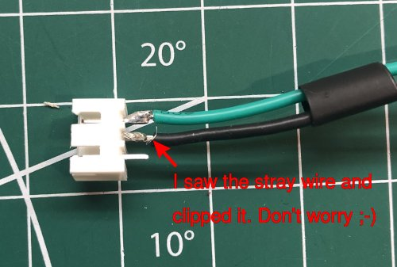\
    *fig 11.12*

    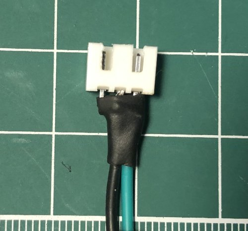\
    *fig 11.13*

8. Reattach the lower X carriage to the rest of the X carriage using the M3 40mm screws/nuts. *I used some threadlocker on the nuts for good measure*

    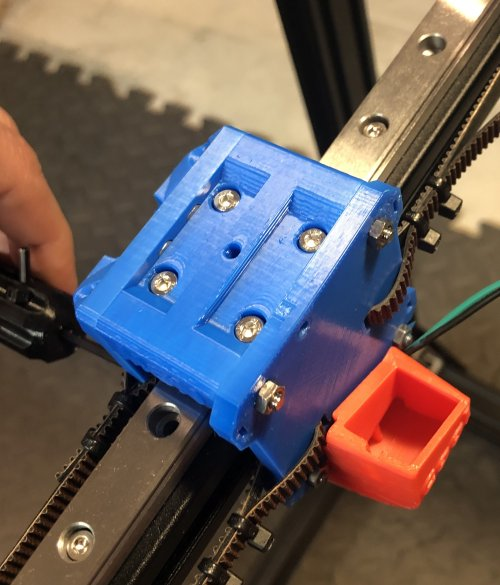\
    *fig 11.14*

9. Zip tie the limit switch wiring to the back X carriage.

    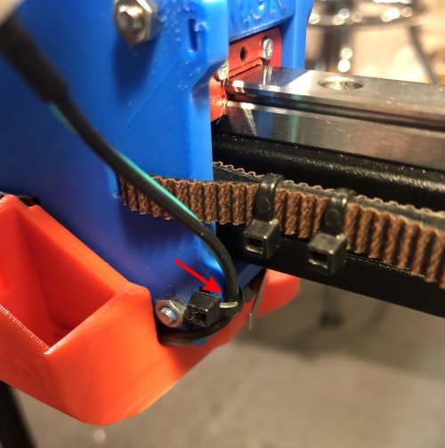\
    *fig 11.15*

10. Cleanup and trim the belts. Now is a good time to trim your belts and verify the limit switch can trigger without the belts catching in the idlers. *I also had to redo some of my zip ties so I could trim the belts closer*

    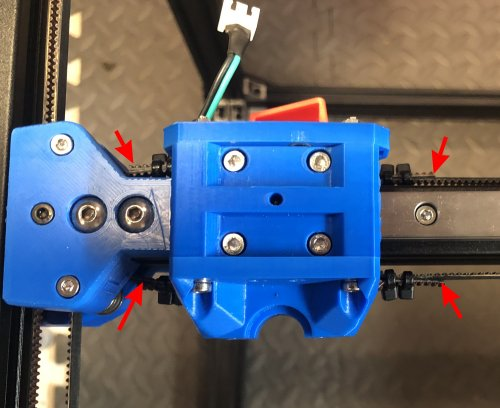\
    *fig 11.16*

11. Insert the 2 M3 25mm Socket Head Cap Screws, with washers, into the 5015 blower fan.

    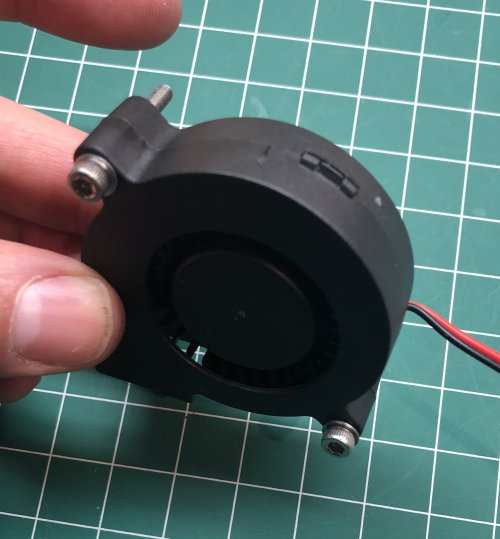\
    *fig 11.17*

12. Put the Fan mount over the screw ends.

    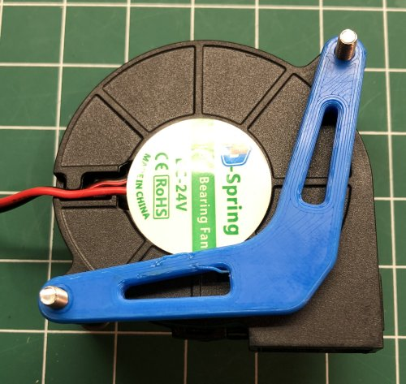\
    *fig 11.18*

13. Secure the screw closest to the blower opening with a lock nut. *Don't overtighten or you will damage the fan*

    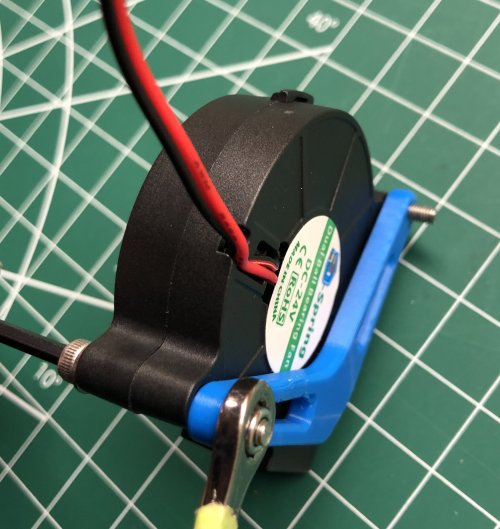\
    *fig 11.19*

14. Attach the blower fan to the X carraige and blower duct. Make sure the mouth of the blower is inserted into the duct correctly. *Don't overtighten or you will damage the fan*

    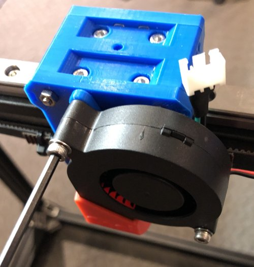\
    *fig 11.20*

15. Secure the blower fan wores and limit switch wires with a zip tie to the mount point on the back x carrage plate. Leave a little slack on the blower wire but make sure it doesn't run into the linear rail mount when the carriage is all the way to the left. *You should have a little more slack for the limit switch connecter than what you see in this pic. I updated the directions after realizing it was too short*

    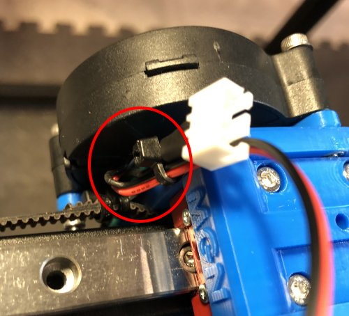\
    *fig 11.21*

16. Attach the Hotend to the X Carrage.

    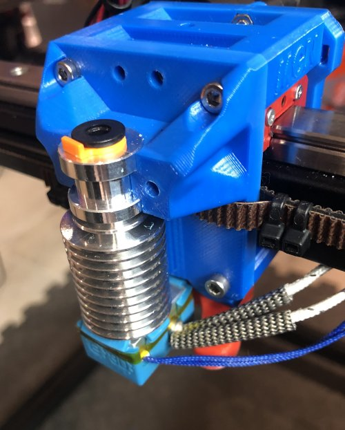\
    *fig 11.22*

17. Attach the PTFE tubing to the hotend and then secure the hotend using the BLTouch Locker and 2 M3 30mm Socket Head Cap Screws. *To insert the tubing into the hotend, remove the orange clip and press down on the fitting then reattach the clip to secure it.*

    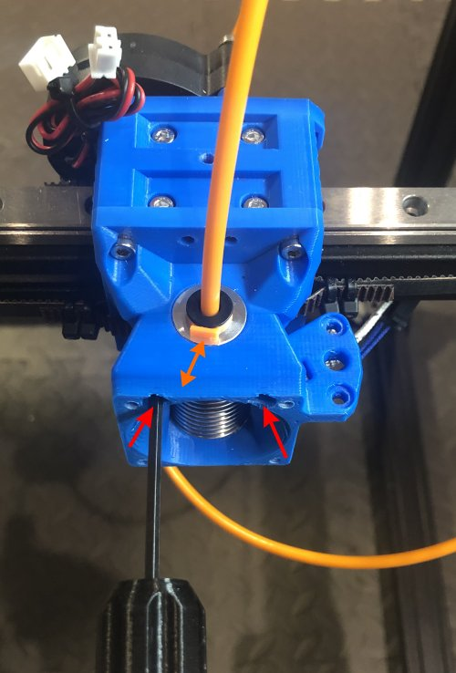\
    *fig 11.23*

18. Connect the cable locker using the M3 14mm Socket Head Cap Screw. Make sure it grabs the nut embedded in the X carriage. If the screw bottoms out before it's tight use some M3 washers. The orientation of the cable locker is important. The bumps/lower offset should point towards the front.

    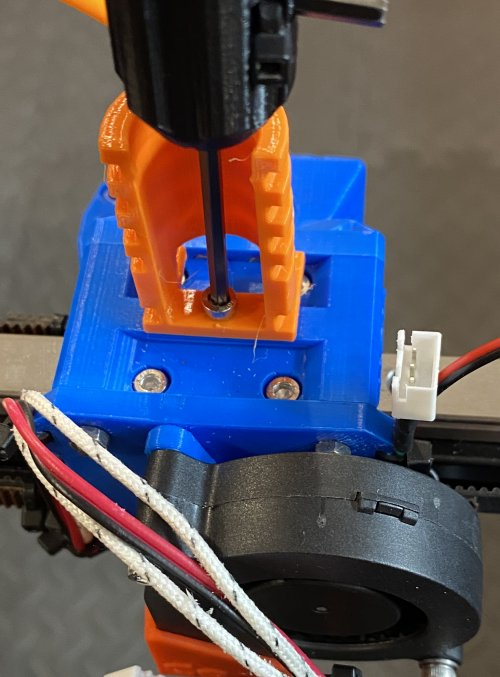\
    *fig 11.24*

19. Using the 2 M3 10mm Socket Head Cap Screws and nuts and washers. Secure the BLTouch to the locker mount. Make sure the BLTouch probe is secure but don't overtighten or you might damage it.

    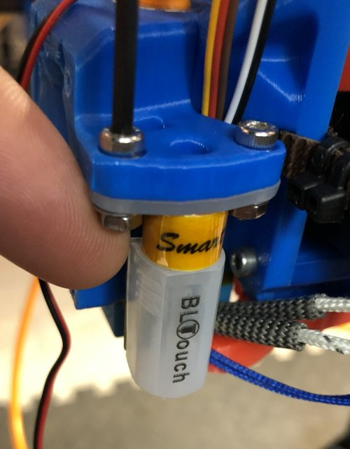\
    *fig 11.25*

20. Using the 4x M3 18mm Socket Head Cap Screws attach the Block Sheild to the front of the X carriage. Make sure the 4010 fan is oriented so it will blow air across the heat sink. Also route the BLTouch probe wires inside the Block Sheild making sure not to pinch them.

    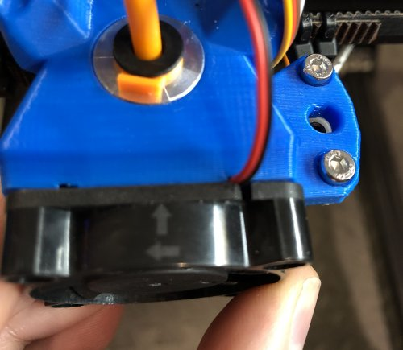\
    *fig 11.26*

    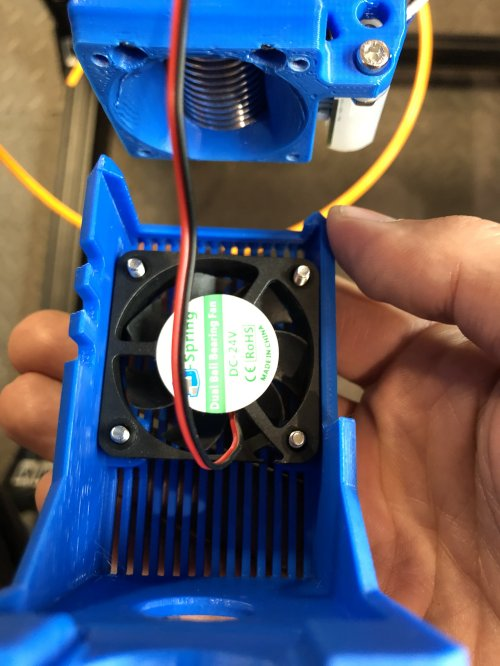\
    *fig 11.27*

    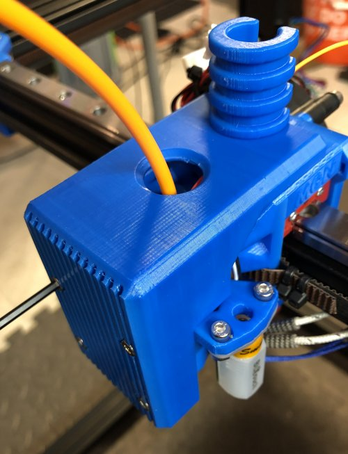\
    *fig 11.28*

    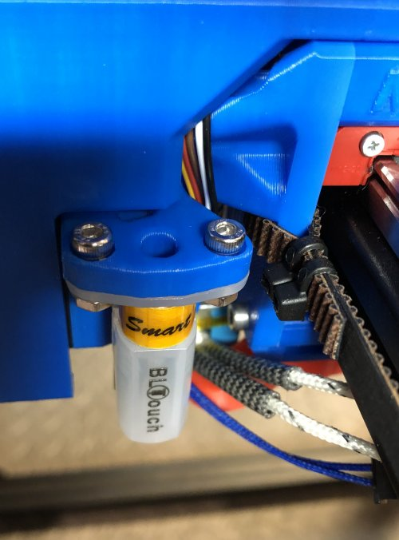\
    *fig 11.29*

    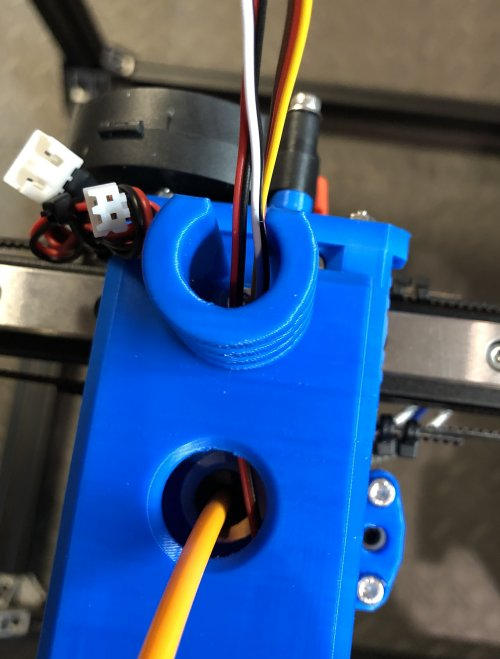\
    *fig 11.30*

21. Now route and zip tie the heater cartridge and thermistor wires so they are out of the way.

    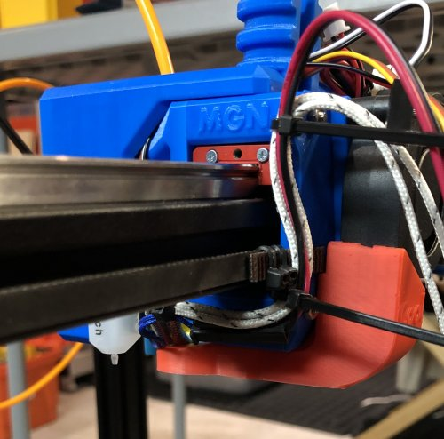\
    *fig 11.31*

22. Here's what it should look like when everything is done.

    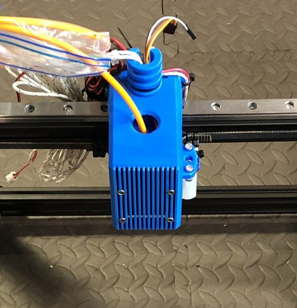\
    *fig 11.32*

