# My BLV MGN Cube - Assembly Instructions

## Step 12 Z Axis Frame

### Step 12 BoM

#### Hardware
| Parts     | Quantity | Details | Example Links |
|-----------|:--------:|---------|---------------|
| 496mm (~19.5in) 2040 extrusion | 2 | From standard 365mm Z frame | |
| 442mm (~19.5in) 2040 extrusion | 2 | From standard 365mm Z frame | |
| M5 8mm Socket Button Head Screws | 48 | DIN9427 | |
| M5 10mm Socket Button Head Screws | 2 | DIN9427 | |
| M5 T-Nuts | 50 | Hammer Head/Drop In Style | |
| [2020 M5 Angle Brackets](img/all-PlateVsBracket.jpeg) (Brackets) | 24 | | [Amazon](https://amzn.to/3rRVq7U) |

#### Printed Parts
| Parts     | Quantity | Details |
|-----------|:--------:|---------|
| Z_rail_stopper_-_Top_Left.stl | 1 | [Printed Parts Settings](../partsSettings) |
| Z_rail_stopper_-_Top_Right.stl | 1 | [Printed Parts Settings](../partsSettings) |
| Jig_Main.stl | 2 | [Printed Parts Settings](../partsSettings) |

#### Tools
| Parts     | Quantity | Details | Example Links |
|-----------|:--------:|---------|---------------|
| M5 Allen Key | 1 | Need an Allen Key for the tight spaces | [Amazon](https://amzn.to/3qNmEgs) |
| Digital Calipers | 1 | | [Amazon](https://amzn.to/36cs0cx) |
| Flat Corner Braces | 4 | As long at it fits an M5 size isn't really important | [Aliexpress](https://s.click.aliexpress.com/e/_A0mpPm Brackets) [Home Depot](https://www.homedepot.com/p/Everbilt-2-1-2-in-Zinc-Plated-Flat-Corner-Brace-4-Pack-15295/202034147) |
| Quick Grip Clamps | 2 | 6" Are fine. I had longer ones | [Aliexpress](https://s.click.aliexpress.com/e/_ADibWo) [Amazon](https://amzn.to/2ODx989) |
| M5 8mm Socket Button Head Screws | 16 | DIN9427 (Temporary) | |
| M5 T-Nuts | 16 | Hammer Head/Drop In Style (Temporary) | |

### Prep
1. Print 1 main jig in PLA
    1. Measure the 60mm section with the Digital Calipers.

        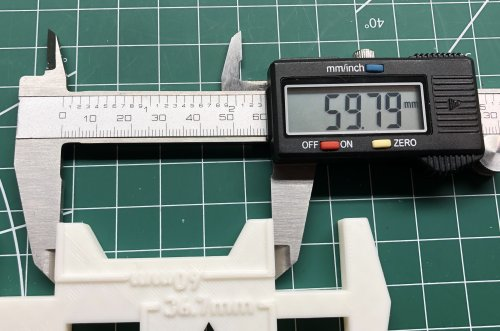\
        *fig 12.1*

    2. Calculate the scale factor using this equation:

        Scale Factor=(60mm/Measured Value) * 100

    3. Print 2 Main Jigs in PLA with using the scale factor

2. File down the ridge of the Z Stopper. It's too high and will interfere when attaching the T-Nut to the extrusion.

    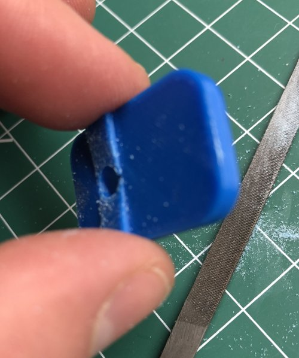\
    *fig 12.2*

3. Loosely attach the Z Rail Stoppers to the 496mm extrusions. The allen key will have just enough space to tighten when the extrusion in in the frame.

    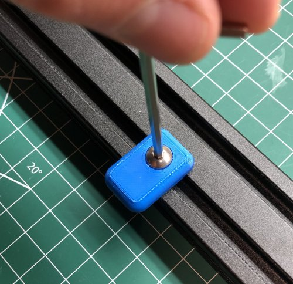\
    *fig 12.3*

### Assembly
1. Temporarily install a pair of Angle Brackets on the front and back uprights of the left side frame. These will help to position the 442mm extrusion later.

    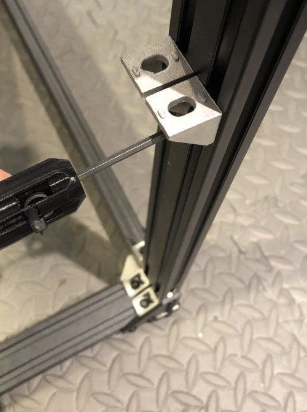\
    *fig 12.4*

    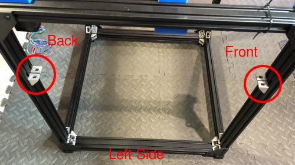\
    *fig 12.5*

2. Carefully slide the 496mm extrusion below the 90 degree joining plates on the Left side of the frame. Make sure the Z stopper is in the correct channel and facing the right way.

    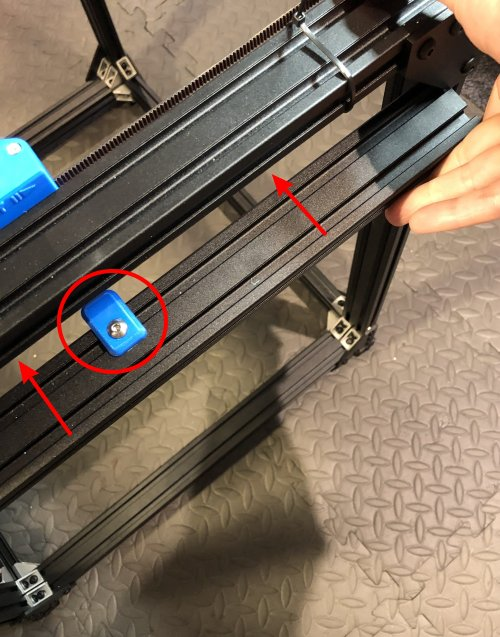\
    *fig 12.6*

3. Temporarily use the 2 442mm extrusions to correctly position the upper 496mm extrusion. Lightly secure with the clamps. Don't use too much pressure on the clamps or you might bend the extrusions.

    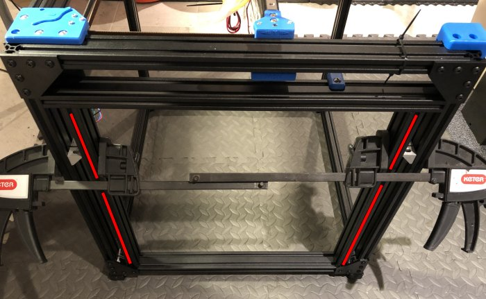\
    *fig 12.7*

4. Temporarily attach 3 Flat Corner Braces, using M5 8mm Screws and T-nuts, to the 496mm extrusion and uprights to secure it. 2 braces on the outside and 1 brace on the front inside. Make sure that there isn't a gap between the 496mm extrusion and the tops of the 442mm extrusions.

    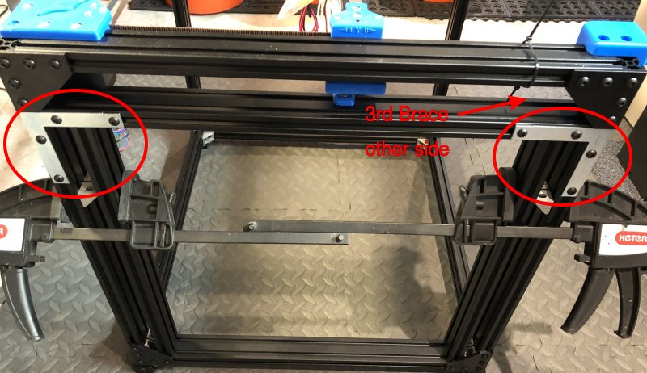\
    *fig 12.8*

5. Remove the clamps and 2 442mm extrusions. Add addtional M5 8mm Screws and T-nuts to the Angle Brackets you attached in Step 1 and readjust them to permaently attach the 496mm extrusion.

    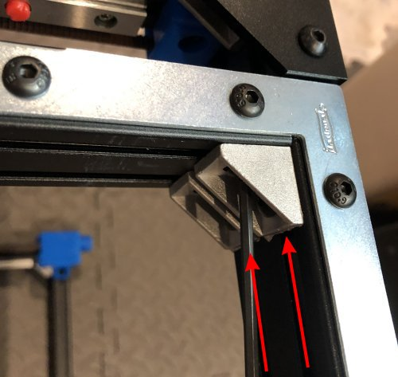\
    *fig 12.9*

    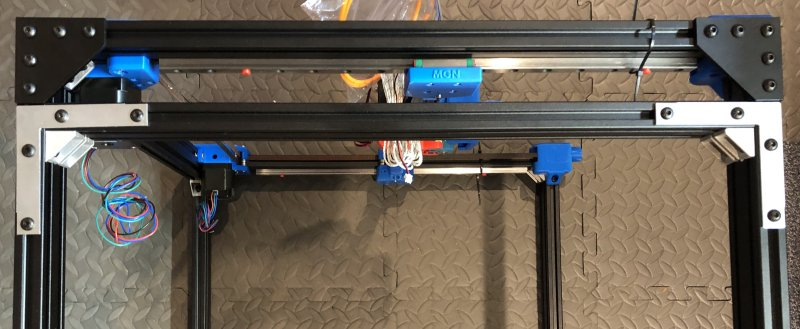\
    *fig 12.10*

6. Remove the 3 Flat Corner Braces.

    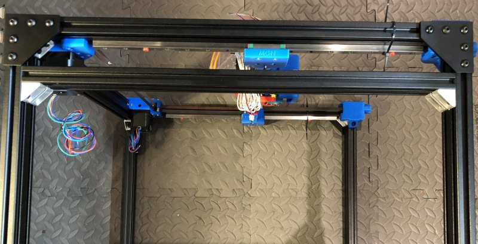\
    *fig 12.11*

7. Repeat Steps 1-6 to properly attach the 496mm extrusion on the right side. It should look like this when you are done.

    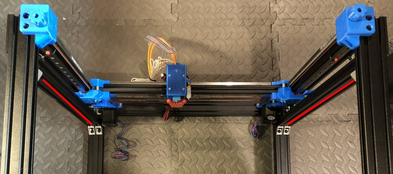\
    *fig 12.12*

8. Carefully insert a 442mm extrusion and attach 4 Flat Corner Braces, but only to the vertical 442mm extrusion and not the horizontal extrusions. We're using the braces to keep the extrusion flush and square but you need to be able to slide it in the next step.

    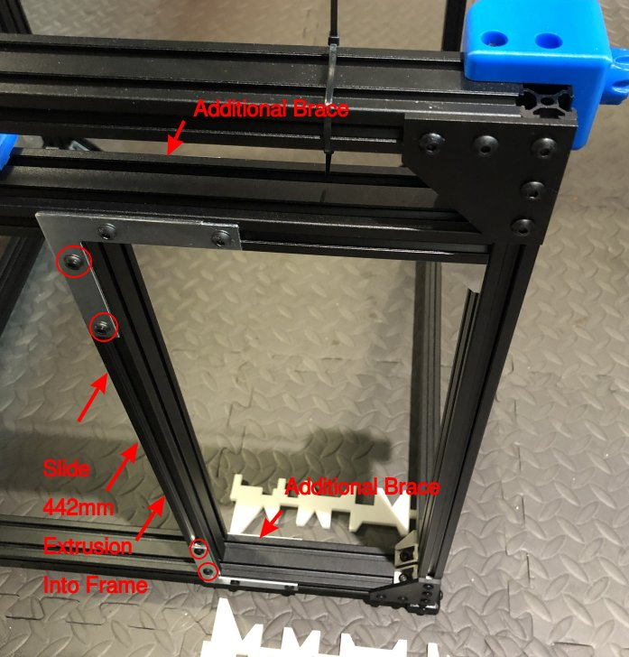\
    *fig 12.13*

9. Using the 2 Main Jigs, set the distance between the 442mm extrusion and the front of the printer frame. The jigs are used on alternate sides of the extrusion to keep the 442mm extrusion as square as possible. I used some tape to keep the jigs in place.

    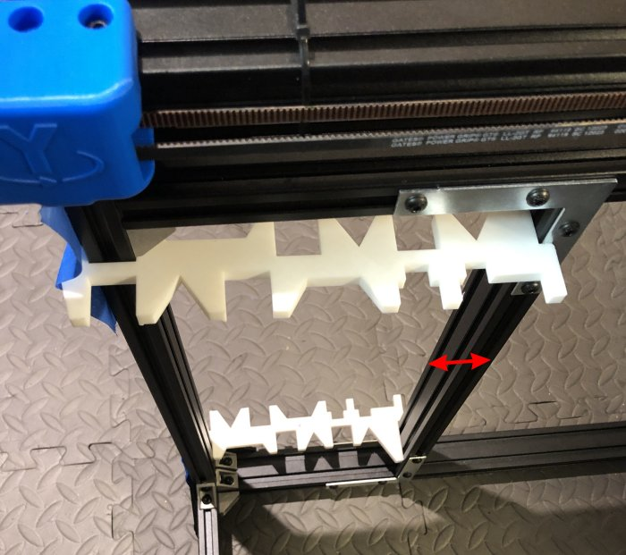\
    *fig 12.14*

10. Tighten the M5 screws on all flat corner braces, horizontal sections, attaching the 442mm Extrusion to the top and bottom extrusions. Only the bottom braces are shown but you should do the top ones as well.

    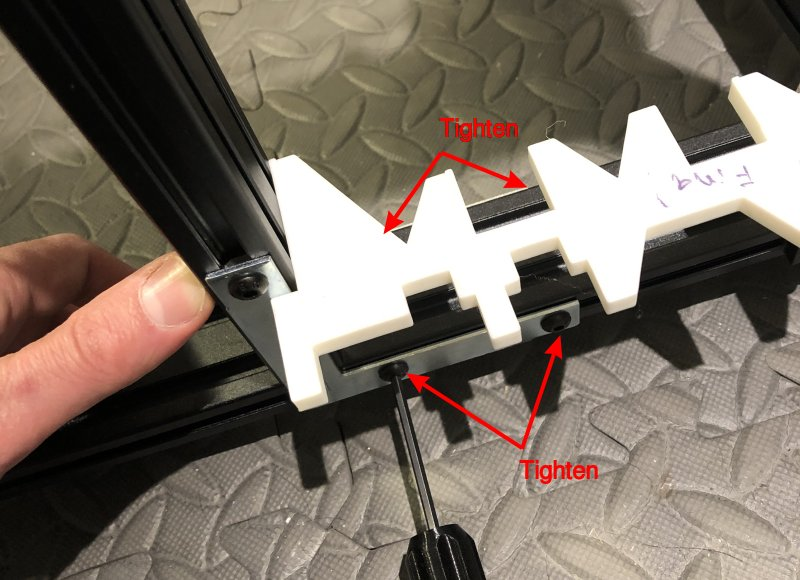\
    *fig 12.15*

11. Use 8 Angle Brackets to attach the top and bottom of the 442mm extrusions to the frame. Losely tighten the brackets (extrusion side first) as the example picture shows. After everything is aligned, do the final tightening in the same order.

    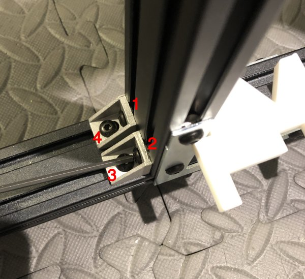\
    *fig 12.16*

    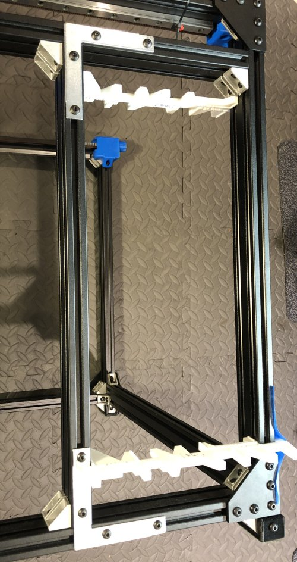\
    *fig 12.17*

    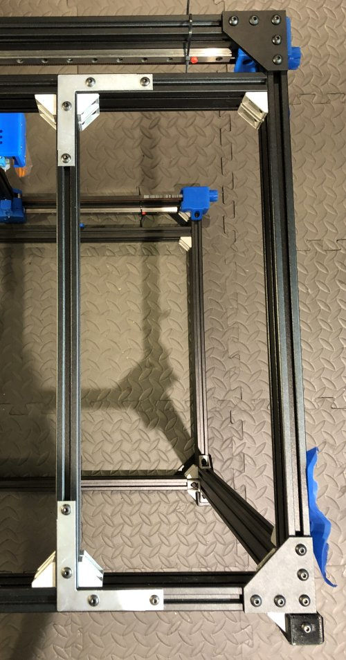\
    *fig 12.18*

12. Now remove the Flat Corner Braces and the left side is done.

    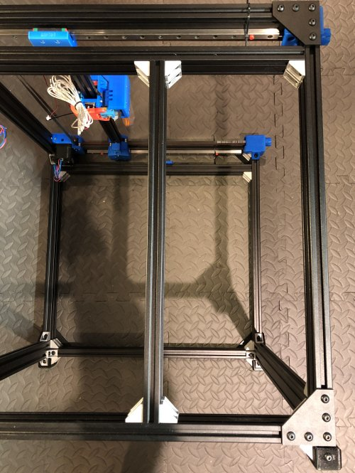\
    *fig 12.19*

14. Position and tighten the Left Z Rail Stopper above the 442mm Extrusion.

    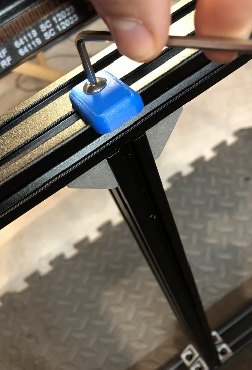\
    *fig 12.20*

13. Repeat Steps 8-14 for the right side. This is what it should look like when you are finished.

    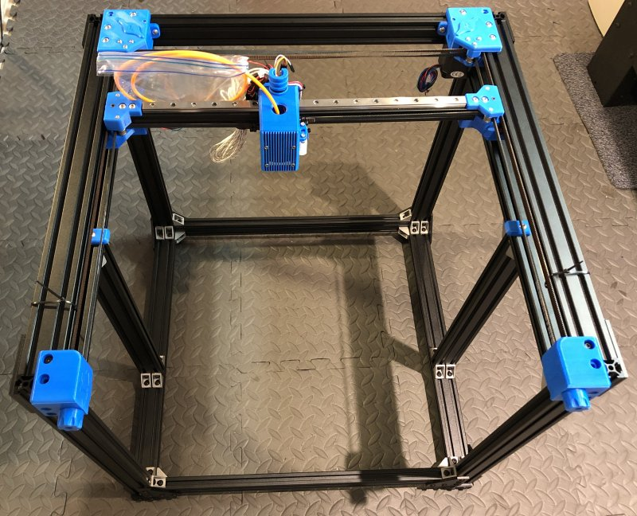\
    *fig 12.21*

