# My BLV MGN Cube - Step 13 Z Rails and Motors

## [Step 13 BoM Spreadsheet Link](https://docs.google.com/spreadsheets/d/e/2PACX-1vTVx7BvB3V7CozF2l4eWkNntWrHSjOawmrsi_bRSVxQLIGVlfZTYEGp8a6fHpENV6hV2cn9PrDLHHl0/pubhtml?gid=1231889643&single=true)

### Prep
1. Attach 8x M3 8mm socket head cap screws and T-Nuts into every other hole of the 2 linear rails. Leave a open hole at the top of each rail.

    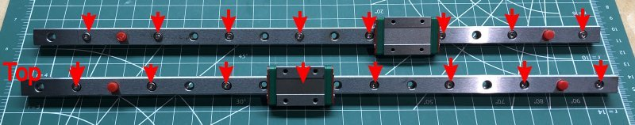\
    *fig 13.1*

2. File down the Z rail stoppers and Z motor mounts so that the T-Nuts will have enough space to grab the extrusion.

    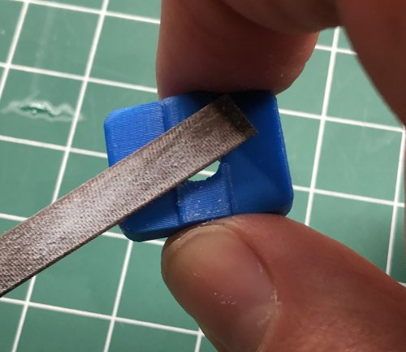\
    *fig 13.2*

    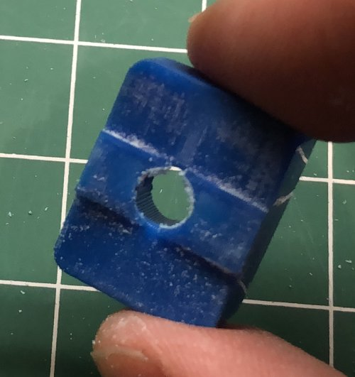\
    *fig 13.3*

    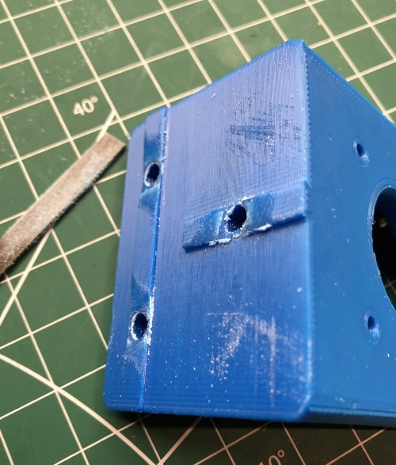\
    *fig 13.4*

### Assembly

1. Attach the left linear rail to the 442mm Z extrusion. Use the 2x 2020 jigs to center the rail on the extrusion and tighten in the pattern indicated. Make sure there isn't a gap between the linear rail and the top Z rail stopper.

    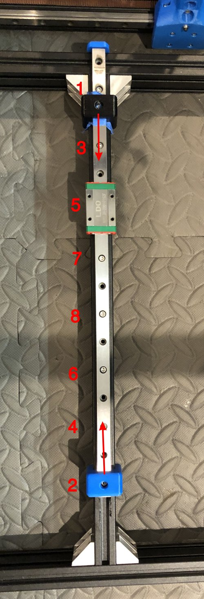\
    *fig 13.5*

    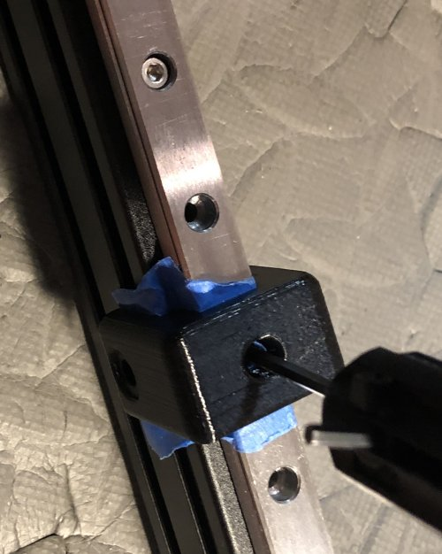\
    *fig 13.6*

2. Attach the lower Z rail stopper using an M5 10mm screw and T-Nut.

    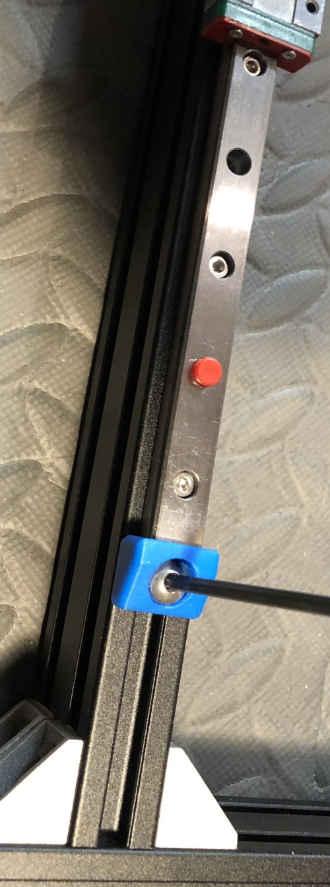\
    *fig 13.7*

3. With the top and bottom stoppers in place you can now remove any shipping stoppers on the rail.

    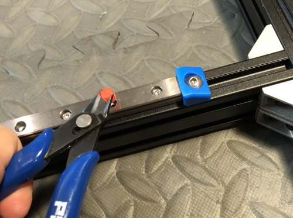\
    *fig 13.8*

4. Attach Left Mgn Mount to the MGN Carriage using 4x M3 8mm screws.

    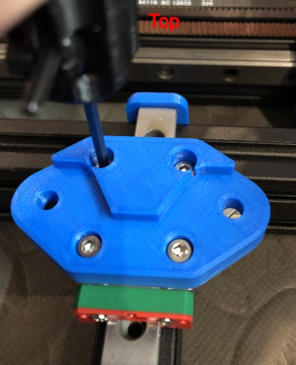\
    *fig 13.9*

5. Attach the Left motor mount at the intersection of the 442mm Z Extrusion and the 496mm left side horizontal extrusion.

    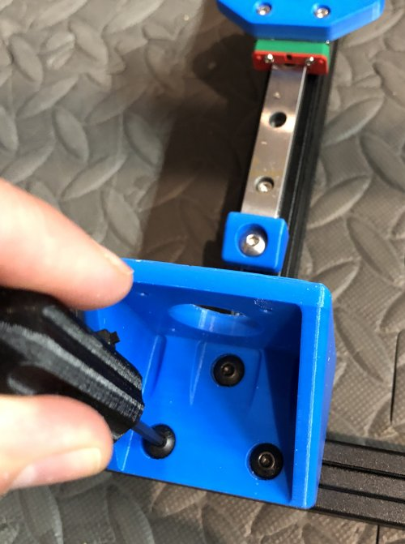\
    *fig 13.10*

6. Attach the left Z stepper motor to the motor mount using 4x M3 12mm screws and washers.

    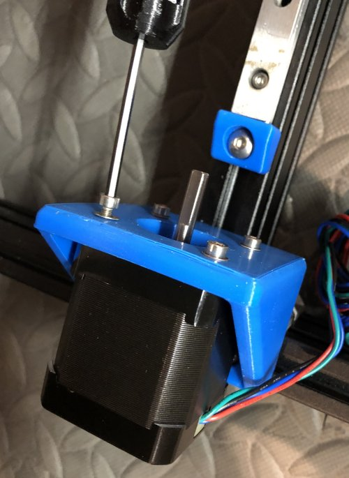\
    *fig 13.11*

7. Repeat assembly steps for the right side. This is what you should have when you are done.

    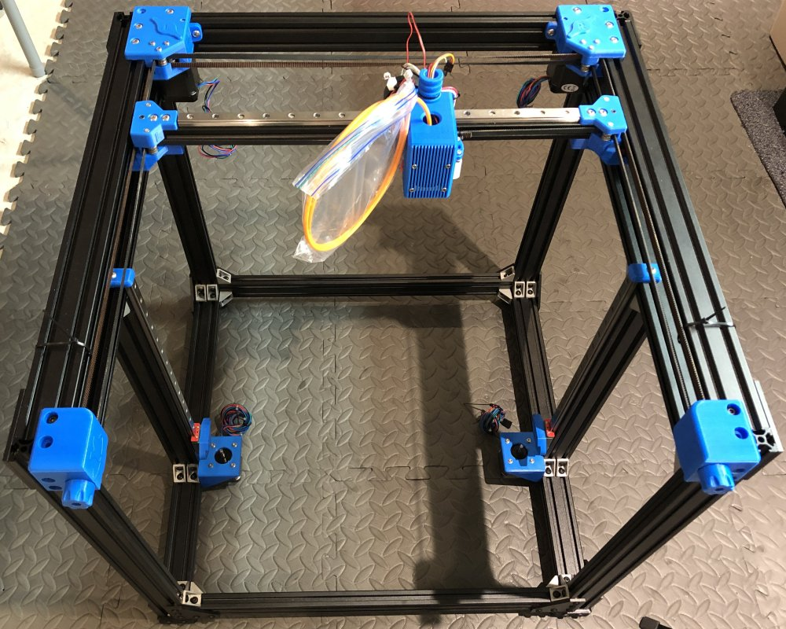\
    *fig 13.12*

