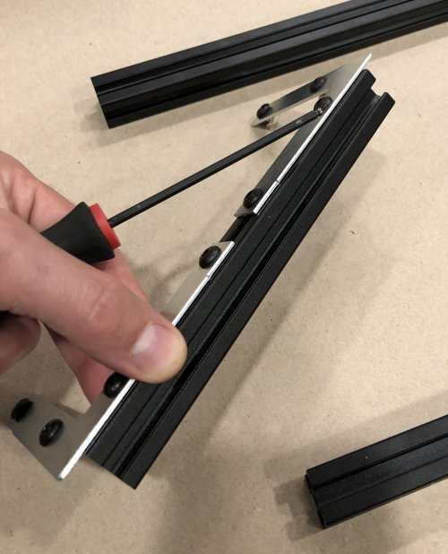
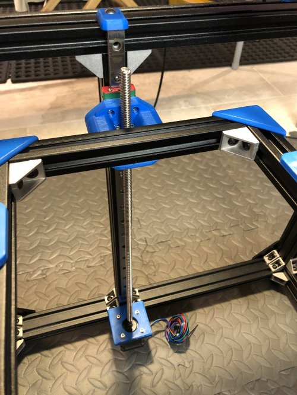

# My BLV MGN Cube - Step 14 Build Heated Bed Frame and Finish Z-Axis

## [Step 14 BoM Spreadsheet Link](https://docs.google.com/spreadsheets/d/e/2PACX-1vTVx7BvB3V7CozF2l4eWkNntWrHSjOawmrsi_bRSVxQLIGVlfZTYEGp8a6fHpENV6hV2cn9PrDLHHl0/pubhtml?gid=623413600&single=true)

### Prep
1. File down the 4x bed holders so that the T-Nuts will have enough space to grab the extrusion.

    \
    *fig 14.1*

2. Find a the flattest surface in your house. Hint, If you have a granite counter top that's probably the best. Make sure it's clean and then use one of your pieces of extrusion as a straight edge and a piece of paper as a thickness guage. Try and slip a piece of paper under the extrusion in a couple of places to test for flatness. Test multiple directions. Probably won't be perfect but pick the best counter you have. This will be the surface you use to build the frame.

    \
    *fig 14.2*

3. Cover the surface in a large piece of craft paper to protect it. *Can't build a 3d printer if your significant other murders you for scratching their counter top with sharp edged extrusions*

### Assembly

1. Attach 2 corner braces to each of the 173mm extrusions so they overlap the ends by about 10mm but less than 20mm. You'll use these as a guide to keep them flush with the ends of the 405mm extrusions in the next step.

    \
    *fig 14.3*

2. Clamp the 2x 405mm extrusions to one of the 173mm extrusions using the corner braces in the last step. Make sure the 172mm extrusion is flush with the ends of the 2x 405mm extrusions.

    \
    *fig 14.4*

3. Using 2 of the angle brackets, with M5 8mm screws and T-nuts, permanently attach the 173mm extrusion to the 2x 405mm extrusions. Start by loosely tightening (#1 then #2) then finish tightening sequence (#3 then #4). The sequence is important to get the bracket aligned and make sure the 173mm extrusion is flush with the ends of the 405mm extrusions.

    \
    *fig 14.5*

4. Clamp the 173mm extrusion on the other other side. Make sure it is flush with with the ends of the 405mm extrusions.

    \
    *fig 14.6*

5. Repeat what you did in step 3. Using 2 of the angle brackets, with M5 8mm screws and T-nuts, permanently attach the 173mm extrusion to the 2x 405mm extrusions. Start by loosely tightening (#1 then #2) then finish tightening sequence (#3 then #4). The sequence is important to get the bracket aligned and make sure the 173mm extrusion is flush with the ends of the 405mm extrusions.

    \
    *fig 14.7*

6. Remove the angle brackets and clamps so you can install the 4x frame covers using M5 10mm screws and T-Nuts. I fastened the covers on the 173mm extrusions (see arrows). *Note: my frame wasn't completely flat but that's fine because the bed is adjustable and mounting it to the 3D printer will probably help with this*

    \
    *fig 14.8*

7. Now install the bed holders onto the 405mm extrusions. You will need to put the top T-Nut into the extrusion, first, and then snap the bed holder in place. Once it is in place, loosely tighten the screws but make sure that the bed holders can still slide along the extrusions.

    \
    *fig 14.9*

    \
    *fig 14.10*

8. Here is what the bed frame should look like with all 4 of the bed mounts attached.

    \
    *fig 14.11*

9. Temporarily attach the heated bed to the 4 bed holders on the bed frame. Use the M4 35mm flat head screws, washers, bed leveling springs, and some M4 nuts. We'll use the bed to correctly position the 4 bed holders in the next step.
   **Note: The bed pictured is different from the one I eventually used and specified in the BoM.** 

   \
   *fig 14.12*

   \
   *fig 14.13*

10. Slide the loose bed holders so that the heated bed is centered on the bed frame.

   \
   *fig 14.14*

11. Now tighten the 2x M5 screws on the sides of each bed holder to fix them in place on the bed frame.

    \
    *fig 14.15*

12. Remove the heated bed so you can tighten the M5 screw on the top of each bed holder. So it doesn't get in the way we'll leave the bed off and reattach the bed in a later step.

    \
    *fig 14.16*

13. Turn the bed holder over and loosely attach the Z mount left and right blocks using the M5 10mm screws and T-nuts. Just the bottom facing screws and T-nuts. We'll insert the 2 side screws and T-nuts later.

    \
    *fig 14.17*

14. Using the calipers score the center point of the 173mm extrusion and use it to center the blocks. Now you can tighten down the M5 screw on each block

    \
    *fig 14.18*

    \
    *fig 14.19*

15. Use 4x M3 35mm screws and lock nuts to attach the lead screw nuts to each Z mount block. Use the 5.5mm wrench to hold the lock nuts.

    \
    *fig 14.20*

    \
    *fig 14.21*

16. With the printer on it's side (Left side facing up) add 2 T-Nuts to the left side of the bed frame. Make sure to put something on the floor to protect the printer and the floor (I have foam tiles on my floor).

    \
    *fig 14.22*

17. Use a zip tie to help position the T-nuts under the holes while you fasten the left Z mount block to the left MGN mount.

    \
    *fig 14.23*

    \
    *fig 14.24*

18. Now carefully put the printer on it's other side and attach the right Z mount block to the right MGN mount in the same way. This was tricky. Make sure not to let the bed crash or twist. Test the bed frame by sliding on the rails and adjust the Z mount block as necessary if it binds.

    \
    *fig 14.25*

    \
    *fig 14.26*

19. Install the lead screws in the left and right Z mount blocks by threading into the lead screw nuts.

    \
    *fig 14.27*

20. Attach the lead screws to the Z steppers using 2x flexible couplers. Make sure to tighten enough so that the stepper and lead screws don't slip but careful not to strip the set screws.

    \
    *fig 14.28*

21. When you are done here's what the final product should look like.

    \
    *fig 14.29*