# My BLV MGN Cube - Assembly Instructions

## Step 15 Build Electronics Panel

### Step 15 BoM

#### Hardware
| Parts     |   Quantity    | Details | Example Links |
|-----------|:-------------:|---------|---------------|
| 576mm (~22 1/2in) 2020 Extrusion |       2       | | |
| M4 6mm Socket Head Cap Screws |       4       | | [Aliexpress](https://www.aliexpress.com/item/10000148429238.html?spm=a2g0s.9042311.0.0.18d04c4do8Elvl) |
| M5 Washers |       9       | DIN125| |
| M5 Nuts |       9       | DIN934 | |
| M5 T-Nuts |      26       | Hammer Head/Drop In Style | |
| M5 8mm Socket Head Cap Screws |      35       | DIN912 | |
| [2020 M5 Angle Brackets](img/all-PlateVsBracket.jpeg) (Brackets) |      16       | | [Amazon](https://amzn.to/3rRVq7U) |
| Din Rail |       2       | 12 in (~300mm) | [Amazon](https://www.amazon.com/gp/product/B082DLNVZD/ref=ppx_yo_dt_b_asin_image_o01_s00?ie=UTF8&psc=1) [AliExpress](https://s.click.aliexpress.com/e/_At6lEP) |
| Tempered Hardboard (Masonite) | 440mm x 574mm | 1/8 in (~3mm) Thick You'll need enough for all the panels | [Home Depot](https://www.homedepot.com/p/1-8-in-x-2-ft-x-4-ft-Tempered-Hardboard-Actual-0-115-in-x-23-75-in-x-47-75-in-109112/202585358) [B&Q](https://www.diy.com/departments/brown-hardboard-l-1-22m-w-0-61m-t-3mm/1696235_BQ.prd) [Bunnings](https://www.bunnings.com.au/masonite-1200-x-915-x-3-2mm-handypanel_p0242391) [Aliexpress](https://www.aliexpress.com/item/32988813396.html) |
| Mean Well Power Supply |       1       | SE-450-24 24V18.8A | [Aliexpress](https://www.aliexpress.com/item/32988813396.html) |

#### Printed Parts
| Parts     | Quantity | Details |
|-----------|:--------:|---------|
| Jig_Main.stl | 2 | [Printed Parts Settings](../partsSettings.md) |
| Extruder__-_bondtech_Rear_mount.stl (Used as a tool in this step) | 1 | [Printed Parts Settings](../partsSettings.md) |

#### Tools
| Parts     | Quantity | Details | Example Links |
|-----------|:--------:|---------|---------------|
| M3 Screwdriver | 1 | | [Amazon](https://amzn.to/3qNmEgs) |
| M5 Screwdriver | 1 | | [Amazon](https://amzn.to/3qNmEgs) |
| 8mm Hex wrench | 1 | Or Pliers | [Amazon](https://amzn.to/3bqH73V) |
| Quick Grip Clamps | 2 | 6" Are fine. I had longer ones | [Aliexpress](https://s.click.aliexpress.com/e/_ADibWo) [Amazon](https://amzn.to/2ODx989) |
| Jig Saw | 1 | With a 24TPI fine wood cutting blade | [Amazon](https://www.amazon.com/Ryobi-JS481LG-Variable-T-Shank-Lighting/dp/B01GWD50X0/) |
| 20mm (1/2") Chisel | 1 | Just used to cleanup drilled holes | |
| X-Acto Knife | 1 | Just for hole cleanup | [Amazon](https://amzn.to/3gUPYPI) |
| Drill | 1 | | |
| Drill Bits | 4.5mm and 5.5mm or 11/64" and 7/32" | | [Amazon](https://www.amazon.com/Migiwata-Extremely-Resistant-Straight-Stainless/dp/B071ZRMWBN/ref=sr_1_2_sspa?dchild=1&gclid=CjwKCAjw2ZaGBhBoEiwA8pfP_qvvSDVjPj1nrN0f2J_9dWb_qNrTin5UjltdlEO3dHnDmmcXLze0-xoCqGkQAvD_BwE&hvadid=409940714355&hvdev=c&hvlocphy=9008192&hvnetw=g&hvqmt=e&hvrand=7482245044767489653&hvtargid=kwd-100882843&hydadcr=24658_11410762&keywords=metric+drill+bits&qid=1623621712&sr=8-2-spons&psc=1&spLa=ZW5jcnlwdGVkUXVhbGlmaWVyPUEyUkVUMFBGNkw4NjNWJmVuY3J5cHRlZElkPUEwMTE3ODk3MzhEMEJTTDdLS1BSRyZlbmNyeXB0ZWRBZElkPUEwMDIzMDQ3NjUzSFE3QlczNUlFJndpZGdldE5hbWU9c3BfYXRmJmFjdGlvbj1jbGlja1JlZGlyZWN0JmRvTm90TG9nQ2xpY2s9dHJ1ZQ==) |
| Blue Tape | 1 roll | | [Amazon](https://www.amazon.com/ScotchBlue-Painters-Multi-Use-1-88-Inch-60-Yard/dp/B00004Z4DU/ref=pd_bxgy_img_1/143-2852796-4819033?pd_rd_w=4kikX&pf_rd_p=fd3ebcd0-c1a2-44cf-aba2-bbf4810b3732&pf_rd_r=5ETWTS9S66YG9GHYQGE8&pd_rd_r=1e531a74-26c0-48c7-8687-d6f892f017ea&pd_rd_wg=vhS40&pd_rd_i=B00004Z4DU&psc=1) |

### Prep
1. Cut a 440mm x 574mm rectangle out of the Tempered Hardboard using the Jig Saw.

    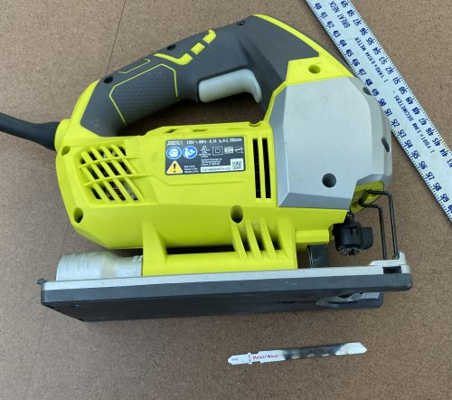\
    *fig 15.1*

2. Attach Blue Tape and measure for holes on the both long edges at 95mm, 191mm, 287mm, 382mm, and 478mm.

    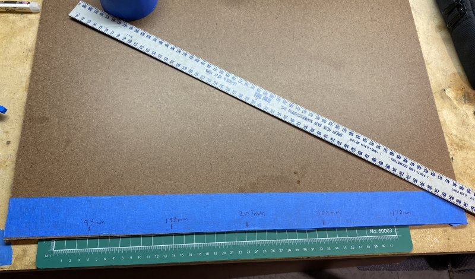\
    *fig 15.2*

    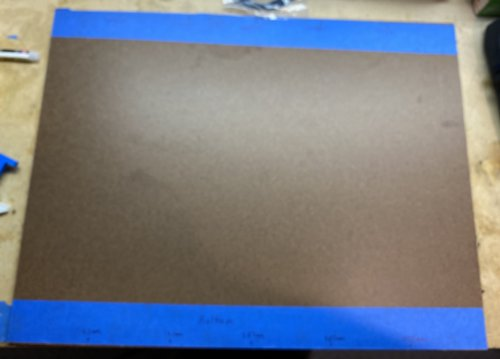\
    *fig 15.3*

### Assembly
1. Place 1x 576mm extrusion on top of the lower side rails and use the 2 man jigs to space it 60mm from the back extrusion.

    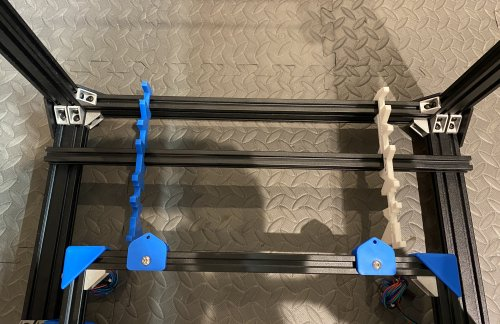\
    *fig 15.4*

2. Attach the 576mm extrusion to the lower side rails using 2 brackets on left and right sides. 4 brackets total to attach the extrusion. They won't fit perfectly flush because of the alignment ridges but that's OK.

    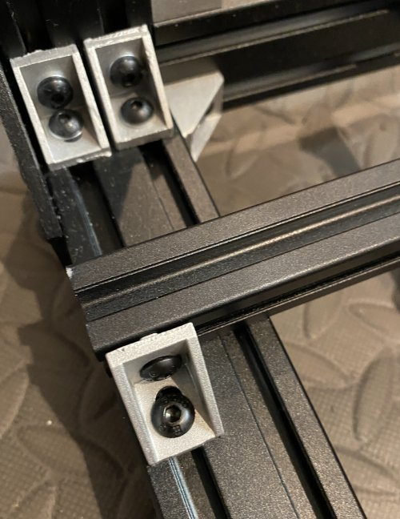\
    *fig 15.5*

    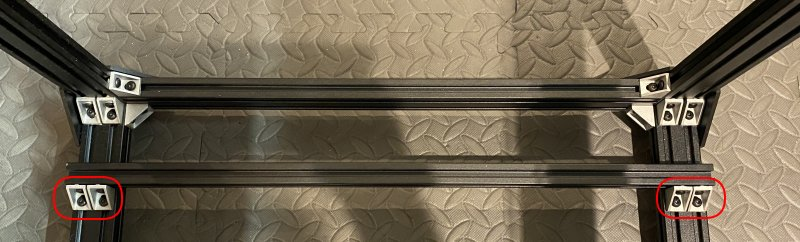\
    *fig 15.6*

    Note: Official instructions call for 8 brackets, 2 front and back of each side of the extrusion. This is excessive/tricky and also gets in the way of the electronics panel.

3. Temporarily attach brackets to each side of the 2nd 576mm extrusion. The bracket should be flush on one side. These will help in the alignment in the next step

    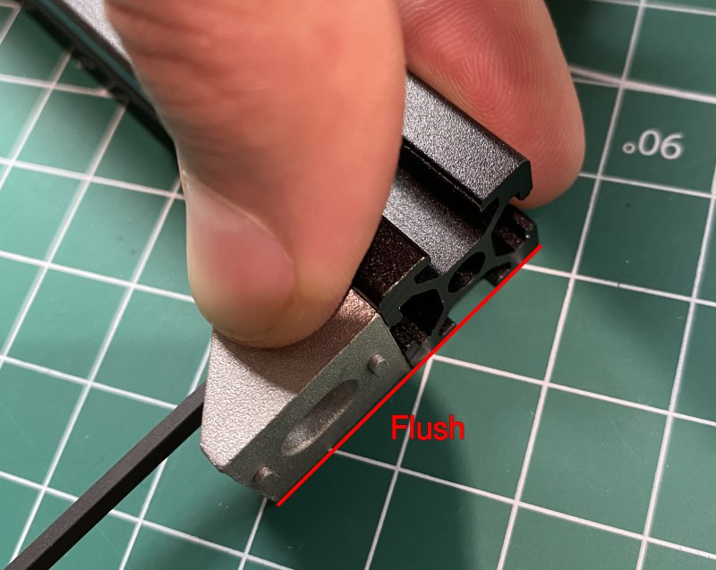\
    *fig 15.7*

    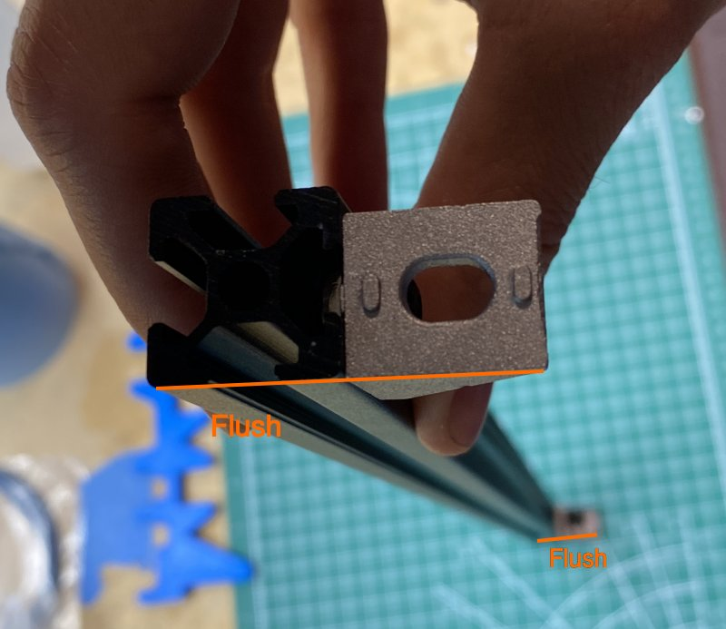\
    *fig 15.8*

4. Clamp the 2nd 576mm extrusion to the bottom of the side extrusions with the linear rails attached to them. The 567mm extrusion should be parallel to the back extrusion and ~60mm apart from it.

    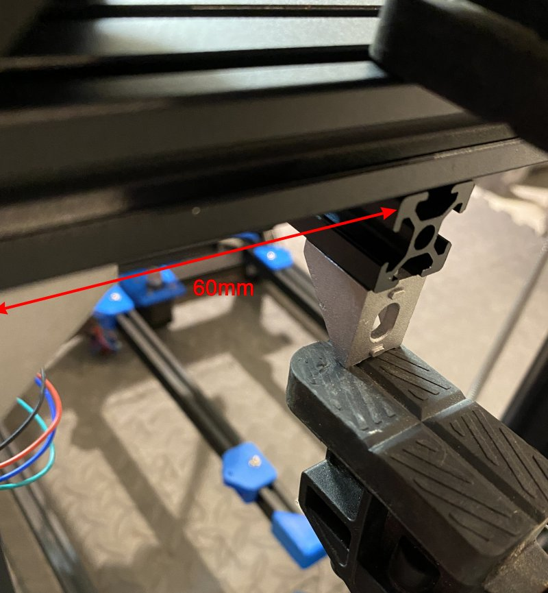\
    *fig 15.9*

    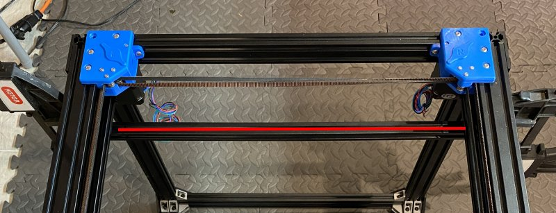\
    *fig 15.10*

5. Using the alignment tools on each side, position the top extrusion 60mm from the back extrusion.

    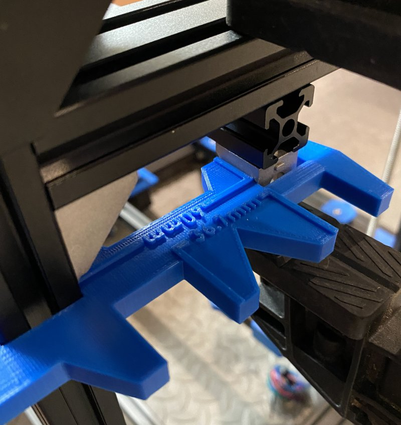\
    *fig 15.11*

6. Using the 2 brackets attach the top extrusion on the left and right sides. Once the extrusion is secured remove the brackets you attached to help align the extrusion and reattach next to the other 2. There should be 2 brackets per side, all facing the front (same way as the bottom extrusion Fig 15.6).

    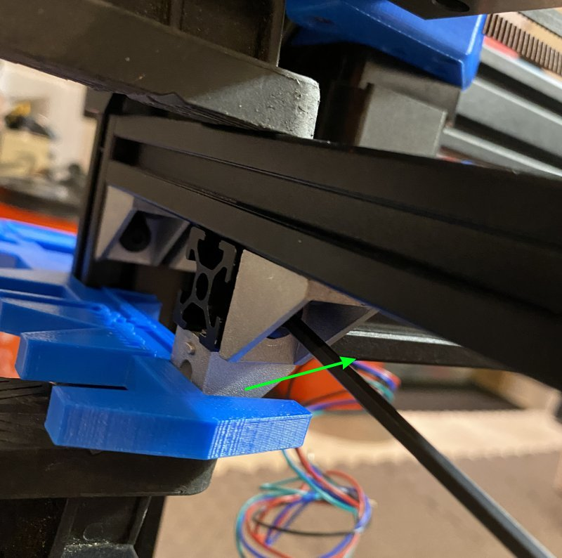\
    *fig 15.12*

7. With the frame resting on it's front, rest the 440mm x 574mm Tempered Hardboard panel on the 2x 576mm extrusions you just attached. Clamp as shown in the picture.

    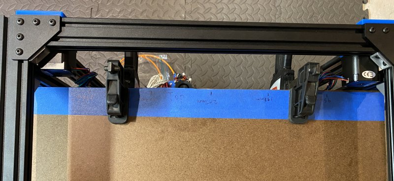\
    *fig 15.13*

8. Using the 3D printed extruder mount as a guide, trace hole locations on the Blue Tape. Do this for the top and bottom of the panel. Just make sure the panel isn't warped when you do the bottom.

    \
    *fig 15.14*

9. Measure out mounting holes for the Din Rails and power supply location. **No middle rail**

   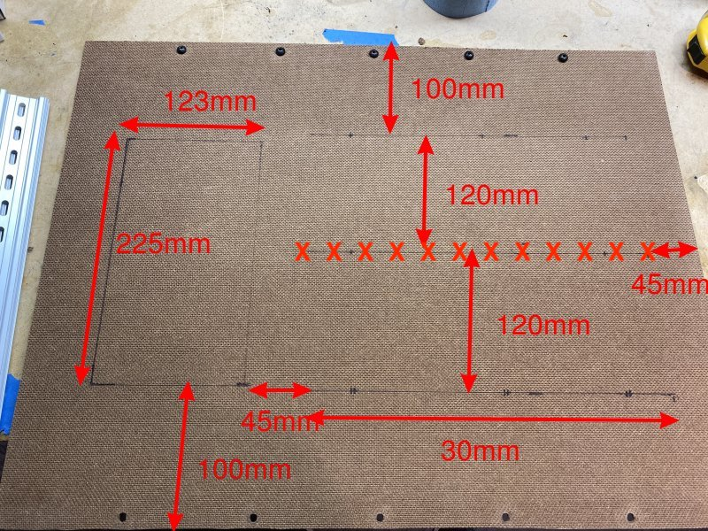\
   *fig 15.15*

10. Using a Din Rail as a template, mark 3 mounting hole locations per rail.

    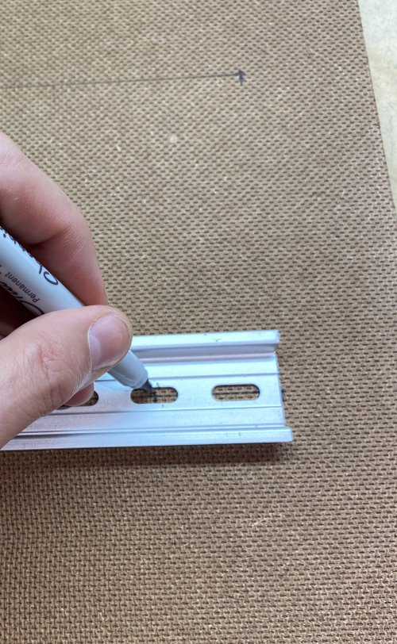\
    *fig 15.16*

11. Create a mounting hole template for the power supply using blue tape. Update: Skip the middle DIN rail.

    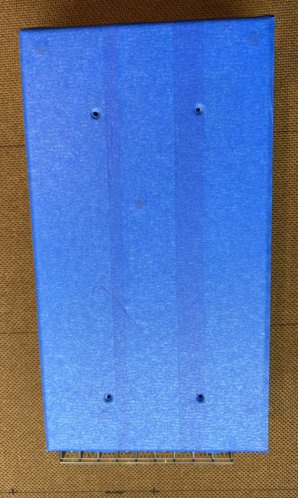\
    *fig 15.17*

13. Use the template on the Tempered Hardboard to mark the locations for the power supply mounting holes.

    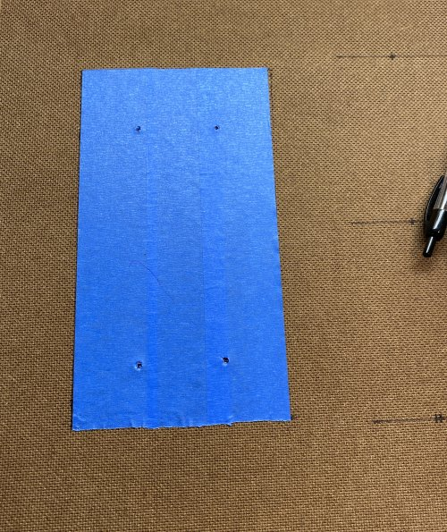\
    *fig 15.18*

14. Drill M4 sized holes (11/64" or ~4.5mm) for the power supply and drill M5 (7/32" or ~5.5mm) sized holes for everything else. You should have 4 M4 (Power Supply) and 19 M5 holes (Rails and Panel Mount).

    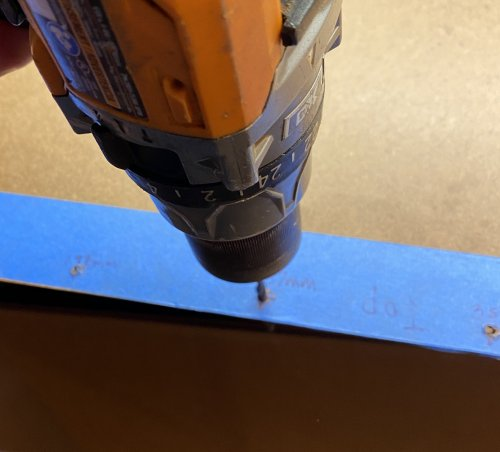\
    *fig 15.19*

    Note: It can be helpful to drill a pilot hole with a much smaller bit (1/16" or 1.5mm). This will help you to drill the hole in the exact location you marked.

15. Clean up the holes using an X-Acto Knife.

    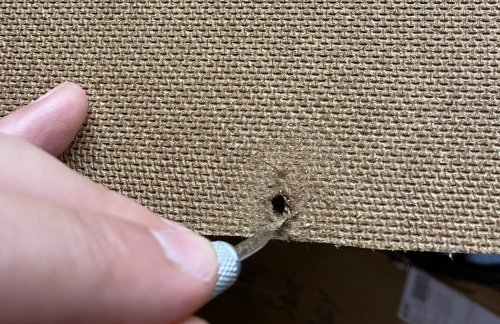\
    *fig 15.20*

16. Mount the rails using M5 8mm Screws,washers (Only needed on the rail side) and Nuts. **No middle rail**

    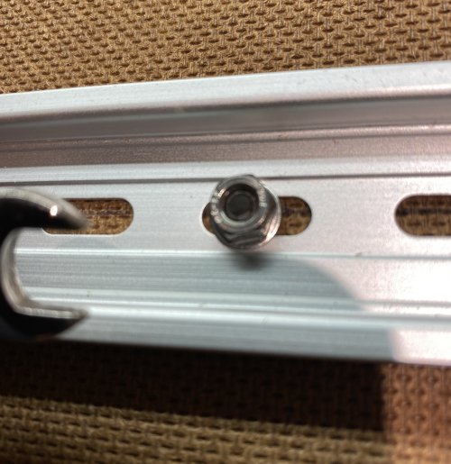\
    *fig 15.21*

    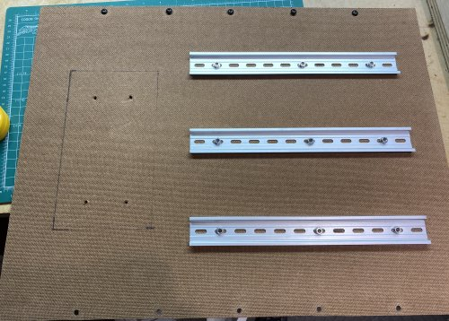\
    *fig 15.22*

    Note: If the holes don't line up you can use the X-Acto Knife to widen or lengthen them.

17. Mount the Power Supply using the M4 6mm screws. Note: I only had M4 4mm flat head screws handy so that's what I used.

    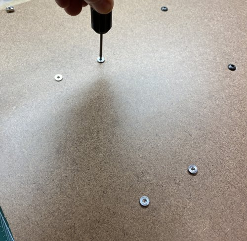\
    *fig 15.23*

    Note: If the holes don't line up you can use the X-Acto Knife to widen or lengthen them.

18. Here's what the front and back of the electronics panel should look like with everything mounted. Note that M5 8mm screws and T-Nuts have been put in the remaining holes. **Power supply should have terminals on top**

    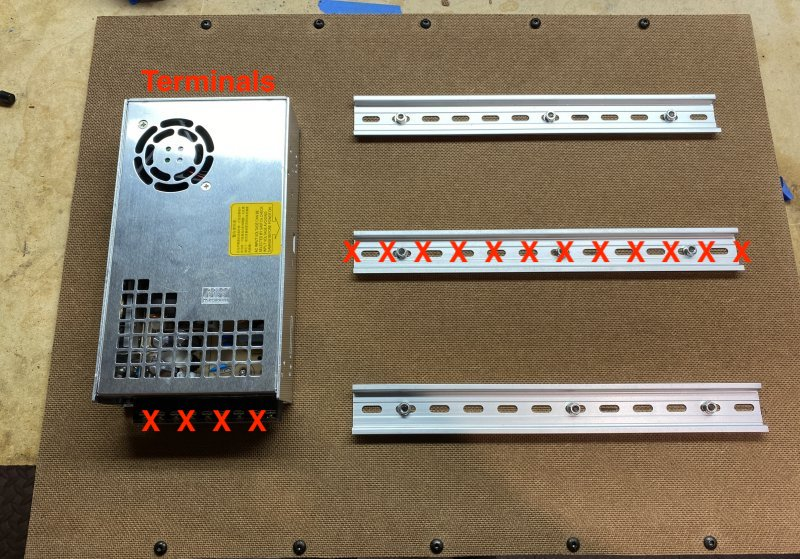\
    *fig 15.24*

    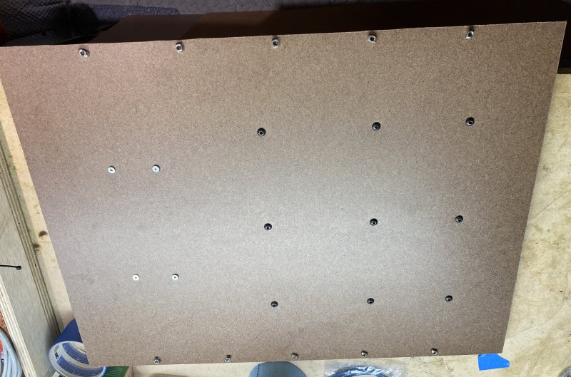\
    *fig 15.25*

19. Now slide the panel onto the 576mm Extrusions and secure using the M5 8mm screws and T-Nuts.

    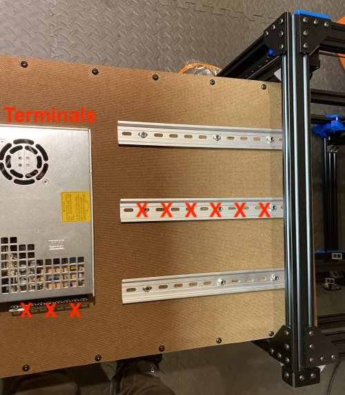\
    *fig 15.26*

    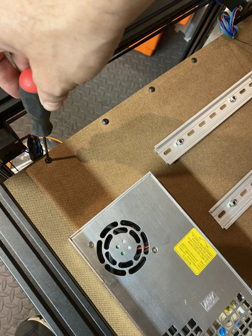\
    *fig 15.27*

20. Here's what the finished product should look like.

    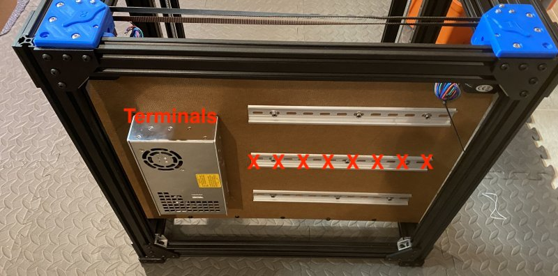\
    *fig 15.28*

    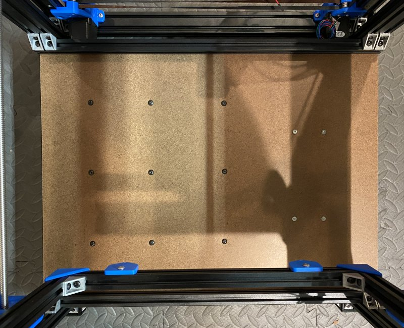\
    *fig 15.29*