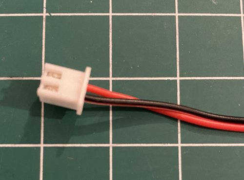

# My BLV MGN Cube - Assembly Instructions

## Step 16 Hotend Wiring

### Step 16 BoM

#### Hardware
| Parts     | Quantity | Details | Example Links |
|-----------|:--------:|---------|---------------|
| Female 3 Pin JST-XH Connector | 1 | Your controller uses these and you should too | [Aliexpress](https://s.click.aliexpress.com/e/_AWPLkY) [Amazon](https://amzn.to/3u0TiMD) |
| Male 2 Pin JST-XH Connector | 2 | Your controller uses these and you should too | [Aliexpress](https://s.click.aliexpress.com/e/_AWPLkY) [Amazon](https://amzn.to/3u0TiMD) |
| Heat Shrink Tubing | 10cm | Enough to cover the pins of the JST-XH Male Connectors | |
| Green Wire | 1m | 22 AWG Stranded Silicone | [Amazon](https://amzn.to/3ruTli7) |
| Black Wire | 3m | 22 AWG Stranded Silicone | [Amazon](https://amzn.to/3ruTli7) |
| Red Wire | 2m | 22 AWG Stranded Silicone | [Amazon](https://amzn.to/3ruTli7) |
| BLTouch Extension Cable | 1m | Should have come with your BLTouch | [Amazon](https://amzn.to/3rKZEhH) |

#### Tools
| Parts     | Quantity | Details | Example Links |
|-----------|:--------:|---------|---------------|
| JST-XH Crimper | 1 | I've had great success with the IWISS IWS-2820 | [Amazon](https://www.amazon.com/IWISS-Crimping-AWG28-20-Terminals-Connectors/dp/B078WNZ9FW/ref=sr_1_5?dchild=1&keywords=iws-2820&qid=1628984315&sr=8-5&th=1) |
| Soldering Iron and Solder | 1 | For small electronics | [Amazon](https://amzn.to/3rvsgLI) |
| Helping Hands | 1 | Optional but will make the soldering much easier | [Amazon](https://www.amazon.com/Neiko-01902-Adjustable-Magnifying-Alligator/dp/B000P42O3C/ref=sr_1_1?dchild=1&keywords=helping+hands&qid=1628984768&sr=8-1) |
| Butane Mini Torch | 1 | You might need to purchase ligher fluid separately (Can't remember) | [Amazon](https://amzn.to/2R3ymGG) |
| Multimeter W/Continuity Tester | 1 | This multimeter has a temp probe too! | [Amazon](https://amzn.to/3sxUjeT) |

### Assembly
1. Check your fan connectors for the correct polarity. -/Black and +/Red should be in the JST-XH connector as pictured. My blower fan was wired backwards. It's easy to remove the female pins and swap them in the connector if you need to. Aliexpress cheap but...

    \
    *fig 16.1*

2. Make extension wires for the both fans using 1m lengths of the 22AWG silicone wire and 2pin male connectors.
    1. Cut pieces of heat shrink tubing for each wire and slide over the wires. Use a larger piece of heat shrink tubing to cover all the wires. *Nothing is more annoying than realizing you forgot to put the heat shrink tubing on a wire after you're done attaching the connectors*

        \
        *fig 16.2*

    2. Strip the ends of the wires. Only strip a little because we are going to crimp the ends with female JST-XH connectors.

        \
        *fig 16.3*

    3. Attach female JST-XH crimps to the ends of the wires using the crimper. *The IWS-2820M worked much better than the fancy ratcheting ones for me. It's not fast but I got much better crimps.*

        \
        *fig 16.4*

    4. Setup the male connector in your helping hands and use the female crimps to attach to the back the connector. This will make soldering them MUCH easier. Also make sure to attach something to the connector to help dissipate the heat when you solder it (I used a spare fan). The connectors are really small and you're likely to melt it if you don't dissipate the heat somehow.

        \
        *fig 16.5*

    5. Solder the female connectors to make it permanent. You shouldn't need much. Be quick to avoid melting the connector.

        \
        *fig 16.6*

    6. Slide the heat shrink tubing over each connection and use the torch to shrink it. I wave the torch back and fourth to keep the heat even and to avoid melting/burning things.

        \
        *fig 16.7*

        \
        *fig 16.8*

3. Make an extension wire for the limit switch using 1m lengths of the 22AWG silicone wire and a 3pin female connector. Preferably green for signal and black for common.

    \
    *fig 16.9*

4. Test the fans for proper operation.
    1. Temporarily wire up the power supply. **CAUTION: You're messing with mains power here and it can kill you. Use your own common sense here and consult a professional if you are unsure on how to do this**

        \
        *fig 16.10*

    2. Select the correct mains voltage on the power supply (Red Switch on Side)

        \
        *fig 16.11*

    3. Connect up the fans and power on the supply to check that they are working correctly. The hotend cooling fan should be sucking in air through the front grill and the part cooling fan should be blowing air around the nozzle.

        \
        *fig 16.12*

5. Test hotend compents and wires.
    1. Test the X-axis limit switch using the multimeter contunity tester. The switch should be wired as normally closed. If the switch wiring breaks or is disconnected it will automatically trigger the switch. Here you see the switch is depressed and my multimeter has registered the circuit as open.

        \
        *fig 16.13*

    2. Test the hotend heater cartridge using the multimeter set to read resistance. You're really just looking for a finite resistance, probably 12-13 Ohms. If you are interested in the math V*V/R=W so in my case 24V*24V/12.8Ohms=45W.

        \
        *fig 16.14*

    3. Test the hotend thermistor. Standard thermistors, like mine, are in the 100K Ohm range. This math is non-trivial so be happy with something finite.

        \
        *fig 16.15*