# My BLV MGN Cube - Assembly Instructions

## Step 17 Build Bowden Extruder and Hotend Cable Manager

**Warning Experimental Work Ahead**

The cable management system here is something I created. It diverges from the standard build which didn't do much for cable management. A lot of the 3d printed parts here are custom and might require some tweaking. If you find an issue please please let me know by creating an issue in the github project.

### Step 16 BoM

#### Hardware
| Parts     | Quantity | Details | Example Links |
|-----------|:--------:|---------|---------------|
| Extruder Stepper Motor | 1 | STEPPERONLINE 17HS16-2004S1 | [STEPPERONLINE](https://www.omc-stepperonline.com/nema-17-bipolar-45ncm-64oz-in-2a-42x42x40mm-4-wires-w-1m-cable-and-connector.html?search=17HS16-2004S1) |
| BMG Extruder | 1 | A good quality clone is fine | [Aliexpress](https://www.aliexpress.com/item/32917029058.html?spm=a2g0s.9042311.0.0.27424c4d85bUyI) |
| M3 35mm Socket Head Cap Screws | 3 | DIN912 (Should be included with the BMG Extruder Kit)| |
| M3 8mm Socket Head Cap Screws | 1 | DIN912 | |
| M5 T-Nuts | 4 | Hammer Head/Drop In Style | |
| M5 10mm Socket Button Head Screws | 2 | DIN9427 | [Amazon](https://amzn.to/3txrazT) [AliExpress](https://s.click.AliExpress.com/e/_ASWaER) |
| M5 8mm Socket Button Head Screws | 2 | DIN9427 | [Amazon](https://amzn.to/3txrazT) [AliExpress](https://s.click.AliExpress.com/e/_ASWaER) |
| M3 Thin Square Nuts | 1 | DIN562 | |
| 1/2" Flex Tubing | 62cm | Also called split wire loom | [Home Depot](https://www.homedepot.com/p/Gardner-Bender-3-8-in-and-1-2-in-Flex-Tubing-7-ft-and-10-ft-Combo-Pack-FLX-538C10/205588197#product-overview) [Amazon](https://www.amazon.com/Gardner-Bender-FLX-538C10-Assorted-Corrugated/dp/B01MSN7D25/ref=sr_1_10?dchild=1&keywords=split%2Bflex%2Btubing%2B1%2F2%22&qid=1628354523&s=hi&sr=1-10&th=1) [Aliexpress](https://www.aliexpress.com/item/32855974110.html?spm=a2g0o.productlist.0.0.112a72eas6e75a&algo_pvid=6370ddcb-8c94-4862-98e7-a1bb0f65fe20&algo_exp_id=6370ddcb-8c94-4862-98e7-a1bb0f65fe20-28) |
| 3mm x 10.16cm zip ties (4in)  | 3 | ~2.5mm x ~120mm | [Amazon](https://amzn.to/3p2nDaE) |
| 24 inch Nylon zip ties | 1 | ~9mm wide at least 60cm long | [Amazon](https://www.lowes.com/pd/Utilitech-15-Pack-24-in-Cable-Ties/50005756) |

#### Printed Parts
| Parts     | Quantity | Details |
|-----------|:--------:|---------|
| [extruder-mount.stl](../../extra/hotend-cable-manager/files/extruder-mount.stl) | 1 | [Printed Parts Settings](../partsSettings.md) |
| [frame-hotend-cable-locker.stl](../../extra/hotend-cable-manager/files/frame-hotend-cable-locker.stl) | 1 | [Printed Parts Settings](../partsSettings.md) |
| [flex-tube-reinforcer.stl](../../extra/hotend-cable-manager/files/flex-tube-reinforcer.stl) | 10 | [Printed Parts Settings](../partsSettings.md) |
| [hotend-cable-guide.stl](../../extra/hotend-cable-manager/files/hotend-cable-guide.stl) | 5 | [Printed Parts Settings](../partsSettings.md) |

#### Tools
| Parts     | Quantity | Details | Example Links |
|-----------|:--------:|---------|---------------|
| 1.5mm Allen Wrench | 1 | For extruder gear | [Amazon](https://amzn.to/3qNmEgs) |
| M3 Screwdriver | 1 | | [Amazon](https://amzn.to/3qNmEgs) |
| M5 Screwdriver | 1 | | [Amazon](https://amzn.to/3qNmEgs) |

### Prep
1. Remove any sharp edges on the inside of the flex tube reinforcers.

    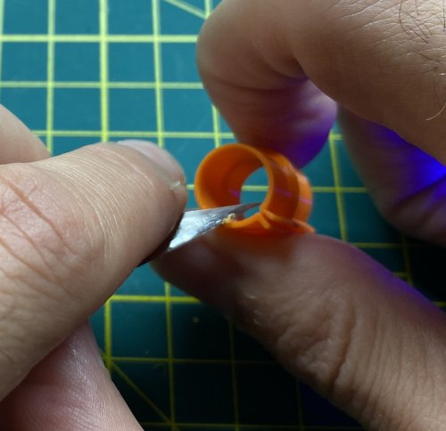\
    *fig 17.1*

### Assembly
1. Place the M3 Square nut in the frame cable locker and use an M3 8mm screw to secure itkl.

    \
    *fig 17.2*

2. Attach the frame cable locker with 2x M5 8mm screws and T-nuts centered on the top back extrusion.

    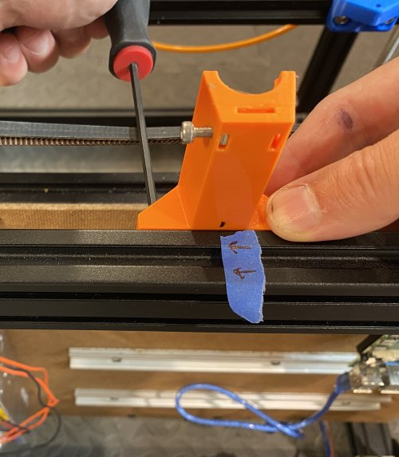\
    *fig 17.3*

3. Place the mounting plate on the stepper motor and measure a 2mm gap from the plate to the botton of the BMG extruder gear. Carefully tighten the set screw. **DON'T OVERTIGHTEN THE SET SCREW OR IT WILL STRIP**

    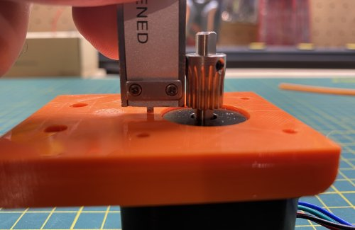\
    *fig 17.4*

4. Separate the BMG extruder and insert the bowden adapter.

    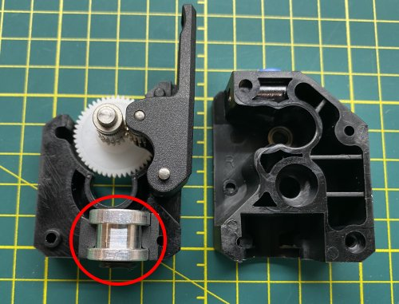\
    *fig 17.5*

5. Make a BMG/Extruder Mount/Stepper sandwich. To help the stepper/gear insert into the BMG extruder try gently wobbling it. Note stepper wires are on the left.

    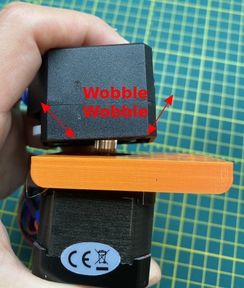\
    *fig 17.6*

6. Complete the extruder mount using 3x M3 35mm screws.

    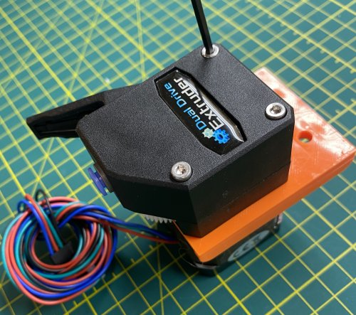\
    *fig 17.7*

7. Using 2x M5 10mm and T-nuts attach the extruder to frame with the bowden hole on the printer centerline.

    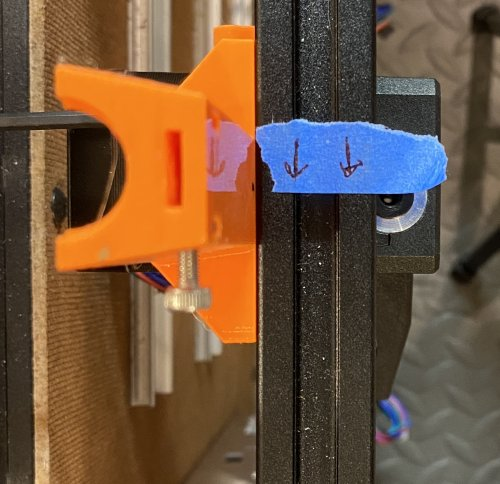\
    *fig 17.8*

    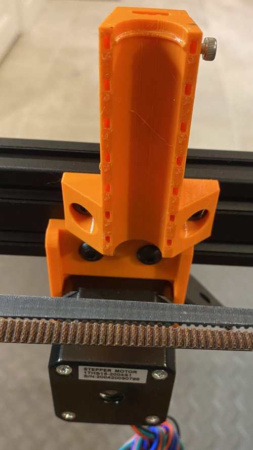\
    *fig 17.9*

7. Attach the BMG extruder tensioner.

    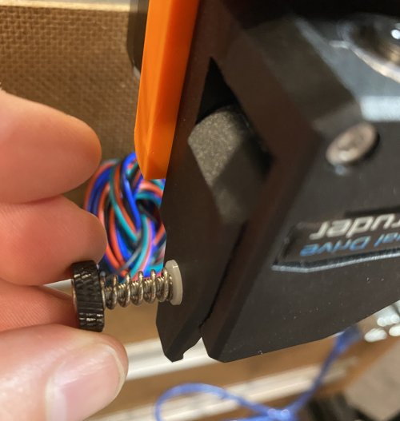\
    *fig 17.10*

8. Insert 10 of the flex tube reinforcers into the 62cm flex tube as indicated by the pictre. The reinforcers are spaced about 9cm apart (center to center). There are 2 reinforcers at one end, for the hotend locker, and 3 reinforcers at the other end, for the frame locker.

    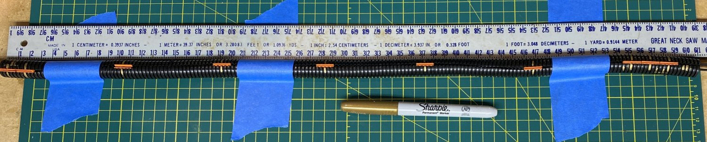\
    *fig 17.11*

9. Carefully insert the cables into the flex tube and through the reinforcers. Try not to twist the cables around one another in the tube. Don't put connectors inside of the tube.

    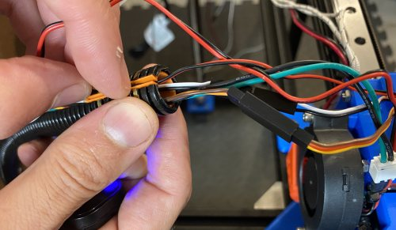\
    *fig 17.12*

10. Using 3x small zip ties secure the end of the flex tube, that has 2 reinforcers, to the Hotend cable locker. The flex tube slit should be centered on the locker. Secure any loose wires using zip ties (Ugly, but it works for now). Again: Connecters inside the flex tube is bad.

    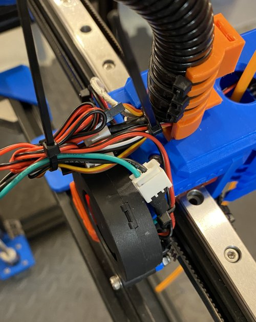\
    *fig 17.13*

    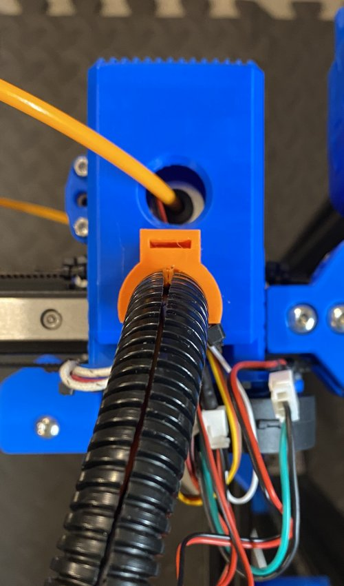\
    *fig 17.14*

11. Thread the large zip tie into the hotend locker until the head of the zip tie clicks into place.

    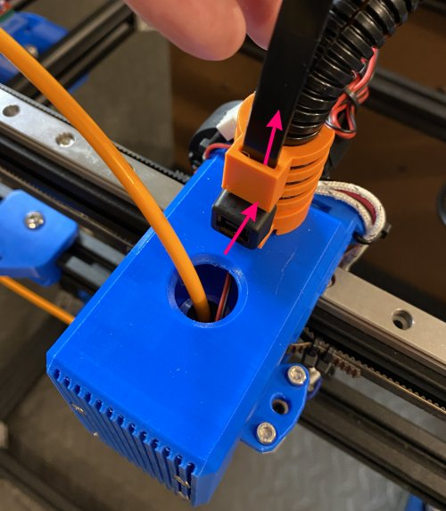\
    *fig 17.15*

12. Thread the PTFE tube and large zip tie onto the hotend cable guides and use the small zip ties to secure to the flex tube. The cable guide has a notch that should align with the reinforcer lips. The slit on the flex tube should be on top.

    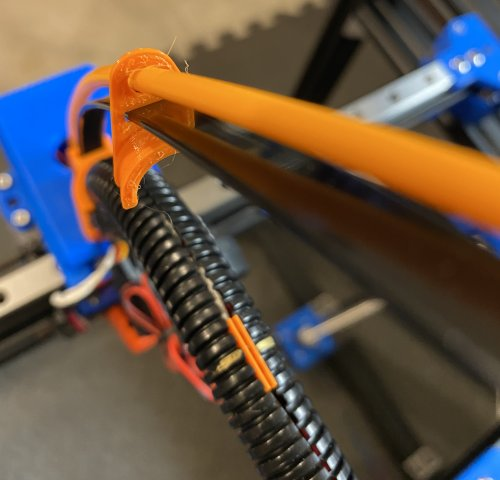\
    *fig 17.16*

    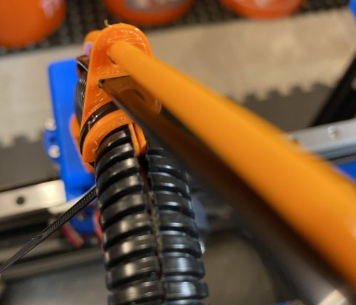\
    *fig 17.17*

    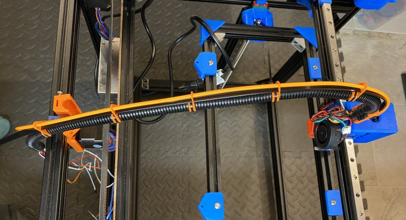\
    *fig 17.18*

13. Insert the large zip tie end and flex tube into the frame locker. Also cut the PTFE tube and insert into the extruder. Tighten the M3 to clamp the end of the zip tie. Around 79cm is what my PTFE tube mesured.

    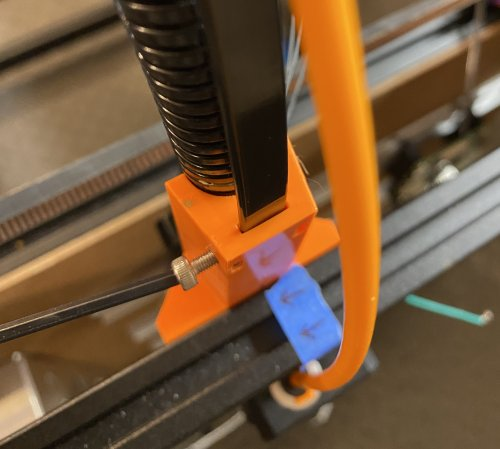\
    *fig 17.19*

14. Secure the frame locker using 3 small zip ties. *Note: I didn't use the top hole to allow the flex tube a little more play.*

    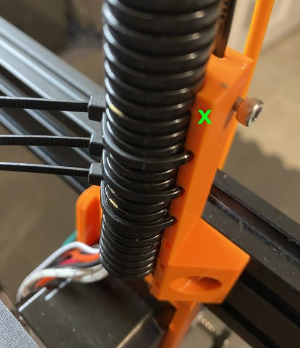\
    *fig 17.20*

14. Here is how the final cable guide should look.

    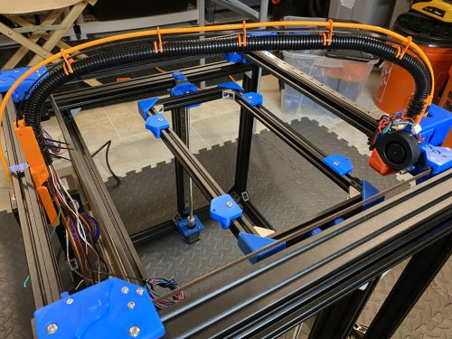\
    *fig 17.21*