# My BLV MGN Cube - Assembly Instructions

## Step 18 Install Heated Bed

**Warning Experimental Work Ahead**

The heated bed is one of the most likely components on a 3d printer to catch fire. Probably like you I'm an amature and I'm accepting the risk for myself on what I'm doing here. If you aren't comfortable doing the same then please consult a professional. If you think I'm doing something unsafe and stupid please let me know by raising an issue for the github project.

### Step 18 BoM

#### Hardware
| Parts     | Quantity | Details | Example Links |
|-----------|:--------:|---------|---------------|
| Heated Bed | 1 | 24V ~220W Aluminum Heated 310mm x 310mm x 3mm | [AliExpress](https://s.click.aliexpress.com/e/_Aq7W5i) |
| 24 inch Nylon zip ties | 1 | ~9mm wide at least 60cm long | [Amazon](https://www.lowes.com/pd/Utilitech-15-Pack-24-in-Cable-Ties/50005756) |
| M5 8mm Socket Button Head Screws | 4 | DIN9427 | [Amazon](https://amzn.to/3txrazT) [AliExpress](https://s.click.AliExpress.com/e/_ASWaER) |
| M5 T-Nuts | 4 | Hammer Head/Drop In Style | |
| M3 Thin Square Nuts | 2 | DIN562 | |
| M3 10mm Socket Head Cap Screws | 2 | DIN912 | |
| M4 Nuts | 4 | DIN934 | |
| M4 Screws | 4 | Din7991 | [AliExpress](https://s.click.aliexpress.com/e/_A1aLOM) |
| Bed Leveling Springs | 4 | Length: 20mm OD: 8mm ID: 4mm | [AliExpress](https://www.amazon.com/gp/product/B07QCN4LB9/ref=ppx_yo_dt_b_search_asin_title?ie=UTF8&psc=1) |
| Heated Bed Insulation | 1 | 300mm x 300mm x 10mm | [AliExpress](https://s.click.aliexpress.com/e/_AaR1YQ) |

#### Printed Parts
| Parts     | Quantity | Details |
|-----------|:--------:|---------|
| [BLV_Thumbwheel_bed_leveling_knob.stl](../../parts/extra/bedadjuster/BLV_Thumbwheel_bed_leveling_knob.stl) | 4 | [Printed Parts Settings](../partsSettings.md) |
| [heatbed-wireguide-bedmount.stl](../../parts/extra/heated-bed-cable-manager/heatbed-wireguide-bedmount.stl) | 1 | [Printed Parts Settings](../partsSettings.md) |
| [heatbed-wireguide-framemount.stl](../../parts/extra/heated-bed-cable-manager/heatbed-wireguide-framemount.stl) | 1 | [Printed Parts Settings](../partsSettings.md) |
| [heatbed-wireguide-loop.stl](../../parts/extra/heated-bed-cable-manager/heatbed-wireguide-loop.stl) | 8 | [Printed Parts Settings](../partsSettings.md) |

#### Tools
| Parts     | Quantity | Details | Example Links |
|-----------|:--------:|---------|---------------|
| Multimeter W/Continuity Tester | 1 | This multimeter has a temp probe too! | [Amazon](https://amzn.to/3sxUjeT) |
| M3 Screwdriver | 1 | | [Amazon](https://amzn.to/3qNmEgs) |
| M5 Screwdriver | 1 | | [Amazon](https://amzn.to/3qNmEgs) |

### Prep
1. Test the heat bed to determine it's wattage and make sure it doesn't have a short. Using the multimeter set to read resistance, measure the restisance between the red and black wires. Use the formula Volts * (Volts/Resistance) = Watts to determine the Wattage. In my case, 24V * (24V/2.5 Ohms) = 230 Watts.

    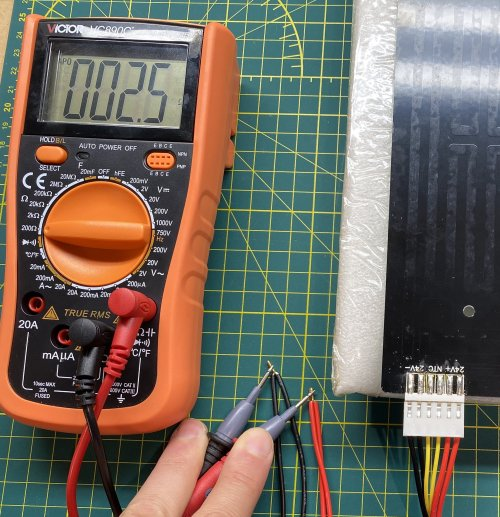\
    *fig 18.1*

    Note: Big Tree Tech recommends an external mosfet for anything over 144 Watts so I'll definitely be using a $10 external Mosfet to keep my board from catching on fire. Also it will probably increase the life on any controller board as they'll run a lot cooler.

2. Test the thermistor to make sure it isn't shorted or there isn't a loose wire. Using the multimeter set to read resistance, measure the restisance between the yellow thermistor wires. I get around 111 KOhms at room temperature which is good. As long as you get a reading KOhms you're probably good.

    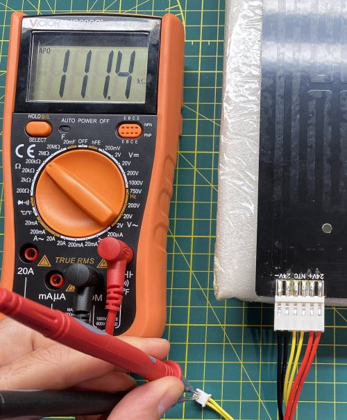\
    *fig 18.2*

3. Attach the heated bed insulation
    1. Measure and cut holes for bed leveling springs.

        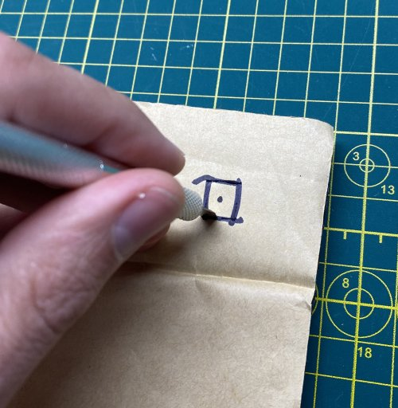\
        *fig 18.3*

        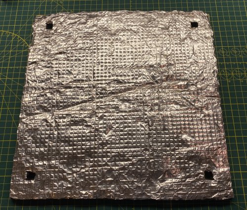\
        *fig 18.4*

    2. Clean the bottom of the heated bed with alcohol and then apply the insulation.

        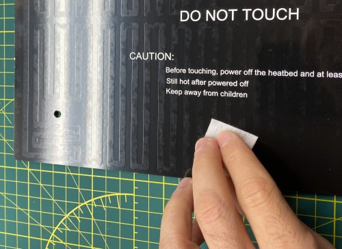\
        *fig 18.6*

        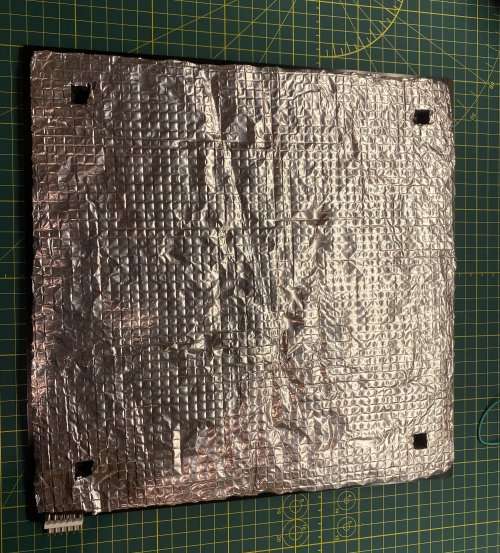\
        *fig 18.7*

    3. Make sure to trim the metal backing away from any power connectors.

        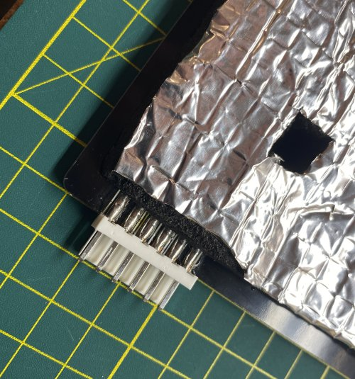\
        *fig 18.5*

4. Insert M4 nuts in each bed leveling knob. Regular nuts are fine because the tension with the bed leveling springs will keep everything tight.

    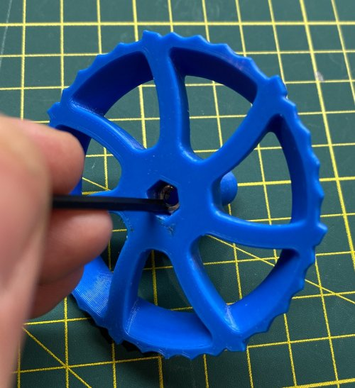\
    *fig 18.3*

5. Put M3 square nuts and M3 10mm screws into each wireguide mount. Also attach 2x M5 8mm and T-Nuts.

    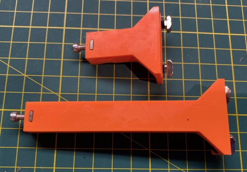\
    *fig 18.4*

6. Cut the ratchet end off the 24" zip tie.

    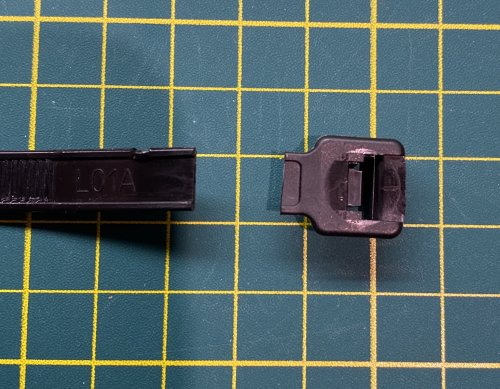\
    *fig 18.5*

### Assembly
1. Attach the heatbed wireguide bedmount (Long one) to the bed frame placing it ~120mm from the bed frame corner to the edge of the mount.

    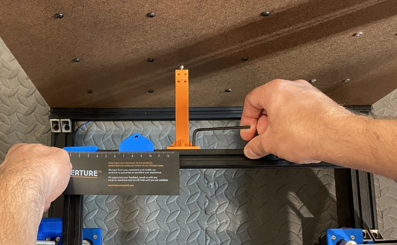\
    *fig 18.6*

2. Attach the heatbed wireguide framemount to the top back 2020 extrusion so that it's centered on the frame (~248mm for me).

    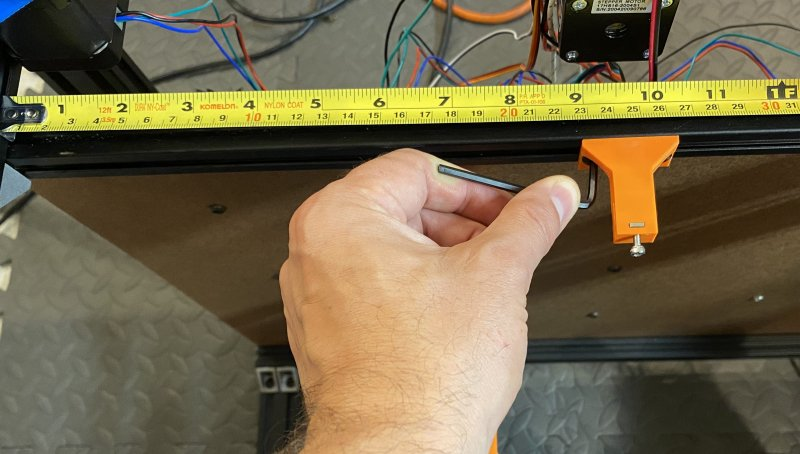\
    *fig 18.7*

3. Attach zip tie to the wireguide mounts. Manually move the bed up and down and make sure the wireguide doesn't run into anything. The zip tie should maintain a graceful arc at all points and should naturally stay level with the 2020 extrusion (See Fig 18.9 and 18.10). **The teeth should be on the outside of the loop.**

    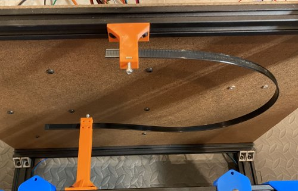\
    *fig 18.8*

    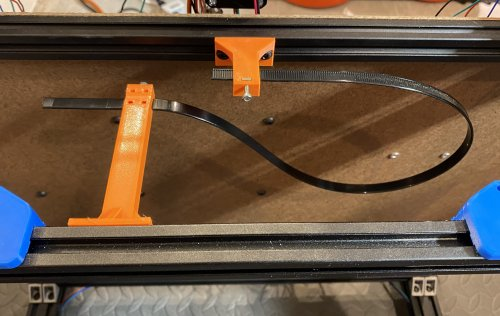\
    *fig 18.9*

    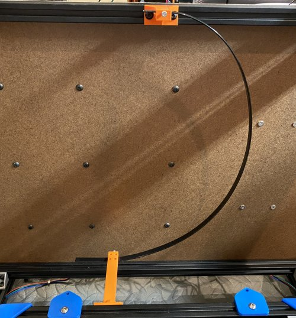\
    *fig 18.10*

4. Trim the zip tie, once your happy with it's movement, and tighten the m3 screws to clamp in place. *Mine was 520mm long when trimmed.*

    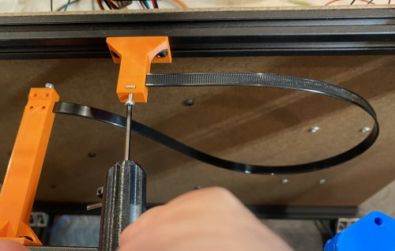\
    *fig 18.11*

5. Attach the 8x wireguide loops to the zip tie. There are teeth on the loops that should grab the teeth on the zip tie.

5. Attach the bed to the frame with using the a M4 ??mm flat head screw/2 washers/bed spring/bed leveling knob.

    \
    *fig 18.2*

    \
    *fig 18.3

    \
    *fig 18.4

5. Thread the heated bed wires through the wire guide

    \
    *fig 18.4

