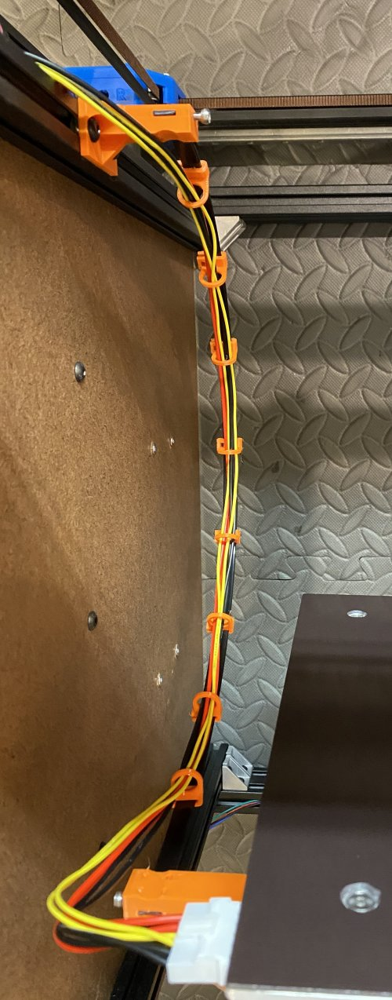

# My BLV MGN Cube - Step 18 Install Heated Bed

The heated bed is one of the most likely components on a 3d printer to catch fire. I'm accepting the risk for myself on what I'm doing here. If you aren't comfortable doing the same then please consult a professional. If you think I'm doing something unsafe and stupid please let me know by raising an issue for the GitHub project.

## [Step 18 BoM Spreadsheet Link](https://docs.google.com/spreadsheets/d/e/2PACX-1vTVx7BvB3V7CozF2l4eWkNntWrHSjOawmrsi_bRSVxQLIGVlfZTYEGp8a6fHpENV6hV2cn9PrDLHHl0/pubhtml?gid=60282210&single=true)

### Prep
1. Test the heat bed to determine it's wattage and make sure it doesn't have a short. Using the multimeter set to read resistance, measure the restisance between the red and black wires. Use the formula Volts * (Volts/Resistance) = Watts to determine the Wattage. In my case, 24V * (24V/2.5 Ohms) = 230 Watts.

    \
    *fig 18.1*

    Note: Big Tree Tech recommends an external mosfet for anything over 144 Watts so I'll definitely be using a $10 external Mosfet to keep my board from catching on fire. Also it will probably increase the life for other controller boards as they'll run a lot cooler.

2. Test the thermistor to make sure it isn't shorted or there isn't a loose wire. Using the multimeter set to read resistance, measure the restisance between the yellow thermistor wires. I get around 111 KOhms at room temperature which is good. As long as you get a reading in KOhms you're probably good.

    \
    *fig 18.2*

3. Attach the heated bed insulation.
    1. Measure and cut holes for bed leveling springs.

        \
        *fig 18.3*

        \
        *fig 18.4*

    2. Clean the bottom of the heated bed with alcohol and then apply the insulation.

        \
        *fig 18.5*

        \
        *fig 18.6*

    3. Make sure to trim the metal backing away from any power connectors.

        \
        *fig 18.7*

4. Attach the magnetic sheet to the heated bed.
    1. Create a ledge to help align the magnetic sheet. *I used some scrap wood*

        \
        *fig 18.8*

    2. Test fit the magnetic sheet on the build plate.

        \
        *fig 18.9*

    3. Remove the protective film on the heated bed.

        \
        *fig 18.10*

    4. Clean the build plate with alcohol and make sure it is free of dust/dirt/cat hair etc..

        \
        *fig 18.11*

        Note: I had a little blemish on my aluminum plate that I sanded down with 1000 grit wet sandpaper.

    5. Peel back ~4cm of the paper backing on one edge of the magnteic bed and carefully apply to heated bed using the ledge as a guide.

        \
        *fig 18.12*

    6. Using a platic spreader (or an old plastic credit card) smooth down the exposed part of the magnetic sheet to prevent air bubbles from getting trapped underneath.

        \
        *fig 18.13*

    7. Keep peeling back paper, 4cm at a time, and smoothing down with the spreader until the entire magnetic sheet is attached to the heated bed. If you go slow and are careful you shouldn't have any air bubbles trapped under the sheet. 

        \
        *fig 18.14*

        \
        *fig 18.15*

    8. Once fully attached flip over and use an X-acto knife to trim the excess material.

        \
        *fig 18.16*

    9. Using the heated bed mounting holes as a guide, poke through the underside of the magnetic sheet using the X-acto knife. This will help you find the mounting holes from the top.

        \
        *fig 18.17*

        \
        *fig 18.18*

    5. Use some blue tape to protect the surface around the mounting hole.

        \
        *fig 18.19*

    6. Using the X-Acto knife, cut out the hole. I found doing this slowly with small shavings worked best.

        \
        *fig 18.20*

        \
        *fig 18.21*

        \
        *fig 18.22*

5. Insert M4 nuts in each bed leveling knob. Regular nuts are fine because the tension with the bed leveling springs will keep everything tight.

    \
    *fig 18.23*

6. Put M3 square nuts and M3 10mm screws into each wireguide mount. Also attach 2x M5 8mm and T-Nuts.

    \
    *fig 18.24*

7. Cut the ratchet end off the 24" zip tie.

    \
    *fig 18.25*

### Assembly
1. Attach the heatbed wireguide bedmount (Long one) to the bed frame placing it ~120mm from the bed frame corner to the edge of the mount.

    \
    *fig 18.26*

2. Attach the heatbed wireguide framemount to the top back 2020 extrusion so that it's centered on the frame (~248mm for me).

    \
    *fig 18.27*

3. Attach the 24 inch zip tie to the wireguide mounts. Manually move the bed up and down and make sure the wireguide doesn't run into anything. The zip tie should maintain a graceful arc at all points and should naturally stay level with the 2020 extrusion (See Fig 18.29 and 18.30). **The teeth should be on the outside of the loop.**

    \
    *fig 18.28*

    \
    *fig 18.29*

    \
    *fig 18.30*

4. Trim the zip tie, once your happy with it's movement, and tighten the M3 screws to clamp it in place. *Mine was 520mm long when trimmed.*

    \
    *fig 18.31*

5. Attach the 8x wireguide loops to the 24" zip tie. There are teeth on the loops that should grab the teeth on the zip tie.

    \
    *fig 18.32*

6. Attach the bed to the frame using 4x bed leveling assemblies. Each assembly is as follows: M4 40mm flat head screw->M4 washer->bed spring->M4 washer->bed mount->bed leveling knob. **It's much easier to do this if you lay the printer frame on its side**

    \
    *fig 18.33*

    \
    *fig 18.34*

    Note: I used a chopstick to keep the M4 Nut in place. 

    \
    *fig 18.35*

7. Attach the heated bed wiring harness and thread it through the wire guide.

    \
    *fig 18.36*

8. Using small zip ties attach the heated bed wiring harness to the mounts and the loops to the large zip tie.

    \
    *fig 18.37*

9. Here's what it should look like when it's done.

    \
    *fig 18.38*

