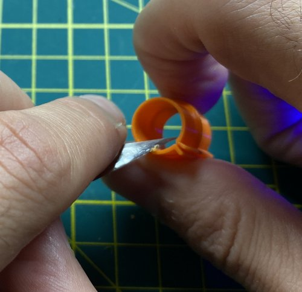
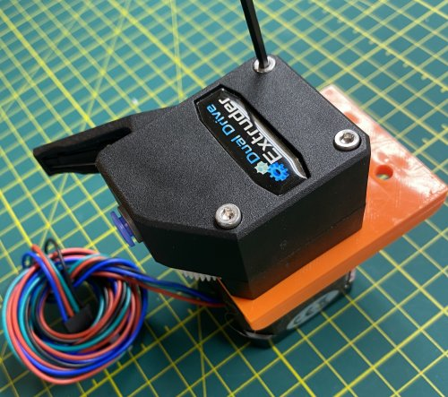
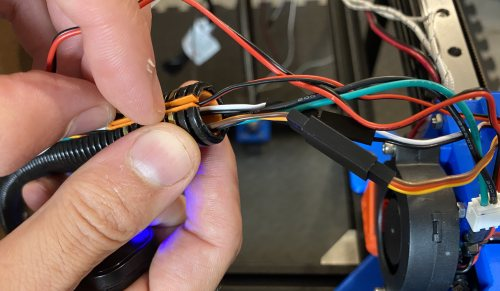

# My BLV MGN Cube - Assembly Instructions

## Step 18 Install Heated Bed

**Warning Experimental Work Ahead**

I'm a big fan of right-sized engineering but this is an area where overengineering is much safer. The heated bed is easily one of the most likely components on a 3d printer to catch fire. Probably like you I'm an amature and I am accepting the risk for myself on what I'm doing here. If you aren't comfortable doing the same then please consult a professional. If you think I'm doing something unsafe and stupid please let me know by raising an issue for the github project.

### Step 18 BoM

#### Hardware
| Parts     | Quantity | Details | Example Links |
|-----------|:--------:|---------|---------------|
| Heated Bed | 1 | 24V ~220W Aluminum Heated 310mm x 310mm x 3mm | [AliExpress](https://s.click.aliexpress.com/e/_Aq7W5i) |
| 24 inch Nylon zip ties | 1 | ~9mm wide at least 60cm long | [Amazon](https://www.lowes.com/pd/Utilitech-15-Pack-24-in-Cable-Ties/50005756) |

| M3 8mm Socket Head Cap Screws | 1 | DIN912 | |
| M5 T-Nuts | 4 | Hammer Head/Drop In Style | |
| M5 10mm Socket Button Head Screws | 2 | DIN9427 | [Amazon](https://amzn.to/3txrazT) [AliExpress](https://s.click.AliExpress.com/e/_ASWaER) |
| M3 Thin Square Nuts | 2 | DIN562 | |

#### Printed Parts
| Parts     | Quantity | Details |
|-----------|:--------:|---------|
| [BLV_Thumbwheel_bed_leveling_knob.stl](extra/bedadjuster/BLV_Thumbwheel_bed_leveling_knob.stl) | 4 | [Printed Parts Settings](../partsSettings.md) |

#### Tools
| Parts     | Quantity | Details | Example Links |
|-----------|:--------:|---------|---------------|
| Multimeter W/Continuity Tester | 1 | This multimeter has a temp probe too! | [Amazon](https://amzn.to/3sxUjeT) |
| M3 Screwdriver | 1 | | [Amazon](https://amzn.to/3qNmEgs) |
| M5 Screwdriver | 1 | | [Amazon](https://amzn.to/3qNmEgs) |

### Prep
1. Fix Bed wires. Bed wires soldered to a bed are a bad idea. I bent these wires about 10 times taking it in and out of the box. They're already breaking. Breaking decreases the guage and increases the heating of the wire which could cause them to catch fire.

    \
    *fig 18.1*

    Note: Factory wires didn't have gauge but they measured to be about 16 AWG. That is too small for ~400W at 24V. Also the insulation was stiff which also isn't good for a motion application.

2. Drill holes 7.3mm on each side of main hole.
   Drill bit should be 3mm or 1/8" for us which is about 3.2mm

The heated bed I have has multiple design flaws so I'm going to have to fix them.
    2. Bed wires soldered to bed instead of crimped. Take a look at the picture and you can see why this is a very bad idea. Note as the wire frays you will essentially decreate it's guague and this could lead to the bed wires heating up and possibly starting a fire!!

Test heated bed element using the multimeter set to read resistance. You're really just looking for a finite resistance, probably 1-2. If you are interested in the math V*V/R=W so in my case 24V*24V/1.5Ohms=384W.

    \
    *fig 18.1*

http://wiresizecalculator.net/calculators/advancedwireampacity.htm
https://www.powerstream.com/Wire_Size.htm

Remove any sharp edges on the inside of the flex tube reinforcers.

    \
    *fig 17.1*

### Assembly
1. Place the M3 Square nut in the frame cable locker and use an M3 8mm screw to secure itkl.

    \
    *fig 17.2*

2. Attach the frame cable locker with 2x M5 8mm screws and T-nuts centered on the top back extrusion.

    \
    *fig 17.3*

3. Place the mounting plate on the stepper motor and measure a 2mm gap from the plate to the botton of the BMG extruder gear. Carefully tighten the set screw. **DON'T OVERTIGHTEN THE SET SCREW OR IT WILL STRIP**

    \
    *fig 17.4*

4. Separate the BMG extruder and insert the bowden adapter.

    \
    *fig 17.5*

5. Make a BMG/Extruder Mount/Stepper sandwich. To help the stepper/gear insert into the BMG extruder try gently wobbling it. Note stepper wires are on the left.

    \
    *fig 17.6*

6. Complete the extruder mount using 3x M3 35mm screws.

    \
    *fig 17.7*

7. Using 2x M5 10mm and T-nuts attach the extruder to frame with the bowden hole on the printer centerline.

    \
    *fig 17.8*

    \
    *fig 17.9*

7. Attach the BMG extruder tensioner.

    \
    *fig 17.10*

8. Insert 10 of the flex tube reinforcers into the 62cm flex tube as indicated by the pictre. The reinforcers are spaced about 9cm apart (center to center). There are 2 reinforcers at one end, for the hotend locker, and 3 reinforcers at the other end, for the frame locker.

    \
    *fig 17.11*

9. Carefully insert the cables into the flex tube and through the reinforcers. Try not to twist the cables around one another in the tube. Don't put connectors inside of the tube.

    \
    *fig 17.12*

10. Using 3x small zip ties secure the end of the flex tube, that has 2 reinforcers, to the Hotend cable locker. The flex tube slit should be centered on the locker. Secure any loose wires using zip ties (Ugly, but it works for now). Again: Connecters inside the flex tube is bad.

    \
    *fig 17.13*

    \
    *fig 17.14*

11. Thread the large zip tie into the hotend locker until the head of the zip tie clicks into place.

    \
    *fig 17.15*

12. Thread the PTFE tube and large zip tie onto the hotend cable guides and use the small zip ties to secure to the flex tube. The cable guide has a notch that should align with the reinforcer lips. The slit on the flex tube should be on top.

    \
    *fig 17.16*

    \
    *fig 17.17*

    \
    *fig 17.18*

13. Insert the large zip tie end and flex tube into the frame locker. Also cut the PTFE tube and insert into the extruder. Tighten the M3 to clamp the end of the zip tie. Around 79cm is what my PTFE tube mesured.

    \
    *fig 17.19*

14. Secure the frame locker using 3 small zip ties. *Note: I didn't use the top hole to allow the flex tube a little more play.*

    \
    *fig 17.20*

14. Here is how the final cable guide should look.

    \
    *fig 17.21*

