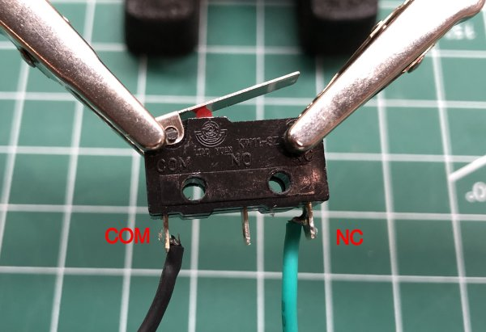
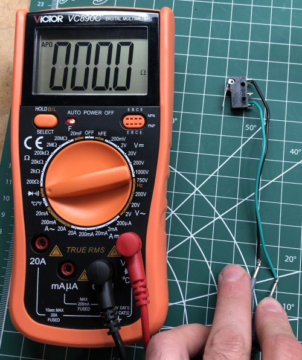
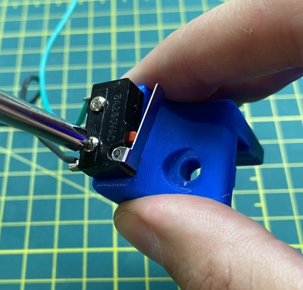
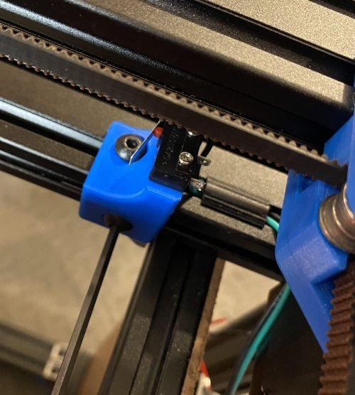
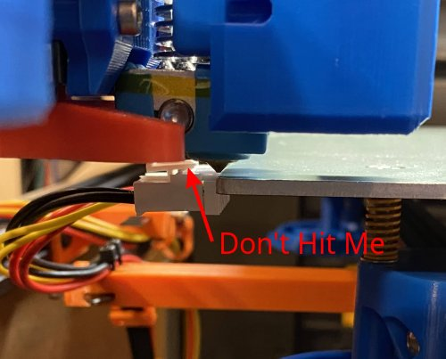
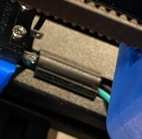

# My BLV MGN Cube - Assembly Instructions

## Step 19 Mount Y Endstop

### Step 19 BoM

#### Hardware
| Parts                             | Quantity | Details | Example Links |
|-----------------------------------|:--------:|---------|---------------|
| Limit Switch                      | 1 | 3P with handle (KW11-3Z) | [Aliexpress](https://s.click.aliexpress.com/e/_A4VObA) |
| M2 12mm Socket Head Cap Screws    | 2 | DIN912 | [Aliexpress](https://s.click.aliexpress.com/e/_9hsKpC) |
| M5 10mm Socket Button Head Screws | 2 | DIN9427 | [Amazon](https://amzn.to/3txrazT) [Aliexpress](https://s.click.aliexpress.com/e/_ASWaER) |
| M5 T-Nuts                         | 2 | Hammer Head/Drop In Style | |
| Black Wire                        | ~45cm | 22 AWG Stranded Silicone | [Amazon](https://amzn.to/3ruTli7) |
| Green Wire                        | ~45cm | 22 AWG Stranded Silicone | [Amazon](https://amzn.to/3ruTli7) |

#### Printed Parts
| Parts     | Quantity | Details |
|-----------|:--------:|---------|
| [Y-Endstop-for-kw11-3p.stl](../../parts/remixed/stl/Y-Endstop-for-kw11-3p.stl) | 1 | [Printed Parts Settings](../partsSettings.md) |
| [extrusion-cover.stl](../../parts/extra/extrusion-cover/extrusion-cover.stl) | 1 (Scaled to 20mm long) | [Printed Parts Settings](../partsSettings.md) |

#### Tools
| Parts     | Quantity | Details | Example Links |
|-----------|:--------:|---------|---------------|
| Soldering Iron and Solder | 1 | For small electronics | [Amazon](https://amzn.to/3rvsgLI) |
| Multimeter W/Continuity Tester | 1 | This multimeter has a temp probe too! | [Amazon](https://amzn.to/3sxUjeT) |
| M2 Screwdriver | 1 | | [Amazon](https://amzn.to/3qNmEgs) |
| M5 Screwdriver | 1 | | [Amazon](https://amzn.to/3qNmEgs) |

### Prep

1. Solder 45cm lengths of black and green wires onto the limit switch. The black wire should attach to the Common (COM) terminal and the green wire should attach to the Normally Closed (NC) terminal. *It's important to use NC instead of NO. If a wire breaks it will automatically trigger the endstop*

    \
    *fig 19.1*

2. Test the limit switch and wiring using the continuity tester on your Multimeter. It should be a closed circuit until you press the switch.

    \
    *fig 19.2*

### Assembly
1. Attach the Limit switch to 3d printed Y-Endstop-for-kw11-3p mount using the 2x M2 12mm screws. *Pretend these are socket head screws instead of star/phillips heads. It's just what I had handy*

    \
    *fig 19.3*

2. Attach the Y endstop mount to the frame as shown using 2x M5 10mm Screws and T-nuts (Fig 19.3). Positon it so that the switch is triggered just at the nozzle reaches the end of the bed and before it hits the bed power connector (Fig 19.4).

    \
    *fig 19.3*

    \
    *fig 19.4*

3. Use the extrusion cover to secuire the switch wire to the frame.

    \
    *fig 19.5*