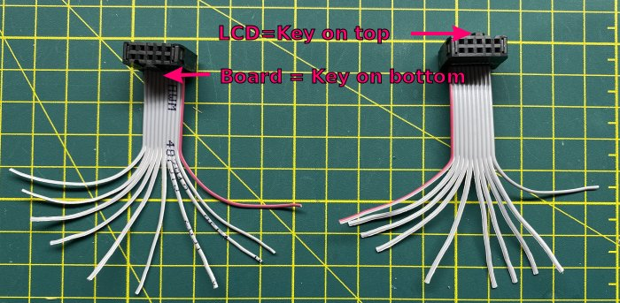
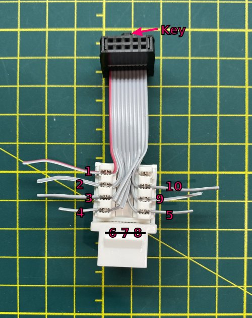
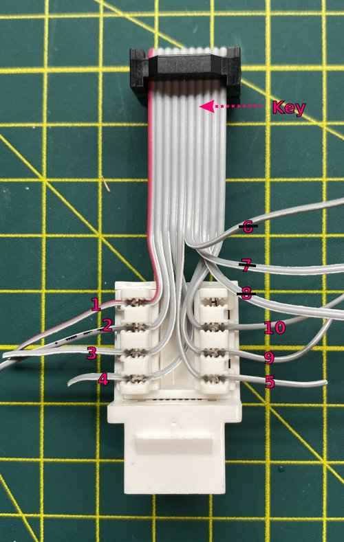
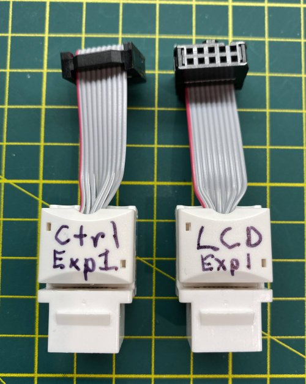

# My BLV MGN Cube - Assembly Instructions

## Step 20 Build Front Panel

### Step 20 BoM

#### Hardware
| Parts     | Quantity | Details | Example Links |
|-----------|:--------:|---------|---------------|
| BTT 3.5 in Touch Screen V3.0 | 1 | Dual Mode, TFT Mode (Marlin)/12864 Mode (Klipper/RRF) | [Amazon](https://www.amazon.com/BIGTREETECH-Graphic-Display-Controller-Printer/dp/B07VWF4W3J) [Aliexpress](https://s.click.aliexpress.com/e/_9x9JTN) |
| IDC ribbon cables | 2 | These are EXP1 and EXP2 cables (Incl W/TFT) | |
| RS232 cable | 1 | (Incl W/TFT) | |
| 576mm (~22.7in) 2020 Extrusion | 1 | from standard 365mm Z frame | |
| Ethernet/RJ45 Keystone Jacks | 6 | | [Amazon](https://www.amazon.com/gp/product/B07JRD69V6/ref=ppx_yo_dt_b_asin_title_o02_s00?ie=UTF8&th=1)|
| 1 Meter Ethernet Cables | 3 | Whatever you have lying around is fine (AWG24 is ideal, stranded or solid) |[Amazon](https://www.amazon.com/Cable-Matters-5-Pack-Snagless-Ethernet/dp/B00C2CBBAM) |

#### Printed Parts
| Parts     | Quantity | Details |
|-----------|:--------:|---------|
| [TFT35v3Mount-tweaked.stl](../../parts/extra/tft35v30-bezel-insert/files/FTFT35v3Mount-tweaked.stl) | 1 | [Printed Parts Settings](../partsSettings.md) |
| [Front_Panel_-_Left_plate_for_TFT35_V2.STL](../../parts/extra/improved-bezel/files/Front_Panel_-_Left_plate_for_TFT35_V2.STL) | 1 | Works for TFT35 V3.0 as well [Printed Parts Settings](../partsSettings.md) |
| [Front_Panel_-_Center_plate.STL](../../parts/extra/improved-bezel/files/Front_Panel_-_Center_plate.STL) | 1 | [Printed Parts Settings](../partsSettings.md) |
| [Front_Panel_-_Right_plate.STL](../../parts/extra/improved-bezel/files/Front_Panel_-_Right_plate.STL) | 1 | [Printed Parts Settings](../partsSettings.md) |
| [Front_Panel_-_left_grill.STL](../../parts/extra/improved-bezel/files/Front_Panel_-_left_grill.STL) | 1 | [Printed Parts Settings](../partsSettings.md) |
| [Front_Panel_-_right_grill.STL](../../parts/extra/improved-bezel/files/Front_Panel_-_right_grill.STL) | 1 | [Printed Parts Settings](../partsSettings.md) |

#### Tools
| Parts     | Quantity | Details | Example Links |
|-----------|:--------:|---------|---------------|
| M2 Screwdriver | 1 | | [Amazon](https://amzn.to/3qNmEgs) |
| M5 Screwdriver | 1 | | [Amazon](https://amzn.to/3qNmEgs) |

### Prep

1. Adapt EXP1 (10pin IDC) Cable to use Ethernet Extensions

    1. Cut the EXP1 ribbon cable about 60mm from the connectors and separate the ribbons into individual wires.

        \
        *fig 20.1*

    2. For  the LCD side (Key on top of connector) splice with a keystone jack. Red wire is 1. Wires 6/7/8 are not used for EXP1 and can be trimmed.

        \
        *fig 20.2*

        

EXP1 Pinout

        

        [Pinout Reference](https://reprap.org/wiki/RepRapDiscount_Full_Graphic_Smart_Controller)

        

        

    3. For  the Controller Board side (Key on bottom connector) flip the cable over so red wire is on the left. Wireing is exactly the same as the LCD side. Wires 6/7/8 are not used for EXP1 and can be trimmed.

        \
        *fig 20.3*

        

EXP2 Pinout

        

        [Pinout Reference](https://reprap.org/wiki/RepRapDiscount_Full_Graphic_Smart_Controller)
        

        

    4. Make sure to attach the little caps on the keystones. These prevent the spliced wires from slipping out. Also it's a good idea to label the connectors. Exp1 and Exp2 will **not** be interchangeable.

        \
        *fig 20.4*

1. Adapt EXP2 (10pin IDC) Cable to use Ethernet Extensions.

     2. Follow the same process you used for EXP1 but with only wires 7 and 10 removed.

        \
        *fig 20.5*

1. Build the RS232 (JST-??) to RJ45 Adapter

    \
    *fig 20.1*

### Assembly
1. Attach the aluminum extrusion to the frame

    \
    *fig 20.2*
