# My BLV MGN Cube - Step 20 Build Front Panel

## [Step 20 BoM Spreadsheet Link](https://docs.google.com/spreadsheets/d/e/2PACX-1vTVx7BvB3V7CozF2l4eWkNntWrHSjOawmrsi_bRSVxQLIGVlfZTYEGp8a6fHpENV6hV2cn9PrDLHHl0/pubhtml?gid=315119312&single=true)

### Prep

1. Adapt the EXP1 (10pin IDC) cable to use Ethernet extensions (For legacy LCD support)

    1. Cut the EXP1 ribbon cable about 60mm from each end and separate the ribbons into individual wires.

        \
        *fig 20.1*

    2. For the adapter that will attach to the TFT touch screen (Key on top of connector), splice with a keystone jack. Red wire is wire 1. Wires 6/7/8 are not used for EXP1 and can be trimmed.

        \
        *fig 20.2*

        Note: I used a stripper/puch down tool to make sure each wire was spliced properly. One of those plastic puch down tools, that usually comes with keystone jacks, would be fine but the ones I bought didn't come with them (That's what you get for $1/each).

        

EXP1 Pinout

        

        

        [Pinout Reference](https://reprap.org/wiki/RepRapDiscount_Full_Graphic_Smart_Controller)

        

        

    3. For the adapter that will attach to the controller board (Key on bottom connector), flip the cable over so red wire is on the left. Wiring is exactly the same as the LCD end. Wires 6/7/8 are not used for EXP1 and can be trimmed.

        \
        *fig 20.3*

    4. Make sure to attach the little caps on the keystones. These prevent the spliced wires from slipping out. Also it's a good idea to label the connectors with "EXP1". The Exp1 and Exp2 cables will **not** be interchangeable.

        \
        *fig 20.4*

1. Adapt the EXP2 (10pin IDC) cable to use Ethernet extensions (For legacy LCD support)

     2. Follow the same process you used for the EXP1 cable but with wires 7 and 10 not attached.

        \
        *fig 20.5*

        

EXP2 Pinout

        

        

        [Pinout Reference](https://reprap.org/wiki/RepRapDiscount_Full_Graphic_Smart_Controller)

        

        

1. Adapt RS232 (5pin JST-XH) cable to use Ethernet extensions (For TFT support)

    1. Using the RS232 (Black) cable provided with the TFT touch screen and 2 keystone jacks, make ethernet adapters (See picture for pinout). You will also need to replace the dupont connector with a 5 pin JST-XH connector (White). Note that the cable is a cross over cable with the pins reversed on each side.

	    \
        *fig 20.6*

        

RS232 Pinout

        

        

        

        

    2. Make sure to attach the little caps on the keystones. These prevent the spliced wires from slipping out. Also it's a good idea to label the connectors.

	    \
        *fig 20.7*

### Assembly
1. Using 2 Main jigs postion the 576mm 2020 extrusion 45mm above the lower front 4040 extrusion. Attach the extrusion to the front vertical extrusions using 4x angle brackets and 8x 8mm M5 screws/T-Nuts (2 brackets on each side).

    \
    *fig 20.8*

    \
    *fig 20.9*

2. Plug the EXP1, EXP2, and RS232 adapters into the back of the TFT touch screen.

    \
    *fig 20.10*

3. Using 4x M3 6mm screws attach the TFT touch screen to the TFT35 Mount.

    \
    *fig 20.11*

4. Using 4x M3 12mm screws attach the TFT35 Mount to the left panel.

    \
    *fig 20.12*

5. Attach the knob onto the TFT touch screen encoder.

    \
    *fig 20.13*

6. Attach 2x M5 10mm screws/T-Nuts to the left panel and attach to the frame as shown.

    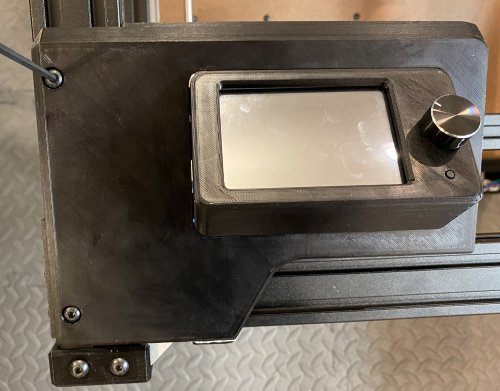\
    *fig 20.14*

7. Don't bother using the M5 attachment point inside the left panel. It's a pain to get to and you won't be able to adjust the panels later if you use it.

    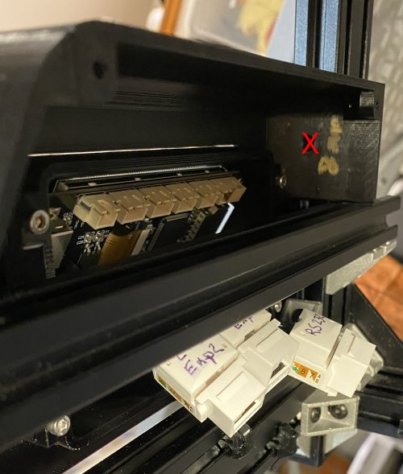\
    *fig 20.15*

8. Secure the bottom of the left panel using a M5 10mm screw/T-nut. Be careful because this part of the print is delicate. I broke it and had to fix it with crazy glue gel. To help position the T-nut use a strip of blue tape.

    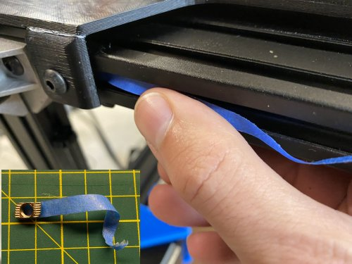\
    *fig 20.16*

    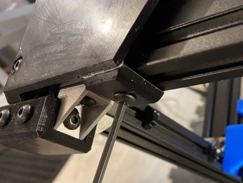\
    *fig 20.17*

9. Attach 2x M5 10mm screws/T-Nuts to the center panel and attach to the frame as shown.

    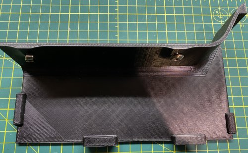\
    *fig 20.18*

    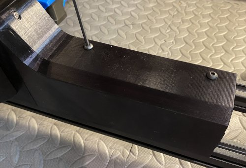\
    *fig 20.19*

10. Using a M3 16mm screw and nut, tie the left and center panels together.

    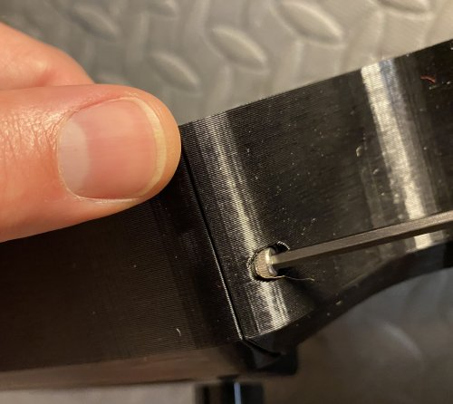\
    *fig 20.20*

11. Attach 4x M5 10mm screws/T-Nuts to the right panel.

    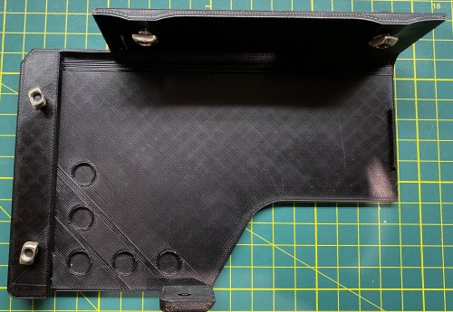\
    *fig 20.21*

12. Carefully flex the panel to get the top T-Nuts into the 2040 extrusion channel and tighten.

    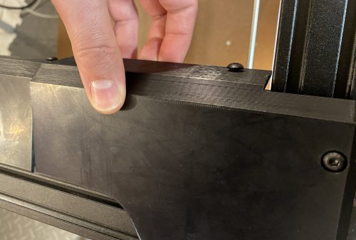\
    *fig 20.22*

    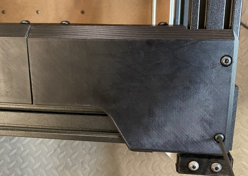\
    *fig 20.23*

13. Adjust the panels to close any gaps. I had to shift the left and right panels together to minimize the gaps.

    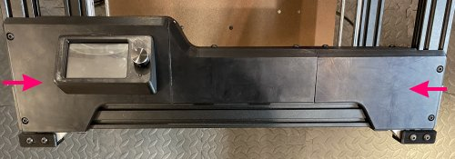\
    *fig 20.24*

14. Attach the bottom of the right panel using a M5 10mm screw/T-Nut.

    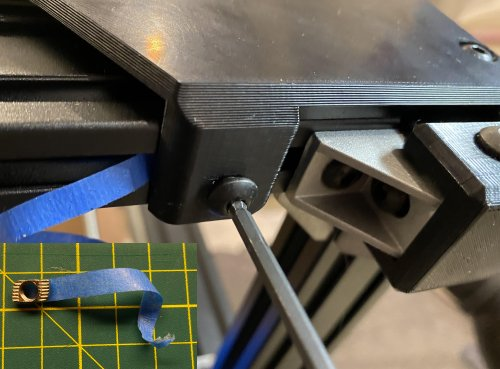\
    *fig 20.25*

15. Useing 4x M5 10mm screws/T-Nuts to attach the left and right grills to the bottom extrusion.

    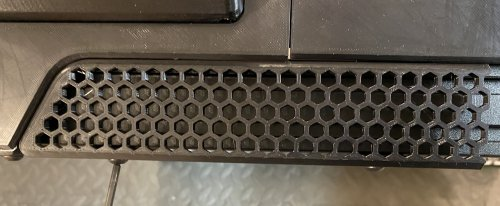\
    *fig 20.26*

    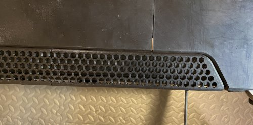\
    *fig 20.27*

16. Here's what the front panel should look like at this point.

    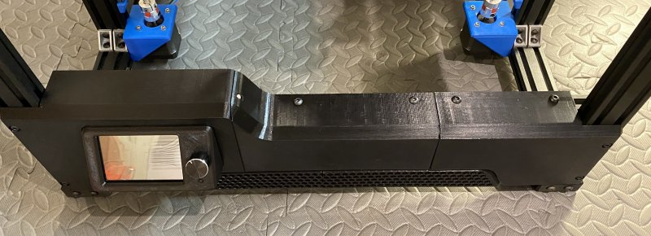\
    *fig 20.28*

17. Now attach 5 vertical wire mounts to the lower left side extrusion as shown.

    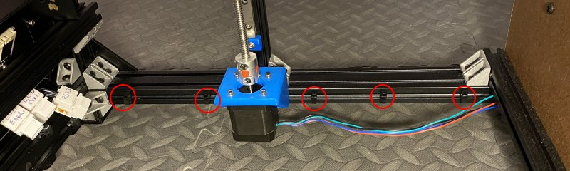\
    *fig 20.29*

18. Connect the 3 Ethernet cables to the 3 Ethernet adapters in the panel and zip tie to the vertical wire mounts. *Attach the other end of each cable to their correspoinding adapters to avoid mixing them up.*

    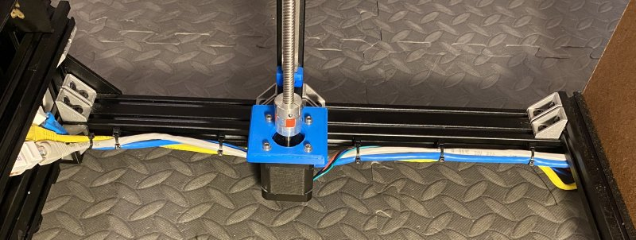\
    *fig 20.30*

19. Here's what it should look like when everything is done.

    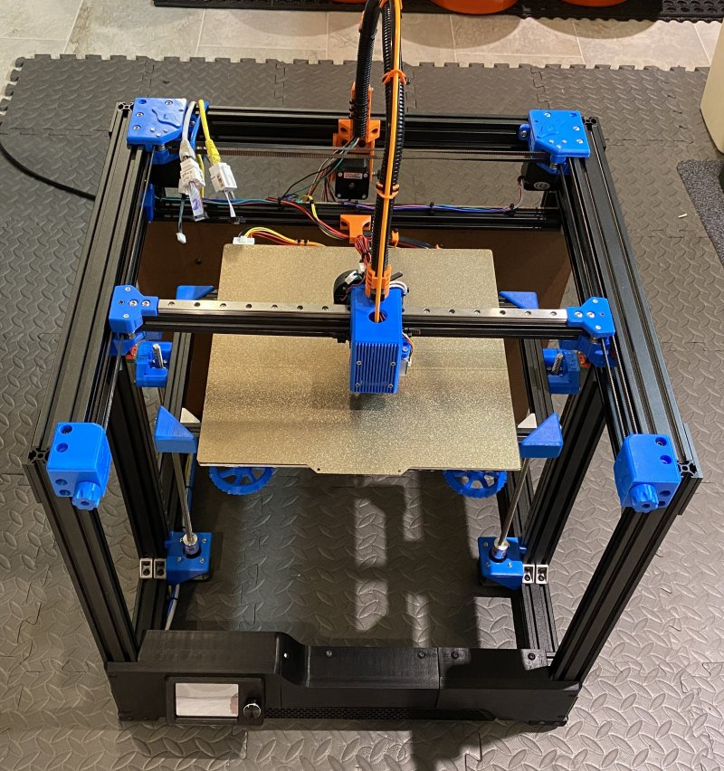\
    *fig 20.31*

