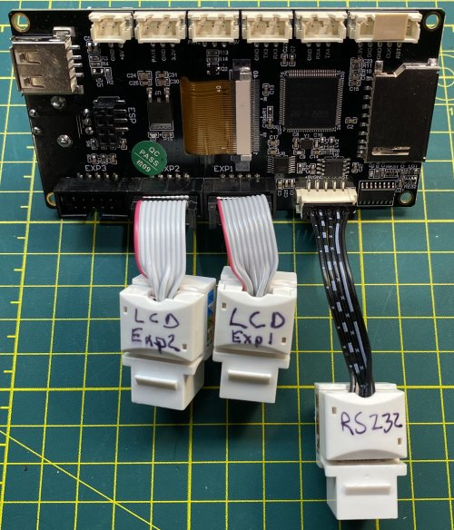

# My BLV MGN Cube - Assembly Instructions

## Step 20 Build Front Panel

### Step 20 BoM

#### Hardware
| Parts     | Quantity | Details | Example Links |
|-----------|:--------:|---------|---------------|
| BTT 3.5 in Touch Screen V3.0 | 1 | Dual Mode, TFT Mode (Marlin)/12864 Mode (Klipper/RRF) | [Amazon](https://www.amazon.com/BIGTREETECH-Graphic-Display-Controller-Printer/dp/B07VWF4W3J) [Aliexpress](https://s.click.aliexpress.com/e/_9x9JTN) |
| IDC ribbon cables | 2 | These are EXP1 and EXP2 cables (Incl W/TFT) | |
| RS232 cable | 1 | (Incl W/TFT) | |
| 576mm (~22.7in) 2020 Extrusion | 1 | from standard 365mm Z frame | |
| Ethernet/RJ45 Keystone Jacks | 6 | | [Amazon](https://www.amazon.com/gp/product/B07JRD69V6/ref=ppx_yo_dt_b_asin_title_o02_s00?ie=UTF8&th=1)|
| 1 Meter Ethernet Cables | 3 | Whatever you have lying around is fine (AWG24 is ideal, stranded or solid) |[Amazon](https://www.amazon.com/Cable-Matters-5-Pack-Snagless-Ethernet/dp/B00C2CBBAM) |
| Female 5 Pin JST-XH Connector | 1 | Your controller uses these and you should too | [Aliexpress](https://s.click.aliexpress.com/e/_AWPLkY) [Amazon](https://amzn.to/3u0TiMD) |
[2020 M5 Angle Brackets](img/all-PlateVsBracket.jpeg) (Brackets) | 4 | | [Amazon](https://amzn.to/3rRVq7U) |
| M5 8mm Socket Head Cap Screws | 8 | DIN912 | |
| M5 T-Nuts | 8 | Hammer Head/Drop In Style | |
| M3 6mm Socket Head Cap Screws | 4 | DIN912 | |
| M3 12mm Socket Head Cap Screws | 4 | DIN912 | |

#### Printed Parts
| Parts     | Quantity | Details |
|-----------|:--------:|---------|
| [TFT35v3Mount-tweaked.stl](../../parts/extra/tft35v30-bezel-insert/files/FTFT35v3Mount-tweaked.stl) | 1 | [Printed Parts Settings](../partsSettings.md) |
| [Front_Panel_-_Left_plate_for_TFT35_V2.STL](../../parts/extra/improved-bezel/files/Front_Panel_-_Left_plate_for_TFT35_V2.STL) | 1 | Works for TFT35 V3.0 as well [Printed Parts Settings](../partsSettings.md) |
| [Front_Panel_-_Center_plate.STL](../../parts/extra/improved-bezel/files/Front_Panel_-_Center_plate.STL) | 1 | [Printed Parts Settings](../partsSettings.md) |
| [Front_Panel_-_Right_plate.STL](../../parts/extra/improved-bezel/files/Front_Panel_-_Right_plate.STL) | 1 | [Printed Parts Settings](../partsSettings.md) |
| [Front_Panel_-_left_grill.STL](../../parts/extra/improved-bezel/files/Front_Panel_-_left_grill.STL) | 1 | [Printed Parts Settings](../partsSettings.md) |
| [Front_Panel_-_right_grill.STL](../../parts/extra/improved-bezel/files/Front_Panel_-_right_grill.STL) | 1 | [Printed Parts Settings](../partsSettings.md) |
| [Jig_Main.stl](../../parts/source/stl/Jig_Main.stl) | 2 | [Printed Parts Settings](../partsSettings.md) |

#### Tools
| Parts     | Quantity | Details | Example Links |
|-----------|:--------:|---------|---------------|
| M2 Screwdriver | 1 | | [Amazon](https://amzn.to/3qNmEgs) |
| M5 Screwdriver | 1 | | [Amazon](https://amzn.to/3qNmEgs) |

### Prep

1. Adapt EXP1 (10pin IDC) Cable to use Ethernet Extensions (For legacy LCD support)

    1. Cut the EXP1 ribbon cable about 60mm from the connectors and separate the ribbons into individual wires.

        \
        *fig 20.1*

    2. For  the LCD side (Key on top of connector) splice with a keystone jack. Red wire is 1. Wires 6/7/8 are not used for EXP1 and can be trimmed.

        \
        *fig 20.2*

        

EXP1 Pinout

        

        

        [Pinout Reference](https://reprap.org/wiki/RepRapDiscount_Full_Graphic_Smart_Controller)

        

        

    3. For  the Controller Board side (Key on bottom connector) flip the cable over so red wire is on the left. Wireing is exactly the same as the LCD side. Wires 6/7/8 are not used for EXP1 and can be trimmed.

        \
        *fig 20.3*

    4. Make sure to attach the little caps on the keystones. These prevent the spliced wires from slipping out. Also it's a good idea to label the connectors. Exp1 and Exp2 will **not** be interchangeable.

        \
        *fig 20.4*

1. Adapt EXP2 (10pin IDC) Cable to use Ethernet extensions (For legacy LCD support)

     2. Follow the same process you used for EXP1 but with only wires 7 and 10 removed.

        \
        *fig 20.5*

        

EXP2 Pinout

        

        

        [Pinout Reference](https://reprap.org/wiki/RepRapDiscount_Full_Graphic_Smart_Controller)

        

        

1. Adapt RS232 (5pin JST-XH) Cable to use Ethernet extensions (For TFT Support)

    1. Using the RS232 cable provided with the Touch Screen and 2 keystone jacks, make ethernet adapters (See picture for pinout). You will also need to replace the dupont connector at one end with a 5 pin JST-XH connector (White). Note that the cable is a cross over cable with the pins reversed on each side.

	    \
        *fig 20.6*

        

RS232 Pinout

        

        

        

        

    2. Make sure to attach the little caps on the keystones. These prevent the spliced wires from slipping out. Also it's a good idea to label the connectors.

	    \
        *fig 20.7*

### Assembly
1. Attach the 576mm 2020 extrusion to front vertical 4040 extrusions. Use 2 of Main Jigs to space it 45mm above the lower horizontal 4040 extrusion. Attach using 2x Angle Brackets and 4x 8mm M5 bolts with T-nuts on each side (4 brackets total).

    \
    *fig 20.8*

    \
    *fig 20.9*

2. Plug the EXP1 EXP2 and RS232 adapters into the back of the TFT touch panel.

    \
    *fig 20.10*

3. Using 4x M3 6mm screws attach the TFT screen to the TFT35 Mount.

    \
    *fig 20.11*

4. Using 4x M3 12mm screws attach the TFT35 Mount to the left front panel.

    \
    *fig 20.12*

5. Attach the knob onto the TFT encoder.

    \
    *fig 20.13*

