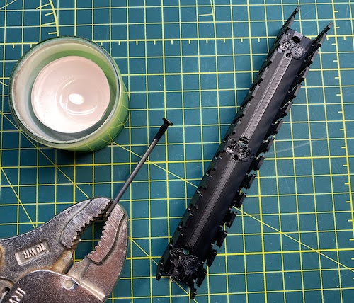
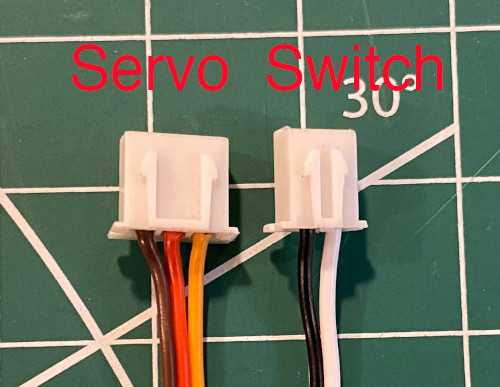
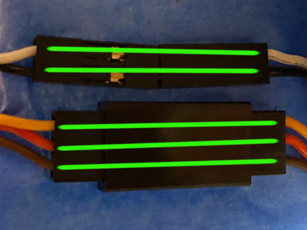
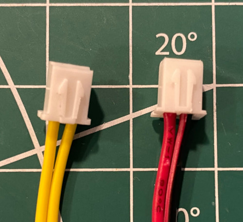
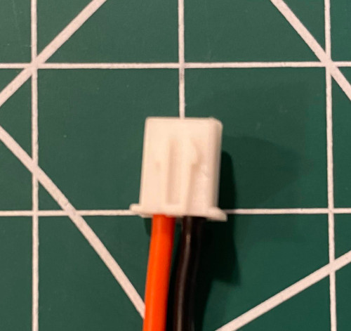
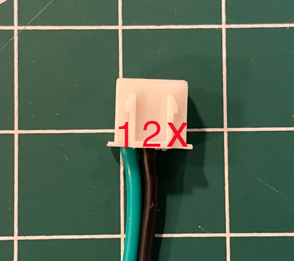
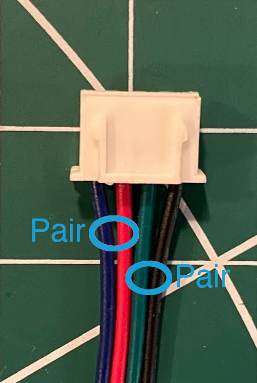

# My BLV MGN Cube - Assembly Instructions

## Step 21 Wire Electronics Panel

### Step 21 BoM

#### Hardware
| Parts                           | Quantity | Details                                                                          | Example Links                                                       |
|---------------------------------|:--------:|----------------------------------------------------------------------------------|---------------------------------------------------------------------|
| Controller Board                |    1     | BIGTREETECH SKR V1.4 Turbo W/TMC 2208 UART                                       | [AliExpress](https://s.click.aliexpress.com/e/_AYaAOG)              |
| Raspberry Pi                    |    1     | rPi 4 w/2GB of Ram (Anything 3B or above is probably fine)                       | [Canakit](https://www.canakit.com/raspberry-pi-4-2gb.html)          |
| rPI Power Supply                |    1     | Don't skimp here!!                                                               | [Canakit](https://www.canakit.com/raspberry-pi-4-power-supply.html) |
| Lerdge High Power Module/MOSFET |    1     | External MOSFET that Protects/Isolates your Controller Board from the Heated Bed | [AliExpress](https://s.click.aliexpress.com/e/_9AROv5)              |
| Female 2 Pin JST-XH Connector   |    5     | Your controller uses these and you should too | [Aliexpress](https://s.click.aliexpress.com/e/_AWPLkY) [Amazon](https://amzn.to/3u0TiMD) |
| Female 3 Pin JST-XH Connector   |    3     | Your controller uses these and you should too | [Aliexpress](https://s.click.aliexpress.com/e/_AWPLkY) [Amazon](https://amzn.to/3u0TiMD) |
| Female 4 Pin JST-XH Connector   |    5     | Your controller uses these and you should too | [Aliexpress](https://s.click.aliexpress.com/e/_AWPLkY) [Amazon](https://amzn.to/3u0TiMD) |
| 4010 Fan | 1 | 24V 2Pin Dual Ball Bearing | [Aliexpress](https://s.click.aliexpress.com/e/_A3DGg2) |

#### Printed Parts
| Parts                                                                                                                                                                                                 | Quantity | Details |
|-------------------------------------------------------------------------------------------------------------------------------------------------------------------------------------------------------|:--------:|---------|
| [Slotted_Wire_Duct200mm_Slotted_Wire_Duct_v17_Bottom_1_Body1_Bottom.stl](../../parts/extra/slotted-wire-ducts/Slotted_Wire_Duct200mm_Slotted_Wire_Duct_v17_Bottom_1_Body1_Bottom.stl)                 |    1     | [Printed Parts Settings](../partsSettings.md) |
| [Slotted_Wire_Duct200mm_Slotted_Wire_Duct_v17_Left_Side_1_Body20_Left_Side.stl](../../parts/extra/slotted-wire-ducts/Slotted_Wire_Duct200mm_Slotted_Wire_Duct_v17_Left_Side_1_Body20_Left_Side.stl)                      |    1     | [Printed Parts Settings](../partsSettings.md) |
| [Slotted_Wire_Duct200mm_Slotted_Wire_Duct_v17_Right_Side_1_Body1_Right_Side.stl](../../parts/extra/slotted-wire-ducts/Slotted_Wire_Duct200mm_Slotted_Wire_Duct_v17_Right_Side_1_Body1_Right_Side.stl) |    1     | [Printed Parts Settings](../partsSettings.md) |
| [Slotted_Wire_Duct200mm_Slotted_Wire_Duct_v17_Top_1_Body1_Top.stl](../../parts/extra/slotted-wire-ducts/Slotted_Wire_Duct200mm_Slotted_Wire_Duct_v17_Top_1_Body1_Top.stl)                                                |    1     | [Printed Parts Settings](../partsSettings.md) |
| [Slotted_Wire_Duct150mm_Slotted_Wire_Duct_v17_Bottom_1_Body1_Bottom.stl](../../parts/extra/slotted-wire-ducts/Slotted_Wire_Duct150mm_Slotted_Wire_Duct_v17_Bottom_1_Body1_Bottom.stl)                 |    9     | [Printed Parts Settings](../partsSettings.md) |
| [Slotted_Wire_Duct150mm_Slotted_Wire_Duct_v17_Left_Side_1_Body20_Left_Side.stl](../../parts/extra/slotted-wire-ducts/Slotted_Wire_Duct150mm_Slotted_Wire_Duct_v17_Left_Side_1_Body20_Left_Side.stl)                      |    9     | [Printed Parts Settings](../partsSettings.md) |
| [Slotted_Wire_Duct150mm_Slotted_Wire_Duct_v17_Right_Side_1_Body1_Right_Side.stl](../../parts/extra/slotted-wire-ducts/Slotted_Wire_Duct150mm_Slotted_Wire_Duct_v17_Right_Side_1_Body1_Right_Side.stl) |    9     | [Printed Parts Settings](../partsSettings.md) |
| [Slotted_Wire_Duct150mm_Slotted_Wire_Duct_v17_Top_1_Body1_Top.stl](../../parts/extra/slotted-wire-ducts/Slotted_Wire_Duct150mm_Slotted_Wire_Duct_v17_Top_1_Body1_Top.stl)                                                |    9     | [Printed Parts Settings](../partsSettings.md) |

#### Tools

| Parts          | Qunatity | Details | Example Links |
|----------------|:--------:|----|---------|
| Flat Head Nail |    1     | Used to melt the rivet heads | |
| Candle         |    1     | | |
| M3 Screwdriver |    1     | | [Amazon](https://amzn.to/3qNmEgs) |
| JST-XH Crimper | 1 | I've had great success with the IWISS IWS-2820 | [Amazon](https://www.amazon.com/IWISS-Crimping-AWG28-20-Terminals-Connectors/dp/B078WNZ9FW/ref=sr_1_5?dchild=1&keywords=iws-2820&qid=1628984315&sr=8-5&th=1) |

### Prep
1. Assemble the Slotted Wire Ducts
   1. Sides should click onto pegs on bottom. 
   2. Heat the nail head, using the candle, and heat weld all the pegs.
   3. I used a twisting motion so the nail wouldn't stick.
   
      \
      *fig 21.1*

2. Add JST-XH connectors to all sensors/probes/switches/mosfets/steppers
   1. For the BLTouch you need a female 3 pin connector for the servo control (Brown=GND, Red=+5V, Orange=Signal) and a female 2 pin connector for the switch (Black=GND, White=Z-min).
      \
      *fig 21.2*

      \
      *fig 21.3*
   
      *Note: If you bought the BLTouch wire extension cable, make sure they didn't switch the wires in the connector. I had this problem!!*

   2. For the Hotend and Heated Bed thermistors you need female 2 pin connectors. Polarity doesn't matter.

      \
      *fig 21.4*
   3. For the fans and MOSFET control wire you need female 2 pin connectors.

      \
      *fig 21.5*

   4. For the switches you need female 3 pin connectors.

      \
      *fig 21.5*
   5. For stepper motors you need female 4 pin connectors.

      \
      *fig 21.6*

      Note: Not all stepper motors use the same color codes. This is the correct sequence for [SKR boards](img/21-BTT_SKR_V1.4PIN.pdf) and [StepperOnline stepper motors](img/21-17HS19-2004S1.pdf).
      Only thing that matters is that the coil pairs be grouped together ([Finding Stepper Pairs](https://3ddistributed.com/duet-wifi/stepper-motor-wire-color-and-coil-pairs/))
  
   6. Here is the list of JST-XH connectors you should have when you are done:
      
      | Description            | No. of  Pins | Gender |
      |------------------------|------------------|--------|
      | BLTouch Servo          | 3                | Female |
      | BLTouch Switch         | 2                | Female |
      | Hotend Thermistor      | 2                | Female |
      | Heated Bed Thermistor  | 2                | Female |
      | Hotend Fan             | 2                | Female |
      | Control Board Fan      | 2                | Female |
      | Parts Cooling Fan      | 2                | Female |
      | X Endstop Switch       | 2                | Female |
      | Y Endstop Switch       | 2                | Female |
      | Left Stepper Motor     | 4                | Female |
      | Right Stepper Motor    | 4                | Female |
      | Z1 Stepper Motor       | 4                | Female |
      | Z2 Stepper Motor       | 4                | Female |
      | Extruder Stepper Motor | 4                | Female |
      | MOSFET Control         | 2                | Female |

1.

### Assembly
1. Mount Slotted Wiring Duct

3. Attach power wires to board in correct spot
4. Label all positive and or negative terminals (Neg is probably easier)
   5.   Did this with a marker
6. Verify power jumper has USB power disabled
7. Verify drivers have uart enabled pad soddered
8. Stick the heatsinks onto the drivers
9. Verify board is in UART mode
   Note: I think the default jumpers work for this (2208's only have UART and not SPI) so spi config probably winds up with uart.
10. Add drivers to board red pins match red pins
11. Attach power to board
12. Plug up all the steppers
13. Using the provided sd card boot up and carefully test each stepper. Directions aren't important and corexy will be messed up but just make sure each stepper is working (Wire test and validates your board is working with baseline config).
