# My BLV MGN Cube - Step 21 Wire Electronics Panel

## [Step 21 BoM Spreadsheet Link](https://docs.google.com/spreadsheets/d/e/2PACX-1vTVx7BvB3V7CozF2l4eWkNntWrHSjOawmrsi_bRSVxQLIGVlfZTYEGp8a6fHpENV6hV2cn9PrDLHHl0/pubhtml?gid=1474174361&single=true)

### Prep
1. Assemble the slotted wire ducts.
   1. The Sides should click onto pegs on the bottom. 
   2. Heat the nail head, using the candle, and heat weld all the pegs.
   3. I used a twisting motion so the nail wouldn't stick.
   
      \
      *fig 21.1*

2. Add JST-XH connectors to the sensors/probes/switches/steppers/MOSFET
   1. For the BLTouch you need a female 3 pin connector for the servo control (Brown=GND, Red=+5V, Orange=Signal) and a female 2 pin connector for the switch (Black=GND, White=Z-min).

      \
      *fig 21.2*

      \
      *fig 21.3*
   
      *Note: If you bought the BLTouch wire extension cable, make sure they didn't switch the wires in the connector. I had this problem!!*

   3. For the hotend and heated bed thermistors you need female 2 pin connectors. Polarity doesn't matter.

      \
      *fig 21.4*
   4. For the fans and MOSFET control wire you need female 2 pin connectors.

      \
      *fig 21.5*

   5. For the switches you need female 3 pin connectors.

      \
      *fig 21.6*
   6. For stepper motors you need female 4 pin connectors.

      \
      *fig 21.7*

      Note: Not all stepper motors use the same color codes. This is the correct sequence for [SKR boards](img/21-BTT_SKR_V1.4PIN.pdf) and [StepperOnline stepper motors](img/21-17HS19-2004S1.pdf).
      Only thing that matters is that the coil pairs be grouped together ([Finding Stepper Pairs](https://3ddistributed.com/duet-wifi/stepper-motor-wire-color-and-coil-pairs/))
  
   7. Here is the list of JST-XH connectors you should have when you are done:
      
| Description            | No. of  Pins | Gender |
|------------------------|------------------|--------|
| BLTouch Servo          | 3                | Female |
| BLTouch Switch         | 2                | Female |
| Hotend Thermistor      | 2                | Female |
| Heated Bed Thermistor  | 2                | Female |
| Hotend Fan             | 2                | Female |
| Control Board Fan      | 2                | Female |
| Parts Cooling Fan      | 2                | Female |
| X Endstop Switch       | 2                | Female |
| Y Endstop Switch       | 2                | Female |
| Left Stepper Motor     | 4                | Female |
| Right Stepper Motor    | 4                | Female |
| Z1 Stepper Motor       | 4                | Female |
| Z2 Stepper Motor       | 4                | Female |
| Extruder Stepper Motor | 4                | Female |
| MOSFET Control         | 2                | Female |

3. Install heat sinks onto TMC2208 stepper drivers. Make sure heat sink doesn't short any of the pins.

   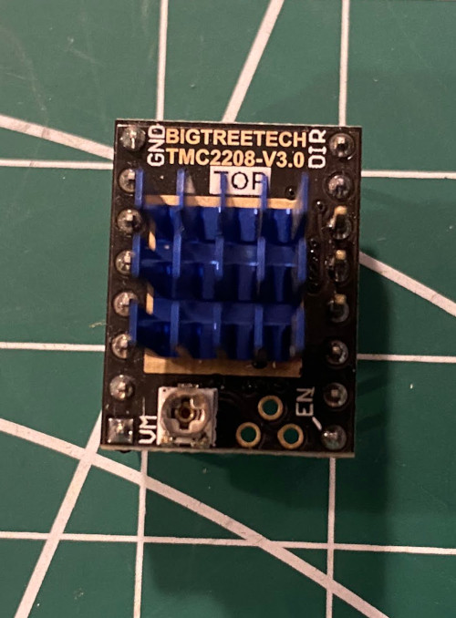\
   *fig 21.8*

4. Using a sharpie color the negative terminals on the controller board [SKR 1.4 board pinout](img/21-BTT_SKR_V1.4PIN.pdf). 

   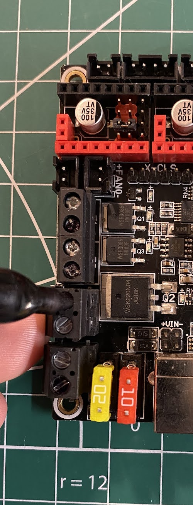\
   *fig 21.9*

### Assembly
1. Set the jumpers on the controller board [SKR 1.4 Manual](img/BTT SKR V1.4 Instruction Manual.pdf).

   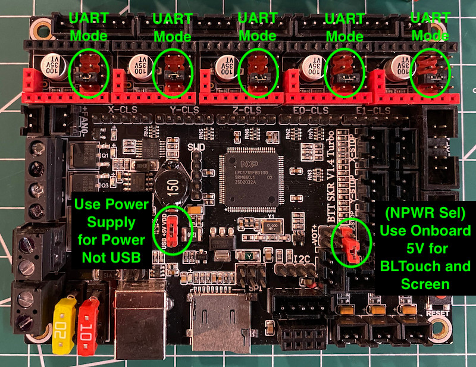\
   *fig 21.10*

2. Install the TMC2208 stepper drivers on the control board.

   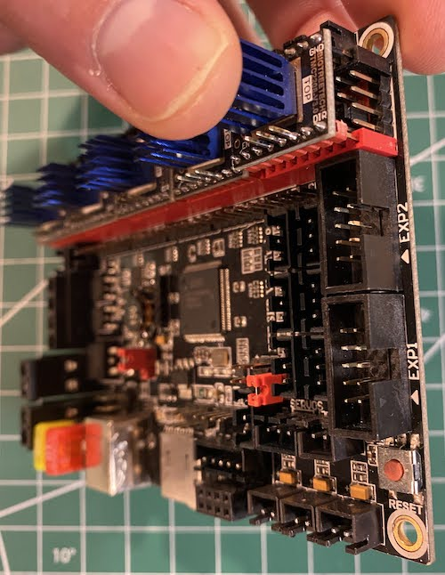\
   *fig 21.11*

3. Draw guidelines for slotted wire ducts.

   \
   *fig 21.12*
4. Remove the electronics panel and mark M3 mounting holes, using the slotted wiring ducts as a template. Note I only did 2 mounting holes per duct.

   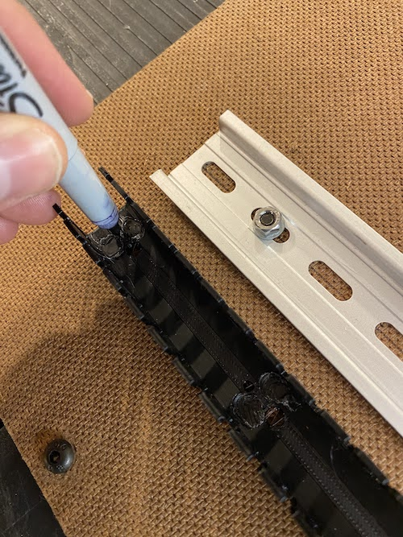\
   *fig 21.13*

    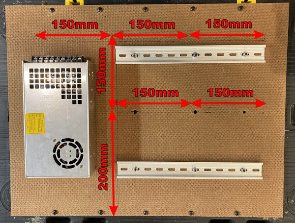\
    *fig 21.14*

5. Drill holes for ducts using a 1/8" or 3.2mm drill bit. Clean up and widen any holes that need adjusting with an X-acto knife.

   \
   *fig 21.15*

6. Mount ducts using 2 10mm M3 bolts, washers, and nuts each. Washers are between the bolt head and hardboard.

   \
   *fig 21.16*
7. Break off slotted wiring duct fingers where the ducts intersect.

   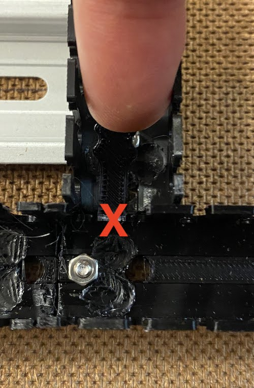\
   *fig 21.17*

8. Reinstall the electronics panel

   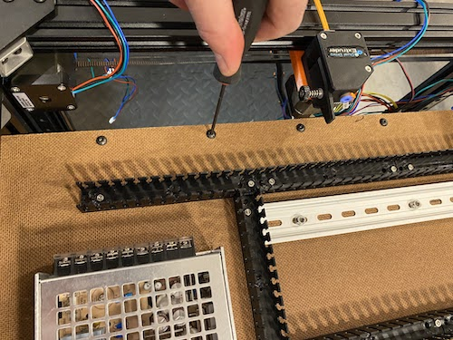\
   *fig 21.18*

9. Mount the controller board to the DIN rails using the 3d printed mounts. To make room for the USB cable you will need to remove one of the wiring duct fingers (Fig 21.20).

   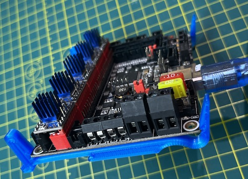\
   *fig 21.19*

   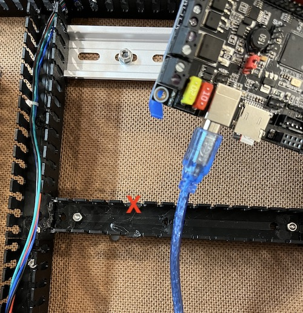\
   *fig 21.20*

   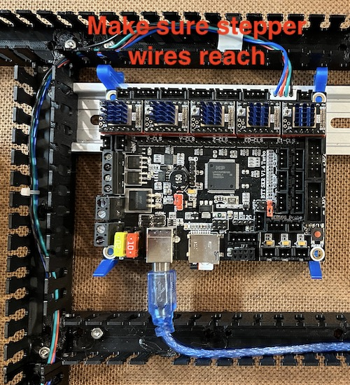\
   *fig 21.21*

    Note: Verify that all the stepper wires can reach.

10. Install the 4010 fan, MOSFET, and Raspberry Pi to the DIN rails using the corresponding 3d printed mounts.

    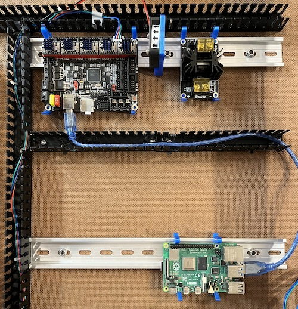\
    *fig 21.22*

11. Connect the power supply to the controller board and MOSFET using the 14AWG red and black primary wire. Make sure to use stranded wire with at least 14 AWG.

    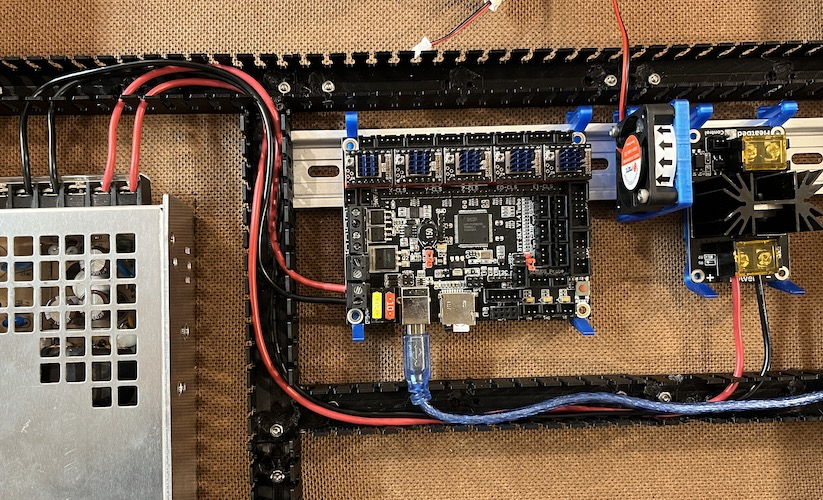\
    *fig 21.23*

12. Connect all electrical components to the controller board and MOSFET as indicated in this wiring diagram

    \
    *fig 21.24*

13. Using 5 of the vertical wire mounts secure the TFT touch screen cables with the zip ties.

    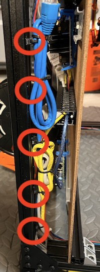\
    *fig 21.25*

14. This is what it should look like with everything wired up.

    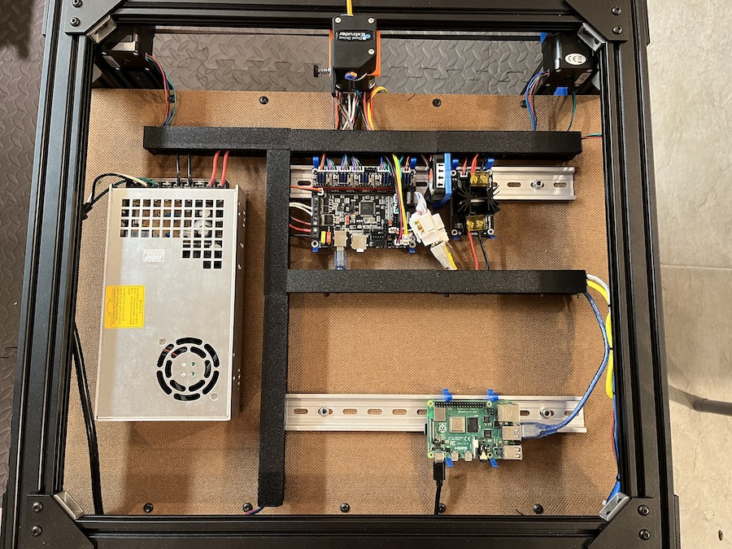\
    *fig 21.26*