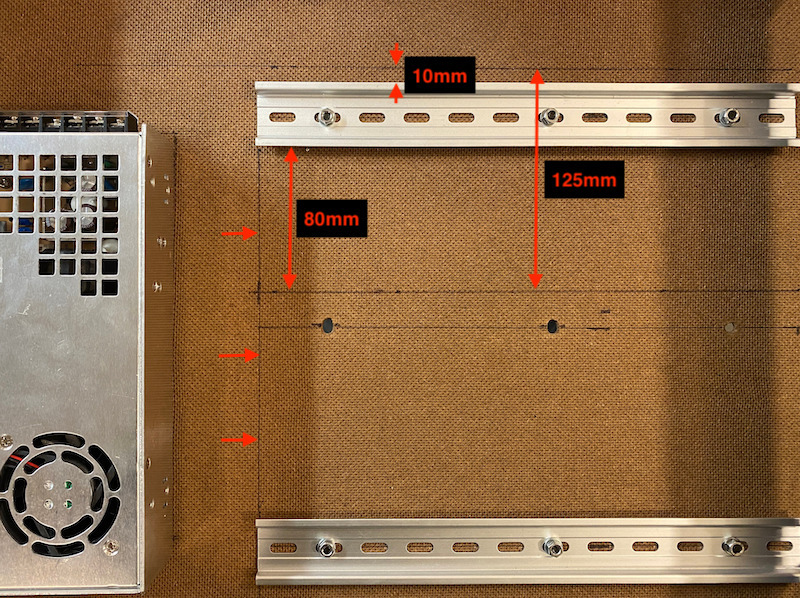
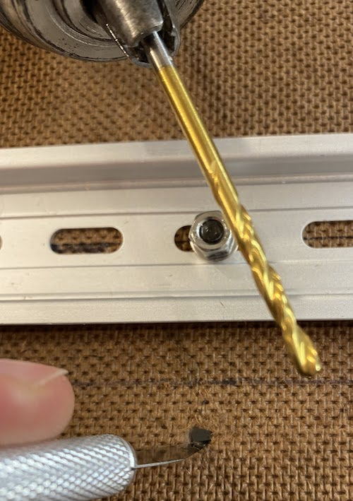
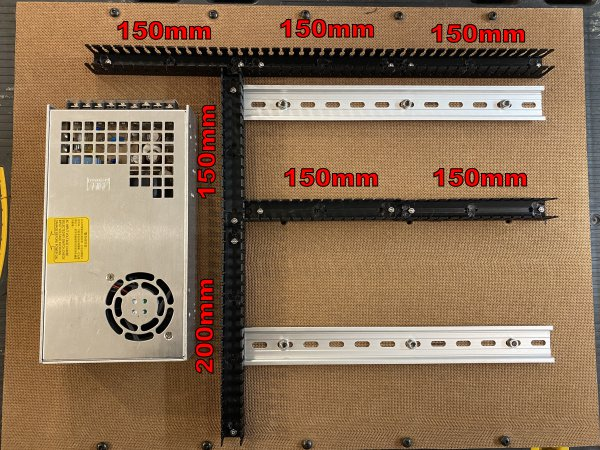

# My BLV MGN Cube - Assembly Instructions

## Step 21 Wire Electronics Panel

### Step 21 BoM

#### Hardware
| Parts                         | Quantity | Details                                                                          | Example Links                                                       |
|-------------------------------|:--------:|----------------------------------------------------------------------------------|---------------------------------------------------------------------|
| Controller Board              |    1     | BIGTREETECH SKR V1.4 Turbo W/TMC 2208 UART                                       | [AliExpress](https://s.click.aliexpress.com/e/_AYaAOG)              |
| Raspberry Pi                  |    1     | rPi 4 w/2GB of Ram (Anything 3B or above is probably fine)                       | [Canakit](https://www.canakit.com/raspberry-pi-4-2gb.html)          |
| rPI Power Supply              |    1     | Don't skimp here!!                                                               | [Canakit](https://www.canakit.com/raspberry-pi-4-power-supply.html) |
| Heated Bed MOSFET (Lerdge)    |    1     | External MOSFET that Protects/Isolates your Controller Board from the Heated Bed | [AliExpress](https://s.click.aliexpress.com/e/_9AROv5)              |
| Female 2 Pin JST-XH Connector |    5     | Your controller uses these and you should too | [Aliexpress](https://s.click.aliexpress.com/e/_AWPLkY) [Amazon](https://amzn.to/3u0TiMD) |
| Female 3 Pin JST-XH Connector |    3     | Your controller uses these and you should too | [Aliexpress](https://s.click.aliexpress.com/e/_AWPLkY) [Amazon](https://amzn.to/3u0TiMD) |
| Female 4 Pin JST-XH Connector |    5     | Your controller uses these and you should too | [Aliexpress](https://s.click.aliexpress.com/e/_AWPLkY) [Amazon](https://amzn.to/3u0TiMD) |
| 4010 Fan (Control Board Fan)  | 1 | 24V 2Pin Dual Ball Bearing | [Aliexpress](https://s.click.aliexpress.com/e/_A3DGg2) |

#### Printed Parts
| Parts                                                                                                                                                                                                 | Quantity | Details |
|-------------------------------------------------------------------------------------------------------------------------------------------------------------------------------------------------------|:--------:|---------|
| [Slotted_Wire_Duct200mm_Slotted_Wire_Duct_v17_Bottom_1_Body1_Bottom.stl](../../parts/extra/slotted-wire-ducts/Slotted_Wire_Duct200mm_Slotted_Wire_Duct_v17_Bottom_1_Body1_Bottom.stl)                 |    1     | [Printed Parts Settings](../partsSettings.md) |
| [Slotted_Wire_Duct200mm_Slotted_Wire_Duct_v17_Left_Side_1_Body20_Left_Side.stl](../../parts/extra/slotted-wire-ducts/Slotted_Wire_Duct200mm_Slotted_Wire_Duct_v17_Left_Side_1_Body20_Left_Side.stl)                      |    1     | [Printed Parts Settings](../partsSettings.md) |
| [Slotted_Wire_Duct200mm_Slotted_Wire_Duct_v17_Right_Side_1_Body1_Right_Side.stl](../../parts/extra/slotted-wire-ducts/Slotted_Wire_Duct200mm_Slotted_Wire_Duct_v17_Right_Side_1_Body1_Right_Side.stl) |    1     | [Printed Parts Settings](../partsSettings.md) |
| [Slotted_Wire_Duct200mm_Slotted_Wire_Duct_v17_Top_1_Body1_Top.stl](../../parts/extra/slotted-wire-ducts/Slotted_Wire_Duct200mm_Slotted_Wire_Duct_v17_Top_1_Body1_Top.stl)                                                |    1     | [Printed Parts Settings](../partsSettings.md) |
| [Slotted_Wire_Duct150mm_Slotted_Wire_Duct_v17_Bottom_1_Body1_Bottom.stl](../../parts/extra/slotted-wire-ducts/Slotted_Wire_Duct150mm_Slotted_Wire_Duct_v17_Bottom_1_Body1_Bottom.stl)                 |    9     | [Printed Parts Settings](../partsSettings.md) |
| [Slotted_Wire_Duct150mm_Slotted_Wire_Duct_v17_Left_Side_1_Body20_Left_Side.stl](../../parts/extra/slotted-wire-ducts/Slotted_Wire_Duct150mm_Slotted_Wire_Duct_v17_Left_Side_1_Body20_Left_Side.stl)                      |    9     | [Printed Parts Settings](../partsSettings.md) |
| [Slotted_Wire_Duct150mm_Slotted_Wire_Duct_v17_Right_Side_1_Body1_Right_Side.stl](../../parts/extra/slotted-wire-ducts/Slotted_Wire_Duct150mm_Slotted_Wire_Duct_v17_Right_Side_1_Body1_Right_Side.stl) |    9     | [Printed Parts Settings](../partsSettings.md) |
| [Slotted_Wire_Duct150mm_Slotted_Wire_Duct_v17_Top_1_Body1_Top.stl](../../parts/extra/slotted-wire-ducts/Slotted_Wire_Duct150mm_Slotted_Wire_Duct_v17_Top_1_Body1_Top.stl)                                                |    9     | [Printed Parts Settings](../partsSettings.md) |

#### Tools

| Parts          | Qunatity | Details | Example Links |
|----------------|:--------:|----|---------|
| Flat Head Nail |    1     | Used to melt the rivet heads | |
| Candle         |    1     | | |
| M3 Screwdriver |    1     | | [Amazon](https://amzn.to/3qNmEgs) |
| JST-XH Crimper | 1 | I've had great success with the IWISS IWS-2820 | [Amazon](https://www.amazon.com/IWISS-Crimping-AWG28-20-Terminals-Connectors/dp/B078WNZ9FW/ref=sr_1_5?dchild=1&keywords=iws-2820&qid=1628984315&sr=8-5&th=1) |

### Prep
1. Assemble the Slotted Wire Ducts
   1. Sides should click onto pegs on bottom. 
   2. Heat the nail head, using the candle, and heat weld all the pegs.
   3. I used a twisting motion so the nail wouldn't stick.
   
      \
      *fig 21.1*

2. Add JST-XH connectors to all sensors/probes/switches/mosfets/steppers
   1. For the BLTouch you need a female 3 pin connector for the servo control (Brown=GND, Red=+5V, Orange=Signal) and a female 2 pin connector for the switch (Black=GND, White=Z-min).
      \
      *fig 21.2*

      \
      *fig 21.3*
   
      *Note: If you bought the BLTouch wire extension cable, make sure they didn't switch the wires in the connector. I had this problem!!*

   2. For the Hotend and Heated Bed thermistors you need female 2 pin connectors. Polarity doesn't matter.

      \
      *fig 21.4*
   3. For the fans and MOSFET control wire you need female 2 pin connectors.

      \
      *fig 21.5*

   4. For the switches you need female 3 pin connectors.

      \
      *fig 21.6*
   5. For stepper motors you need female 4 pin connectors.

      \
      *fig 21.7*

      Note: Not all stepper motors use the same color codes. This is the correct sequence for [SKR boards](img/21-BTT_SKR_V1.4PIN.pdf) and [StepperOnline stepper motors](img/21-17HS19-2004S1.pdf).
      Only thing that matters is that the coil pairs be grouped together ([Finding Stepper Pairs](https://3ddistributed.com/duet-wifi/stepper-motor-wire-color-and-coil-pairs/))
  
   6. Here is the list of JST-XH connectors you should have when you are done:
      
      | Description            | No. of  Pins | Gender |
      |------------------------|------------------|--------|
      | BLTouch Servo          | 3                | Female |
      | BLTouch Switch         | 2                | Female |
      | Hotend Thermistor      | 2                | Female |
      | Heated Bed Thermistor  | 2                | Female |
      | Hotend Fan             | 2                | Female |
      | Control Board Fan      | 2                | Female |
      | Parts Cooling Fan      | 2                | Female |
      | X Endstop Switch       | 2                | Female |
      | Y Endstop Switch       | 2                | Female |
      | Left Stepper Motor     | 4                | Female |
      | Right Stepper Motor    | 4                | Female |
      | Z1 Stepper Motor       | 4                | Female |
      | Z2 Stepper Motor       | 4                | Female |
      | Extruder Stepper Motor | 4                | Female |
      | MOSFET Control         | 2                | Female |

3. Install heat sinks onto TMC2208 stepper drivers. Make sure heat sink doesn't short any of the pins.

   \
   *fig 21.8*

4. Using a sharpie color the negative terminals on the controller board [SKR 1.4 board pinout](img/21-BTT_SKR_V1.4PIN.pdf). 

   \
   *fig 21.9*

### Assembly
1. Set the jumpers on the controller board [SKR 1.4 Manual](img/21-BTT SKR V1.4 Instructions Manual.pdf).

   \
   *fig 21.10*

2. Install the TMC2208 stepper drivers on the control board.

   \
   *fig 21.11*

3. Draw guidelines for slotted wire ducts.

   \
   *fig 21.12*
4. Remove the electronics panel and mark M3 mounting holes, using slotted wiring ducts as a template. Note I only did 2 mounting holes per duct.

   \
   *fig 21.13*

    \
    *fig 21.14*

5. Drill holes for ducts using a 1/8" or 3.2mm drill bit. Clean up and widen any holes that need adjusting with an X-acto knife.

   \
   *fig 21.15*

6. Mount duct using 2 10mm M3 bolts, washers, and nuts each. Washers are between the bolt head and hardboard.

   \
   *fig 21.16*
7. Break off slotted wiring duct fingers where the ducts intersect.

   \
   *fig 21.17*

8. Reinstall the electronics panel

   \
   *fig 21.18*

9. Using the DIN mounts install the Controller Board, Heated Bed MOSFET, and Raspberry PI.

   \
   *fig 21.19*

10. Using XX Guage red and black wires run power to the SKR 1.4 and Attach power to board
11. Plug up all the steppers
12. Using the provided sd card boot up and carefully test each stepper. Directions aren't important and corexy will be messed up but just make sure each stepper is working (Wire test and validates your board is working with baseline config).
