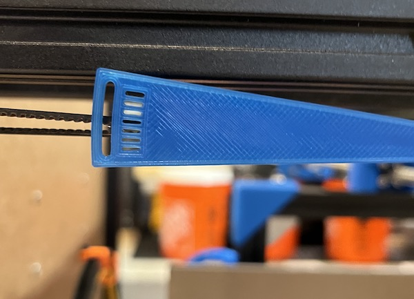

# My BLV MGN Cube - Step 22 Tension Belts

## [Step 22 BoM Spreadsheet Link](https://docs.google.com/spreadsheets/d/e/2PACX-1vTVx7BvB3V7CozF2l4eWkNntWrHSjOawmrsi_bRSVxQLIGVlfZTYEGp8a6fHpENV6hV2cn9PrDLHHl0/pubhtml?gid=1084529860&single=true)

### Procedure
1. Attach the bottle weight to the tension tool using the wire. The bottle weight should be able to pivot freely.

   \
   *fig 22.1*

2. With everything on the kitchen scale add water to the bottle so that the entire tool weighs 200g. You can use the spray bottle to add water in small amounts for fine-tuning.

   \
   *fig 22.2*

3. Lock the X gantry against the front idler holders using the 2x 2020 jigs, M5 10mm screws, and T-nuts.

   \
   *fig 22.3*

4. Center the X carriage on the X gantry and lock it in pace with the 2x X carriage clamps, M5 x 10mm screws, and T-nuts.

   \
   *fig 22.4*

5. Find and mark the center line for the left side and right side of the belts. Measure from the pulleys in the back corner blocks to the corresponding pulleys in the X gantry.

   \
   *fig 22.5*

6. Put the printer on its left side and attach the gauge to the belt making sure to align the pivot with the center line.

   \
   *fig 22.6*

7. Adjust the front tensioner so the belt is visible through the middle hole on the tool.

   \
   *fig 22.7*

8. Repeat steps 6 through 8 for the printer on its right side.

   \
   *fig 22.8*

9. Remove the X gantry and X carriage locks.

   \
   *fig 22.9*

   \
   *fig 22.10*

11. Verify the X gantry is square.
    1. Manually move the X gantry from each side to contact the front idler blocks. There should be no gap on the alternate block.

        \
        *fig 22.11*

    2. If it isn't parallel then alternately loosen one tensioner while tightening the other the exact same amount. This will allow you to adjust for any minor asymmetry while still keeping the belt tension uniform.

        \
        *fig 22.12*
    
        \
        *fig 22.13*
