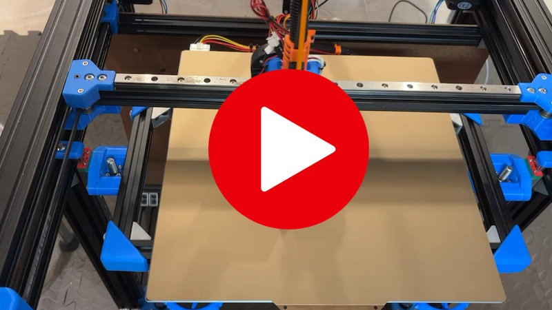

# My BLV MGN Cube - Step 23 Setup OctoPrint and Klipper

## [Step 23 BoM Spreadsheet Link](https://docs.google.com/spreadsheets/d/e/2PACX-1vTVx7BvB3V7CozF2l4eWkNntWrHSjOawmrsi_bRSVxQLIGVlfZTYEGp8a6fHpENV6hV2cn9PrDLHHl0/pubhtml?gid=1255807009&single=true)

### Procedure
1. Install OctoPi on your RaspberryPi (rPi) by following the [Official OctoPi Instructions](https://octoprint.org/download/#octopi) and the notes below.
   * Use the OctoPi 32GB microSD card
   * Use RaspberryPi installer and selected "OctoPi (stable)" from the "Other specific-purpose OS"
   * Select the gear icon and pre-configure the image
     * Set hostname: blvcube.local (Or whatever you want to name your printer)
     * Enable SSH
     * Set Username and Password: Keep 'pi' username but pick a unique password
     * Configure Wireless LAN: Your wifi settings
     * Do the locale info for your region

2. Insert the OctoPi MicroSD card and turn on your rPi. 
3. Find the IP of the RaspberryPi
   ```shell
   nslookup blvcube
   ```
   Note: If that doesn't work try `blvcube.lan` or `blvcube.local` otherwise you'll have to login to your wifi router and find out what IP it assigned to it.

4. Login to OctoPrint "Ex. [http://blvcube](http://blvcube)" and go through the setup. BLV Cube specific configs are below.
   * Default Printer Profile
      * General
        * Name: BLVCube
        * Model BLV Cube
      * Print bed & build volume
        * Form Factor: Rectangular
        * Origin: Lower Left
        * Width (X): 310.0
        * Depth (Y): 310.0
        * Height (Z): 345.0 
        * Custom bounding box: false
      * Axes
        * X: 6000 mm/min Invert control: false
        * Y: 6000 mm/min Invert control: false
        * Z: 200 mm/min Invert control: false
        * E: 300 mm/min Invert control: false
      * Hotend & extruder
        * Nozzle Diameter: 0.4 mm
        * Number of Extruders: 1
        * Default extrusion length: 5mm

5. Install klipper software on the rPi 
   1. Use SSH to connect to the rPi with the username "pi" and the password you chose.
   2. Download and install Klipper.
      ```shell
      git clone https://github.com/Klipper3d/klipper
      ./klipper/scripts/install-octopi.sh
      ```
      Reference: [Klipper instructions](https://www.klipper3d.org/Installation.html#prepping-an-os-image)
6. Configure OctoPrint to talk to Klipper daemon using the following serial port settings
   * Serial Port: /tmp/printer
   * Baudrate: 250000
   * Auto-connect to printer on server start: Checked

7. Test the config by connecting to the printer from OctoPrint. You should see something like this in the Terminal tab:
   ```
   Connecting to port /tmp/printer, baudrate 250000
   Changing monitoring state from "Opening serial connection" to "Connecting"
   Connected to: Serial<id=0xa8e242b0, open=True>(port='/tmp/printer', baudrate=250000, bytesize=8, parity='N', stopbits=1, timeout=10.0, xonxoff=False, rtscts=False, dsrdtr=False), starting monitor
   Send: N0 M110 N0*125
   Recv: ok
   Send: N0 M110 N0*125
   Changing monitoring state from "Connecting" to "Operational"
   Recv: ok
   Send: N0 M110 N0*125
   Recv: ok
   Send: N1 M115*39
   Recv: ok FIRMWARE_VERSION:v0.10.0-594-g7290c145 FIRMWARE_NAME:Klipper
   Send: M21
   Recv: ok
   Send: M105
   Recv: ok T:0
   ```
   Note: This just tells us that OctoPrint is talking to the Klipper service on the rPi. We haven't setup the controller board yet so any errors like "!! mcu 'mcu': Unable to connect" are normal for now.

8. Build the firmware for the SKR 1.4 Turbo using [this guide](https://docs.vorondesign.com/build/software/skr13_klipper.html)
9. Copy the binary file in `~/klipper/out/klipper.bin` to the klipper microSD card and rename to `firmware.bin`.
   Easiest way to do this is to use `scp` to copy the bin to your machine and then on to the microSD card.
10. Install the klipper firmware on the SKR 1.4 Turbo controller board.
    1. Insert the klipper microSD card into the controller board and power on.
    2. The controller board will automatically flash the onboard memory using the firmware.bin on the SD card.
    3. If you remove the microSD card and see a file named "FIRMWARE.CUR" the flashing was successful.

11. Install the klipper config
    1. scp the config to the rPI (the tgz is in the configs directory)
        ```shell
        scp configs/klipper-cfg.tgz pi@blvcube:
        ```
    2. Login to the rPi and extract the tarball
       ```shell
       tar xzvf klipper-cfg.tgz
       ```
    3. Configure the rPi klipper service to talk to your controller via the serial port 
       
       1. Power on the controller board
          ```shell
          ls /dev/serial/by-id/* | grep -i klipper
          ```
          You should see something like this
          ```shell
          /dev/serial/by-id/usb-Klipper_lpc1769_02D0000EC09869AFADCA405EC02000F5-if00
          ```
       2. Edit the printer.cfg file and update the `serial` parameter under the `[mcu]` heading.
       
          Example:
          ```
          [mcu]
          serial: /dev/serial/by-id/usb-Klipper_lpc1769_02D0000EC09869AFADCA405EC02000F5-if00

          ```
          
       3. Restart klipper to reread the config by typing `RESTART` the the OctoPrint Terminal.
       4. You should now start seeing real temperature messages in the Terminal which means the Klipper is now communicating with the controller.
          ```shell
          Send: M105
          Recv: ok B:19.9 /0.0 T0:21.2 /0.0
          Send: M105
          Recv: ok B:19.9 /0.0 T0:21.1 /0.0
          ```
          
12. Time to test the printer!! Run `G28` in a terminal and see what happens. I HIGHLY RECOMMEND you have your finger on the power button and watch this VERY CAREFULLY

    [](https://youtu.be/UrhKAm_vww0){:target="_blank"}\
    *fig 23.1*

         
### Appendix: Restart Klipper on Controller Connection
The Klipper service only connects to the controller when the service starts. This means if you leave the rPi on and separately turn the controller on/off you will need to restart klipper every time. This is annoying if you use OctoPrint to control your Cube's power. This workaround will automatically restart Klipper any time the rPi detects that the controller has connected via it's serial port.

1. Add the rules.d trick to auto restart klipper when the controller board reboots
   1. Find the Vendor ID and Product ID
      ```shell
      sudo lsusb -v 2>&1 | grep -E 'iManufacturer|idVendor|idProduct' | grep -B2 'Klipper' 
      ```
      in my case I get back
      ```shell
      idVendor           0x1d50 OpenMoko, Inc.
      idProduct          0x614e
      iManufacturer           1 Klipper
      ```
   2. edit /etc/udev/rules.d/98-klipper.rules
      ```shell
      ## rule to restart klipper when the printer is connected via usb
      SUBSYSTEM=="usb", ATTRS{idVendor}=="1d50", ATTRS{idProduct}=="614e", ACTION=="add", RUN+="/bin/su pi -c '/bin/echo RESTART > /tmp/printer'"
      ```
      Replace "id50" and "614e" with your information if it's different
   3. Reload the rules when you are done
      ```shell
      udevadm control --reload-rules
      systemctl restart systemd-udevd.service
      ```

