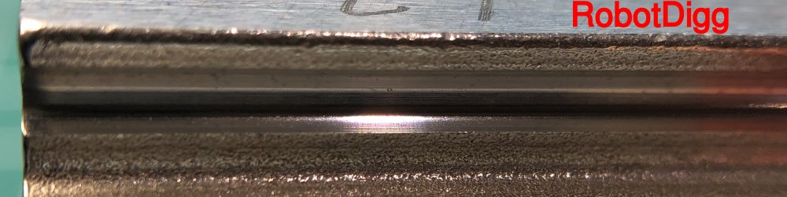

# Liner Rail Bakeoff

## What's This Now?

I'm doing this to show some examples of the "economy" rails I've purchased and things to look out for. Linear rails for 3D printers are available at anywhere from $15/$200. Here's a detailed comparison of some of the lower end models I've purchased to hopefully provide some guidance and save you major headaches later on.

## TLDR

LDO would be my 1st pick followed by Robodigg and last would be CNA. For CNA I'd expect 2 out of 5 rails to be unusable and from the poor machining you'd probably introduce artifacts that would be very hard to fix. While Robotdigg is somewhat comparable keep in mind that coming from Aliexpress means to take a definite risk trying to return items and shipping times will be in weeks if not months.

### The Rails

| Part Number | Manufacturer | Cost + Shipping | Example Links |
|-----------|---------|-------|---------------|
| MGN12H 400mm Linear Rail | [CNA/RDBB](img/CNAManufacturer.JPG) (Cheap Cheap Cheap) | $20.92 | [Aliexpress](https://www.aliexpress.com/item/32829826159.html?spm=a2g0s.9042311.0.0.27424c4dwPelhS) |
| SS-MGN12-1H-400mm | RobotDigg (Middle Quality) | $34.20 | [Aliexpress](https://s.click.aliexpress.com/e/_AA8VKF) |
| LDO-MGN12H | LDO (Best Quality) | $34.80 (Free ship over $60) | [PrintedSolid](https://www.printedsolid.com/products/ldo-linear-rail-mgn12h-with-one-carriage-in-300-400-500-700mm-lengths?variant=23236699816021) [Filastruder](https://www.filastruder.com/products/ldo-linear-rails) |

### Tools I used

| Description     | Details | Example Links |
|-----------|---------|---------------|
| iPhone | What I took the pictures with | [Apple](https://www.apple.com/iphone/) |
| Clip-On Macro Lens | 20x Macro is what I used in this kit | [Amazon](https://amzn.to/3eeCqLU) |
| Smart Phone Tripod | To keep it steady | [Amazon](https://amzn.to/3dtMaTI) |

## Surface Finish Comparison On the Carriage

### End Finish

 
**Surface is covered in marks. Even though it's cosmetic this one is particularly deep**

 
**Similar tooling marks but nothing too deep**

 
**Many superficial scratches. There's a thick Chrome/Electroplated surface treatment here**

### Underside Finish

**The grain in this picture really shows the poor quality of the alloy they're using. The mark in the upper left is actually engraved**

**Little hard to see but the grain is much smaller and more consistent**

**More of those etching marks but not too bad. However my 2nd carriage had some [missing Chrome on the underside](img/RDChromePlating.JPG)**

### Race/Return End Finish

**The alloy they're using is really terrible. Notice that the race has a hand filed bevel on it**

**Here you can see that the machining is just better. The tolerances are much tighter**

**Edges aren't very crisp. I'm guessing that's from the Chroming. This is less of an issue for RobotDigg because of something smart they did with PTFE liners. More on that later**

### Race Finish

**This is the important bit. Look at those pits and imperfections**

**Machining on the race here is much better than CNA**

**Machining on the race is comparable to LDO and much better than CNA. This is where the machining really counts!!**

### Ball Return Channels

**Look at those bumps. Bearings are not going to like that**

**More bumps. Rough!!**

**From a 2nd rail I got. That's a noticeable lip inside the ball return. This rail feels like gravel by the way**

**Not perfect but way better than CNA**

**Not perfect but way better than CNA**

**This one looks pretty good**

**This shot doesn't really matter because of the smart engineering in the next step**

**This liner means the machining isn't an issue and for our light application this will work great**

**Hard to get a good shot as the liner is nearly mirror smooth**

### Ball Bearings

**Accidentally Left them in Simple Green overnight and this happened. Guessing this shows how thinly chromed they are**

**Left them in Simple Green overnight to repeat the test. They're a little dirty but the chrome is in tact and under a magnifying glass they were good**

**Didn't have any spare ball bearings for RobotDigg to do this test with**

## Bearing Size

| Manufacturer | Size in mm | Note |
|-----------|---------|------|
| CNA/RDBB | 2.36 | Undersized |
| LDO | 2.37 | Closer to true 3/32 size and similar to the Amazon G25 grade bearings I bought |
| RobotDigg | 2.36 | Undersized |

## Verdict

The LDO linear rails had the best machining of the bunch and were comparable in price to the RobotDigg and worth the additional $15 over the CNAs. If you are in the USA you can get these from 2 reputable stores so shipping and returns will be much easier if you do have a problem. They'll definitely be my choice going forward.

While the RobotDigg had some good engineering with the PTFE linings and a couple other tricks on the end caps, the actual machining was not as good as the LDOs and they cost about the same. Also unlike the LDO and CNA rails there was no oil feeding port. That's not a huge issue as you can just put oil on the bearing directly in most cases. If you don't have access to the LDOs I'd choose the RobotDigg.

The CNA were by far the worst of the bunch. Machining was terrible and I think there is a lot of risk in using these on your 3d printer. They're super cheap but if you have to buy 1-3 rails and deal with returns to China it really isn't worth it. I'd worry about how long these will last given the quality of the bearings and what artifacts you might see.

## Additional Sources
https://www.youtube.com/watch?v=DMAx_JSMqGc
https://railcore.org/hardware/linear_rails.html

